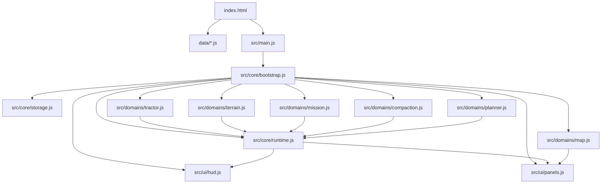

# Rearquitetura do Prototipo Design

**Spec**: `.specs/features/rearquitetura-prototipo/spec.md`
**Status**: Draft

---

## Architecture Overview

A arquitetura-alvo deve sair do monolito atual em `prototipo/index.html` para uma estrutura estatica, simples e carregada diretamente pelo navegador, sem build e sem servidor. O objetivo nao e construir uma aplicacao de frontend formal, mas separar responsabilidades recorrentes em poucos modulos coesos.

As decisoes centrais deste design sao:

- `index.html` permanece como shell da pagina e ordem de carregamento.
- datasets saem do HTML e passam para arquivos `.js` declarativos carregados por `script src`.
- os modulos JavaScript serao scripts classicos, carregados em ordem explicita no `index.html`, sem depender de ES modules como base arquitetural.
- JavaScript fica organizado em poucas camadas tecnicas: `core`, `domains`, `ui`.
- o estado deixa de ser um bloco unico implícito e passa a ser isolado por dominio, com coordenacao leve no runtime.
- a logica de dominio permanece fora da UI sempre que isso trouxer ganho real de clareza.
- nao sera criada uma arvore profunda de adaptadores, factories, services genericos ou microarquivos.



### Architectural Shape

O projeto deve adotar uma modularizacao media, nao minima e nao maximalista:

- separar o que hoje e responsabilidade nitidamente distinta;
- manter junto o que so faz sentido em um unico lugar;
- usar um arquivo por dominio quando possivel;
- dividir um dominio em dois arquivos apenas quando houver uma fronteira recorrente e clara, como `state + behavior` ou `engine + facade`.

### Script Loading Model

Para eliminar ambiguidade de implementacao sob `file://`, a arquitetura base adota este modelo:

- todos os arquivos JS do prototipo sao scripts classicos, nao ES modules;
- `index.html` controla a ordem de carga de bibliotecas, datasets e arquivos da aplicacao;
- cada arquivo expõe apenas o necessario no namespace global do prototipo, preferencialmente sob um unico objeto raiz, por exemplo `window.SoloCompactado`;
- `src/main.js` continua sendo o gatilho de inicializacao, mas nao e o unico arquivo carregado;
- `src/main.js` assume que dependencias ja foram carregadas previamente pelo `index.html`.

Ordem base de carga:

1. Leaflet e bibliotecas externas
2. `data/*.js`
3. `src/core/*.js`
4. `src/domains/*.js`
5. `src/ui/*.js`
6. `src/main.js`

Esse modelo e parte do design para evitar imports dinamicos, bundler ou dependencias incertas de suporte a modules em `file://`.

### Directory Target

```text
prototipo/
  index.html
  assets/
    styles/
      base.css
      layout.css
      hud.css
      planner.css
  data/
    terrain-sources.js
    terrain-grid.js
    terrain-bdc-raster.js
    bdc-paladino-7km-items.json
  src/
    main.js
    core/
      bootstrap.js
      keyboard.js
      runtime.js
      storage.js
      formatters.js
    domains/
      map.js
      tractor.js
      terrain.js
      mission.js
      compaction.js
      planner.js
    ui/
      dom.js
      hud.js
      panels.js
      debug.js
```

### Why This Size Fits The Project

- o projeto atual ainda e um prototipo de pagina unica;
- as responsabilidades principais ja existem de forma clara no runtime atual;
- a manutencao vai melhorar mais com 10 a 15 arquivos bons do que com 30 arquivos minimos;
- `map`, `planner`, `mission` e `compaction` justificam modulos proprios;
- utilitarios genericos devem ser poucos e concretos, nao uma nova camada de framework caseiro.

---

## Code Reuse Analysis

### Existing Components to Leverage

| Component | Location | How to Use |
| --- | --- | --- |
| Estrutura visual atual | `prototipo/index.html` | Extrair o layout mantendo IDs, estrutura de HUD e ordem visual atual |
| Estilos atuais | `prototipo/index.html` | Mover para CSS externo preservando variaveis, blocos e classes existentes |
| Datasets embutidos | `prototipo/index.html` | Converter os blocos `application/json` em arquivos `.js` declarativos |
| Runtime atual | `prototipo/index.html` | Reaproveitar a logica existente separando por dominio sem alterar comportamento |
| Documentacao das sprints | `prototipo/sprint-*.md` | Usar como referencia dos fluxos que nao podem regredir |

### Integration Points

| System | Integration Method |
| --- | --- |
| Leaflet carregado por CDN | Mantido via `script` externo no `index.html` |
| `localStorage` da missao | Encapsulado em `src/core/storage.js` e consumido por `src/domains/mission.js` |
| Datasets de terreno | Carregados antes de `main.js` e lidos por `src/domains/terrain.js` |
| Loop de atualizacao do prototipo | Mantido no bootstrap/runtime com responsabilidades mais claras |

### Current Constraints Reused

- O prototipo ja roda sem build e deve continuar assim.
- O layout atual ja possui IDs e marcadores de DOM suficientes para reaproveitamento.
- O estado atual, embora concentrado, ja revela os dominios corretos para a modularizacao.
- A documentacao de sprint ja descreve o comportamento-alvo que precisa ser preservado.

---

## Components

### `index.html`

- **Purpose**: Servir como shell estatico da pagina, com markup principal, inclusao de CSS, bibliotecas externas e ordem de carga dos scripts.
- **Location**: `prototipo/index.html`
- **Interfaces**:
  - `link[href="assets/styles/*.css"]` - carrega estilos externos.
  - `script[src="data/*.js"]` - injeta datasets no escopo global de bootstrap.
  - `script[src="src/core/*.js"]`, `script[src="src/domains/*.js"]`, `script[src="src/ui/*.js"]` - carregam os modulos em ordem estatica.
  - `script[src="src/main.js"]` - inicia a aplicacao apos todas as dependencias ja estarem disponiveis.
- **Dependencies**: Leaflet CDN, arquivos `data/*.js`, `src/core/*.js`, `src/domains/*.js`, `src/ui/*.js`, `src/main.js`.
- **Reuses**: Estrutura HTML e IDs existentes do arquivo atual.

### `data/*.js`

- **Purpose**: Externalizar datasets hoje embutidos no HTML, mantendo carga compativel com `file://`.
- **Location**: `prototipo/data/`
- **Interfaces**:
  - `window.__SOLO_TERRAIN_SOURCES__`
  - `window.__SOLO_TERRAIN_GRID__`
  - `window.__SOLO_TERRAIN_BDC_RASTER__`
- **Dependencies**: Nenhuma alem do navegador.
- **Reuses**: Conteudo dos blocos `terrain-sources-data`, `terrain-grid-data` e `terrain-bdc-raster-data`.

### `src/main.js`

- **Purpose**: Ponto de entrada unico e minimo.
- **Location**: `prototipo/src/main.js`
- **Interfaces**:
  - `startApp(): void` - dispara o bootstrap da aplicacao.
- **Dependencies**: modulos previamente carregados pelo `index.html`, em especial `src/core/bootstrap.js`
- **Reuses**: Ordem de inicializacao atual do runtime.

### `src/core/bootstrap.js`

- **Purpose**: Orquestrar a inicializacao em passos simples e legiveis.
- **Location**: `prototipo/src/core/bootstrap.js`
- **Interfaces**:
  - `bootstrapApp(): AppContext` - valida datasets, monta runtime, inicializa mapa, UI e loop.
- **Dependencies**: `runtime.js`, `storage.js`, modulos de dominio, modulos de UI.
- **Reuses**: `initializeRuntime()` e bootstrap atual existentes no `index.html`.

### `src/core/runtime.js`

- **Purpose**: Centralizar apenas a coordenacao leve entre dominios e o estado compartilhado minimo.
- **Location**: `prototipo/src/core/runtime.js`
- **Interfaces**:
  - `createRuntime(): RuntimeState`
  - `getRuntimeSnapshot(): RuntimeView`
  - `tickRuntime(deltaMs: number, timestamp: number): void`
- **Dependencies**: modulos de dominio.
- **Reuses**: `runtimeState` atual, reduzido e reorganizado.

### `src/core/storage.js`

- **Purpose**: Isolar acesso a `localStorage`, validacao basica e tratamento de falhas de persistencia.
- **Location**: `prototipo/src/core/storage.js`
- **Interfaces**:
  - `isStorageAvailable(): boolean`
  - `restoreMission(datasetVersion: string): MissionData | null`
  - `persistMission(mission: MissionData, datasetVersion: string): void`
  - `clearMission(): void`
- **Dependencies**: `window.localStorage`
- **Reuses**: Logica atual de probe, restore, save e clear.

### `src/core/formatters.js`

- **Purpose**: Reunir formatacoes de HUD e painel para evitar espalhamento de utilitarios de apresentacao.
- **Location**: `prototipo/src/core/formatters.js`
- **Interfaces**:
  - `formatHudNumber(...)`
  - `formatTimestamp(...)`
  - `formatPlannerMetric(...)`
  - `formatPlannerDelta(...)`
- **Dependencies**: Nenhuma.
- **Reuses**: Helpers de formatacao atuais.

### `src/domains/map.js`

- **Purpose**: Encapsular criacao do mapa Leaflet, camera, camadas base e overlays cartograficos.
- **Location**: `prototipo/src/domains/map.js`
- **Interfaces**:
  - `createMapDomain(runtime): MapDomain`
  - `setCameraPosition(position, options): void`
  - `setMapBase(mode): void`
  - `fitPlannerBounds(bounds): void`
- **Dependencies**: Leaflet, runtime, planner, tractor.
- **Reuses**: Inicializacao do mapa, camera, base imagery/BDC e overlays existentes.

### `src/domains/tractor.js`

- **Purpose**: Controlar estado do trator, entradas do teclado, movimento e heading.
- **Location**: `prototipo/src/domains/tractor.js`
- **Interfaces**:
  - `createTractorDomain(runtime): TractorDomain`
  - `update(deltaMs: number): void`
  - `applyDirectionalInput(eventType: string, key: string): void`
  - `getSnapshot(): TractorSnapshot`
- **Dependencies**: runtime.
- **Reuses**: `tractorState`, `inputState`, `updateTractorState()` e overlay atual.

### `src/domains/terrain.js`

- **Purpose**: Resolver datasets, celula atual, pixel BDC atual e snapshot de terreno.
- **Location**: `prototipo/src/domains/terrain.js`
- **Interfaces**:
  - `createTerrainDomain(runtime, datasets): TerrainDomain`
  - `validateDatasets(): ValidationResult`
  - `resolveCurrentTerrain(position): TerrainSnapshot`
  - `getDatasetVersion(): string`
- **Dependencies**: datasets globais carregados por `data/*.js`.
- **Reuses**: validacao de dataset, `resolveCell`, `resolveTerrainPixel`, `buildTerrainSnapshot`.

### `src/domains/mission.js`

- **Purpose**: Controlar ciclo de vida da missao, amostragem, acumulado, restauracao, limpeza e exportacao.
- **Location**: `prototipo/src/domains/mission.js`
- **Interfaces**:
  - `createMissionDomain(runtime, storage): MissionDomain`
  - `updateSampling(deltaMs: number, timestamp: number): void`
  - `resetMission(): void`
  - `exportMission(): void`
  - `getMissionView(): MissionView`
- **Dependencies**: runtime, terrain, tractor, storage, compaction.
- **Reuses**: `createSample`, `updateSampling`, `buildMissionExport`, `downloadMissionExport`, `resetMission`.

### `src/domains/compaction.js`

- **Purpose**: Manter o motor de compactacao desacoplado do DOM e da persistencia.
- **Location**: `prototipo/src/domains/compaction.js`
- **Interfaces**:
  - `runCompaction(tractorConfig, terrainSnapshot): CompactionProfile`
  - `buildCompactionView(profile, accumulator): CompactionView`
- **Dependencies**: terreno atual, configuracao do trator.
- **Reuses**: `buildCompactionProfile`, `calcContactStress`, `propagateStress`, `calcSigmaP`, `calcDeformation`, `assessLayerRisk`, `runCompactionMotor`.

### `src/domains/planner.js`

- **Purpose**: Concentrar estado, interacoes e calculos do coverage planner.
- **Location**: `prototipo/src/domains/planner.js`
- **Interfaces**:
  - `createPlannerDomain(runtime, mapDomain): PlannerDomain`
  - `startDrawing(): void`
  - `finishDrawing(): void`
  - `cancelDrawing(): void`
  - `generatePlan(): void`
  - `clearPlan(): void`
  - `toggleViewMode(): void`
  - `setOverlayMode(mode: string): void`
  - `setWorkingWidth(value: number): void`
  - `isDrawingActive(): boolean`
- **Dependencies**: runtime, map domain, terrain when necessario.
- **Reuses**: Estado `coveragePlanner`, desenho de talhao, geracao do plano e controles visuais atuais.

### `src/core/keyboard.js`

- **Purpose**: Ser o dono unico do fluxo de teclado, arbitrando trator, planner e debug.
- **Location**: `prototipo/src/core/keyboard.js`
- **Interfaces**:
  - `bindKeyboard(runtime, tractorDomain, plannerDomain, debugUi): void`
- **Dependencies**: runtime, `tractor.js`, `planner.js`, `ui/debug.js`
- **Reuses**: Regras atuais de `keydown`/`keyup`, inclusive bloqueio de setas durante desenho e alternancia da tecla `D`.

### `src/ui/dom.js`

- **Purpose**: Concentrar captura de elementos do DOM e evitar `document.getElementById` espalhado.
- **Location**: `prototipo/src/ui/dom.js`
- **Interfaces**:
  - `getDomRefs(): DomRefs`
- **Dependencies**: markup do `index.html`
- **Reuses**: Todos os seletores atuais do arquivo unico.

### `src/ui/hud.js`

- **Purpose**: Renderizar metricas de trator, terreno, compactacao e status principais do HUD.
- **Location**: `prototipo/src/ui/hud.js`
- **Interfaces**:
  - `renderHud(viewModel): void`
- **Dependencies**: `dom.js`, `formatters.js`, runtime.
- **Reuses**: `buildHudViewModel()`, `renderHud()` e estrutura atual do HUD.

### `src/ui/panels.js`

- **Purpose**: Ligar e renderizar os paineis de planner e missao sem concentrar regra pesada.
- **Location**: `prototipo/src/ui/panels.js`
- **Interfaces**:
  - `bindMissionPanel(actions): void`
  - `bindPlannerPanel(actions): void`
  - `renderMissionPanel(view): void`
  - `renderPlannerPanel(view): void`
- **Dependencies**: `dom.js`, runtime, mission, planner.
- **Reuses**: listeners atuais dos botoes e renderizacao dos blocos de painel.

### `src/ui/debug.js`

- **Purpose**: Isolar overlay de debug e alternancia visual.
- **Location**: `prototipo/src/ui/debug.js`
- **Interfaces**:
  - `toggleDebug(): void`
  - `renderDebug(view): void`
- **Dependencies**: `dom.js`, tractor, runtime.
- **Reuses**: `debugState`, overlay atual e bindings da tecla `D`.

---

## Data Models

### RuntimeState

```typescript
interface RuntimeState {
  datasetReady: boolean
  datasetError: string | null
  storageAvailable: boolean
  storageError: string | null
  currentCell: TerrainCell | null
  currentTerrainPixel: TerrainPixel | null
  currentCompactionProfile: CompactionLayer[] | null
  latestSample: MissionSample | null
  mission: MissionState
  planner: PlannerState
  uiMessage: UiMessage | null
}
```

**Relationships**: Guarda apenas estado transversal. O detalhe interno de cada dominio fica no proprio modulo.

### TractorSnapshot

```typescript
interface TractorSnapshot {
  position: { lat: number; lng: number }
  headingDeg: number
  speedMps: number
  machinePreset: string
  wheelLoadKg: number
  inflationPressureKpa: number
  tyreWidthM: number
  trackGaugeM: number
  routeSpeedKph: number
}
```

**Relationships**: Alimenta terreno, missao, HUD, planner e motor de compactacao.

### TerrainSnapshot

```typescript
interface TerrainSnapshot {
  cellId: string | null
  thematicClass: string | null
  clayContent: number | null
  waterContent: number | null
  matricSuctionKpa: number | null
  bulkDensity: number | null
  concFactor: number | null
}
```

**Relationships**: E resolvido pelo dominio de terreno e consumido por HUD, missao e compactacao.

### MissionState

```typescript
interface MissionState {
  missionId: string
  startedAt: string
  samples: MissionSample[]
  compactionAccumulator: Record<string, CompactionAccumulator>
  sampling: {
    lastLogicalKey: string | null
    lastTimestamp: number | null
  }
}
```

**Relationships**: Persistido em `localStorage`, exportado pelo dominio de missao e mostrado no HUD/painel.

**Compatibility Note**: Missoes persistidas antes da rearquitetura podem ser invalidadas nesta nova versao; nao ha requisito de migracao retroativa.

### PlannerState

```typescript
interface PlannerState {
  mode: "idle" | "drawing"
  fieldPolygon: Array<{ lat: number; lng: number }> | null
  coveragePlan: object | null
  overlayMode: "baseline" | "optimized"
  viewMode: "follow" | "planner"
  mapBase: "imagery" | "bdc"
  plannerZoom: number | null
  followZoom: number | null
  workingWidthM: number
}
```

**Relationships**: Controla desenho, plano, camera e exibicao do planner em integracao com mapa e UI.

---

## Error Handling Strategy

| Error Scenario | Handling | User Impact |
| --- | --- | --- |
| Dataset ausente ou invalido | Falhar cedo no bootstrap com mensagem visivel no painel de erro | Usuario entende que o problema e de dados/inicializacao |
| `localStorage` indisponivel | Operar em memoria e sinalizar fallback no HUD/missao | Fluxo segue funcionando sem persistencia |
| Missao persistida de versao anterior | Invalidar e reiniciar a coleta na nova versao | Usuario precisa iniciar nova coleta nesta arquitetura |
| Falha na exportacao da missao | Exibir mensagem operacional temporaria sem quebrar a sessao | Usuario perde apenas a exportacao naquele momento |
| Falha na imagery | Manter fallback para base BDC quando aplicavel | Navegacao continua disponivel |
| Planejamento sem dataset valido | Desabilitar ou bloquear acoes dependentes com feedback claro | Evita estados inconsistentes |

---

## Tech Decisions

| Decision | Choice | Rationale |
| --- | --- | --- |
| Carga de datasets | Arquivos `.js` com atribuicoes em `window` | Funciona com `file://` e evita `fetch` |
| Ponto de entrada | `src/main.js` unico | Reduz pontos de entrada e facilita leitura |
| Carga de modulos JS | Scripts classicos ordenados pelo `index.html` | Remove ambiguidade com `file://` e dispensa bundler |
| Camadas | `core`, `domains`, `ui` | Organiza sem criar arquitetura profunda |
| Estado | Isolado por dominio com runtime leve | Mantem clareza sem store monolitico |
| CSS | Poucos arquivos por responsabilidade visual | Separa o essencial sem fragmentar demais |
| DOM refs | Centralizadas em `ui/dom.js` | Evita centenas de seletores espalhados |
| Planner e compactacao | Mantidos fora da UI | Preserva clareza e reduz regressao durante evolucao |
| Modularizacao | Preferir poucos modulos coesos | Evita microarquivos e over-engineering |

---

## Implementation Notes

- O design assume scripts classicos como base obrigatoria da arquitetura.
- ES modules podem ser avaliados futuramente, mas nao fazem parte da solucao-base desta rearquitetura.
- Se algum dominio ficar pequeno demais durante a implementacao, ele pode ser consolidado em modulo vizinho desde que a fronteira de responsabilidade continue clara.
- `bdc-paladino-7km-items.json` pode permanecer como artefato de dados/documentacao se nao for consumido no bootstrap do prototipo.
- A ordem de scripts no `index.html` passa a ser parte da arquitetura, porque substitui a necessidade de bundler.
- Ownership do teclado:
  - `core/keyboard.js` recebe todos os eventos de teclado.
  - `planner.js` informa se o modo de desenho esta ativo e, nesse caso, bloqueia as setas de navegacao do trator.
  - `tractor.js` apenas aplica entradas direcionais aprovadas pelo arbitro de teclado.
  - `ui/debug.js` apenas alterna e renderiza o overlay; nao registra listeners globais por conta propria.

---

## Requirement Mapping

| Requirement ID | Design Decision |
| --- | --- |
| ARQ-PROT-01 | Separacao em `core`, `domains` e `ui` com poucos modulos coesos |
| ARQ-PROT-02 | Cada dominio principal recebe um ponto previsivel de manutencao |
| ARQ-PROT-03 | `index.html` continua sendo o ponto de abertura unico |
| ARQ-PROT-04 | Datasets e modulos JS carregados por `script src` e ordem estatica no `index.html`, sem `fetch`, imports dinamicos ou servidor |
| ARQ-PROT-05 | Shell, mapa, HUD e overlay do trator sao preservados no markup e bootstrap |
| ARQ-PROT-06 | Fluxos de debug, missao e exportacao permanecem em modulos dedicados |
| ARQ-PROT-07 | Planner permanece com desenho, plano, zoom, fit e alternancias atuais |
| ARQ-PROT-08 | Compactacao continua desacoplada e integrada ao loop de runtime |
| ARQ-PROT-09 | Datasets saem do HTML para `data/*.js` |
| ARQ-PROT-10 | Arquivos de dados seguem formato declarativo simples |
| ARQ-PROT-11 | Nenhum loader generico ou pipeline extra de dados sera introduzido |
| ARQ-PROT-12 | Estado e responsabilidades sao isolados por dominio |
| ARQ-PROT-13 | Runtime continua leve e sem store central superabstrato |
| ARQ-PROT-14 | Consolidacao e permitida para evitar fragmentacao artificial |
| ARQ-PROT-15 | UI so renderiza e despacha acoes, sem concentrar regra pesada |
| ARQ-PROT-16 | A arvore alvo privilegia poucos modulos e extensao natural para proximas sprints |
