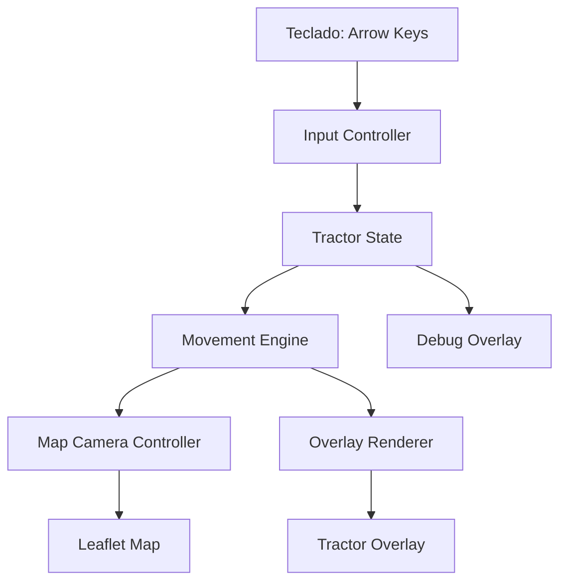

# Sprint 1: Mapa Satelital com Trator Navegavel Design

**Spec**: [spec.md](/Users/wiser/projects/gabrielgoes/SoloCompactado-IPT/.specs/features/sprint-1-mapa-trator/spec.md)  
**Status**: Completed

---

## Architecture Overview

A Sprint 1 sera implementada como um unico arquivo [index.html](/Users/wiser/projects/gabrielgoes/SoloCompactado-IPT/prototipo/index.html) com `HTML`, `CSS` e `JavaScript` embutidos. O mapa sera renderizado com `Leaflet`, centrado inicialmente na Fazenda Paladino, e o trator sera desenhado como overlay central fixo acima da viewport do mapa.

O movimento sera controlado por teclado. O estado logico do trator sera mantido em JavaScript e, a cada frame, a posicao geografica sera recalculada e usada para recentrar o mapa. Isso preserva a sensacao de que o trator esta parado no centro enquanto a fazenda se move por baixo dele.



---

## Code Reuse Analysis

### Existing Components to Leverage

| Component | Location | How to Use |
| --- | --- | --- |
| Sprint definition | [sprint-1-mapa-trator.md](/Users/wiser/projects/gabrielgoes/SoloCompactado-IPT/prototipo/sprint-1-mapa-trator.md) | Fonte de escopo e restricoes da sprint |
| Feature spec | [spec.md](/Users/wiser/projects/gabrielgoes/SoloCompactado-IPT/.specs/features/sprint-1-mapa-trator/spec.md) | Fonte de requisitos e rastreabilidade |

### Integration Points

| System | Integration Method |
| --- | --- |
| `Leaflet` | Inclusao via CDN no HTML unico |
| `Esri World Imagery` | Camada raster satelital principal configurada no `Leaflet`, com `maxNativeZoom` `16` |

Nao ha componentes reutilizaveis no codigo local para mapa, navegacao ou renderizacao do trator. Esta sprint parte de implementacao nova e isolada em `prototipo/`.

---

## Components

### HTML Shell

- **Purpose**: Definir a estrutura unica da pagina e os containers base da demo.
- **Location**: [index.html](/Users/wiser/projects/gabrielgoes/SoloCompactado-IPT/prototipo/index.html)
- **Interfaces**:
  - `#app` - raiz visual da pagina
  - `#map` - container controlado pelo `Leaflet`
  - `#tractor-overlay` - overlay central do trator
  - `#debug-overlay` - painel opcional de debug
- **Dependencies**: `Leaflet CSS`, `Leaflet JS`
- **Reuses**: escopo da sprint e requisitos da spec

### Map Bootstrap

- **Purpose**: Inicializar o `Leaflet`, configurar tiles e travar o comportamento do mapa ao papel de camera.
- **Location**: script embutido em [index.html](/Users/wiser/projects/gabrielgoes/SoloCompactado-IPT/prototipo/index.html)
- **Interfaces**:
  - `createMap(containerId: string, center: LatLng, zoom: number): L.Map` - cria o mapa com centro inicial
  - `setCameraPosition(map: L.Map, position: LatLng): void` - recentra o mapa sem animacoes nativas indesejadas
- **Dependencies**: `Leaflet`, `Esri World Imagery`
- **Reuses**: nenhum

### Input Controller

- **Purpose**: Capturar `keydown` e `keyup`, manter estado das teclas e expor intents de movimento.
- **Location**: script embutido em [index.html](/Users/wiser/projects/gabrielgoes/SoloCompactado-IPT/prototipo/index.html)
- **Interfaces**:
  - `attachKeyboardControls(): void` - registra listeners globais
  - `pressedKeys: Set<string>` - conjunto de teclas ativas
  - `toggleDebugOnKeyD(event: KeyboardEvent): void` - alterna o estado de debug
- **Dependencies**: `window`, foco do navegador
- **Reuses**: nenhum

### Movement Engine

- **Purpose**: Atualizar posicao, heading e velocidade a partir do estado do teclado.
- **Location**: script embutido em [index.html](/Users/wiser/projects/gabrielgoes/SoloCompactado-IPT/prototipo/index.html)
- **Interfaces**:
  - `updateTractorState(deltaMs: number, input: InputState, state: TractorState): TractorState`
  - `moveForward(position: LatLng, headingDeg: number, distanceMeters: number): LatLng`
- **Dependencies**: estado atual do trator, tempo entre frames
- **Reuses**: nenhum

### Overlay Renderer

- **Purpose**: Atualizar a representacao visual do trator e do debug sem mover o elemento de centro.
- **Location**: script embutido em [index.html](/Users/wiser/projects/gabrielgoes/SoloCompactado-IPT/prototipo/index.html)
- **Interfaces**:
  - `renderTractorOverlay(state: TractorState): void`
  - `renderDebug(state: TractorState, enabled: boolean): void`
- **Dependencies**: DOM do overlay, `TractorState`
- **Reuses**: nenhum

### Frame Loop

- **Purpose**: Coordenar entrada, fisica simples, camera e render a cada frame.
- **Location**: script embutido em [index.html](/Users/wiser/projects/gabrielgoes/SoloCompactado-IPT/prototipo/index.html)
- **Interfaces**:
  - `tick(timestamp: DOMHighResTimeStamp): void`
  - `startLoop(): void`
- **Dependencies**: `requestAnimationFrame`, componentes acima
- **Reuses**: nenhum

---

## Data Models

### LatLng

```javascript
{
  lat: number,
  lng: number
}
```

**Relationships**: usado pelo `Leaflet`, pela camera e pelo estado do trator.

### TractorState

```javascript
{
  position: { lat: number, lng: number },
  headingDeg: number,
  speedMps: number,
  maxSpeedMps: number,
  turnRateDegPerSec: number,
  accelerationMps2: number
}
```

**Relationships**: alimentado pelo `Input Controller`, atualizado pelo `Movement Engine`, consumido pelo `Map Bootstrap` e `Overlay Renderer`.

### InputState

```javascript
{
  up: boolean,
  down: boolean,
  left: boolean,
  right: boolean
}
```

**Relationships**: derivado do teclado e usado pelo `Movement Engine`.

### DebugState

```javascript
{
  enabled: boolean,
  lastFrameMs: number
}
```

**Relationships**: usado apenas pelo `Overlay Renderer`.

---

## Error Handling Strategy

| Error Scenario | Handling | User Impact |
| --- | --- | --- |
| `Leaflet` nao carregar via CDN | Exibir mensagem de erro clara no container principal e abortar init | Demo nao inicia, mas falha fica diagnostica |
| `Esri World Imagery` indisponivel | Manter mapa com estado de erro visivel, sem fallback automatico nesta sprint | Usuario entende que o problema e do mapa, nao do controle |
| Pagina sem foco para teclado | Permitir clique no mapa para recuperar foco e mostrar dica curta | Controle volta sem recarregar |
| Frame rate instavel | Usar `deltaMs` com clamp para evitar saltos muito grandes | Movimento continua previsivel |

---

## Tech Decisions

| Decision | Choice | Rationale |
| --- | --- | --- |
| Biblioteca de mapa | `Leaflet` | Simples, compativel com HTML puro e suficiente para a Sprint 1 |
| Camada satelital | `Esri World Imagery` | Entrega leitura satelital imediata sem aumentar a arquitetura da sprint |
| Compatibilidade de tiles | `maxNativeZoom: 16` e sem `detectRetina` | Reduz risco de indisponibilidade de tiles em area rural mantendo ampliacao visual aceitavel |
| Estrategia de entrega | Arquivo HTML unico | Alinha com o objetivo de abrir direto no navegador |
| Camera | Trator fixo no centro + mapa recentrado | Reproduz a metafora de apps como Google Maps e Waze |
| Estado de movimento | Loop com `requestAnimationFrame` | Permite movimento fluido e previsivel |
| `ArrowDown` | Freio sem re | Menor ambiguidade na fisica da Sprint 1 |
| Ativacao do debug | Tecla `D` | Contrato simples e testavel |
| Zoom inicial | `16` | Equilibrio melhor entre leitura local e disponibilidade real de tiles |
| Rotacao | Girar apenas o trator na v1 | Menor complexidade e melhor legibilidade inicial |
| Orientacao do trator | Compensar o eixo visual nativo do emoji e manter `heading` continuo | Evita desalinhamento visual e elimina salto ao cruzar `360°` |
| Arquitetura de arquivos | Tudo em `prototipo/` | Decisao ja registrada nas sprints e no pedido do usuario |

---

## Implementation Notes

- A implementacao deve evitar controles nativos do `Leaflet` que conflitem com a demo, como arrastar o mapa manualmente, zoom por scroll e teclado nativo da biblioteca.
- O `Leaflet` sera usado como motor de renderizacao do mapa, nao como controlador da navegacao do usuario.
- O movimento geografico do trator pode usar aproximacao local em metros para latitude/longitude, suficiente para a escala da demo.
- O mapa deve iniciar na Fazenda Paladino com `zoom` `16`.
- A camada satelital principal deve ser `Esri World Imagery`.
- A camada satelital deve ser configurada com `maxNativeZoom` `16`.
- `detectRetina` nao deve ser usado nesta sprint.
- A velocidade deve ter piso explicito em `0`.
- A velocidade maxima da demo deve ser `50 m/s`.
- `ArrowDown` deve apenas reduzir a velocidade ate `0`, sem gerar re.
- O debug deve nascer desabilitado por padrao.
- O debug deve ser alternado pela tecla `D`.
- O `heading` interno do trator deve permanecer continuo, sem normalizacao obrigatoria a cada volta completa.
- O overlay deve compensar a orientacao nativa do emoji de trator para manter a frente visual alinhada ao movimento.
- O arquivo final da sprint deve ser criado em [index.html](/Users/wiser/projects/gabrielgoes/SoloCompactado-IPT/prototipo/index.html).

## Requirement Mapping

| Requirement ID | Design Coverage |
| --- | --- |
| S1MAP-01 | `HTML Shell` garante o artefato `prototipo/index.html` |
| S1MAP-02 | `Map Bootstrap` define centro inicial da Fazenda Paladino |
| S1MAP-03 | `Map Bootstrap` define `zoom` inicial `16` |
| S1MAP-04 | `Map Bootstrap` configura `Esri World Imagery` |
| S1MAP-05 | `Map Bootstrap` exibe erro visivel se a camada falhar |
| S1MAP-06 | `HTML Shell` + `Overlay Renderer` mantem trator fixo no centro |
| S1MAP-07 | `Input Controller` + `Movement Engine` processam `ArrowUp` |
| S1MAP-08 | `Input Controller` + `Overlay Renderer` processam rotacao |
| S1MAP-09 | `Movement Engine` trata `ArrowDown` como freio sem re |
| S1MAP-10 | `Frame Loop` + `Map Bootstrap` garantem fluidez |
| S1MAP-11 | `HTML Shell` usa mapa full-screen sem paineis extras |
| S1MAP-12 | `Overlay Renderer` garante marcador central evidente |
| S1MAP-13 | `Map Bootstrap` desabilita interacoes nativas conflitantes do `Leaflet` |
| S1MAP-14 | `Overlay Renderer` atualiza orientacao coerente, com compensacao do emoji e rotacao continua |
| S1MAP-15 | `Movement Engine` elimina drift parado |
| S1MAP-16 | `Input Controller` alterna debug com tecla `D` |
| S1MAP-17 | `Overlay Renderer` exibe debug opcional |
| S1MAP-18 | `DebugState` controla desligamento padrao |
