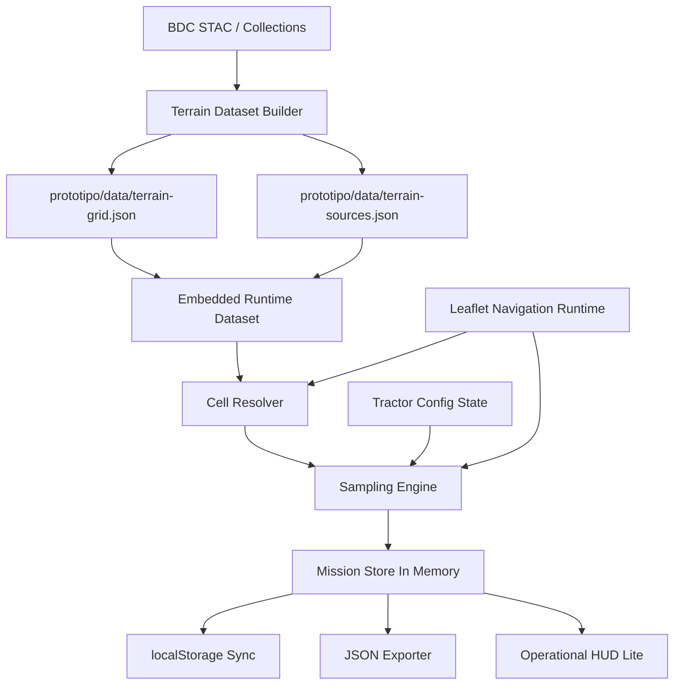

# Sprint 2: Coleta e Armazenagem de Variaveis Design

**Spec**: [spec.md](/Users/wiser/projects/gabrielgoes/SoloCompactado-IPT/.specs/features/sprint-2-coleta-variaveis/spec.md)  
**Status**: Completed

---

## Architecture Overview

A Sprint 2 sera implementada como evolucao direta de [index.html](/Users/wiser/projects/gabrielgoes/SoloCompactado-IPT/prototipo/index.html), mantendo `HTML`, `CSS` e `JavaScript` embutidos para a navegacao e adicionando leitura de dados oficiais de terreno a partir de dataset local versionado em `prototipo/data/`.

Para manter o prototipo abrindo localmente no navegador e, ao mesmo tempo, respeitar a exigencia de nao inventar dados de terreno, o design separa a solucao em dois niveis:

- runtime local no navegador: navega, resolve celula atual, coleta snapshots, persiste em `localStorage` e exporta `JSON`;
- dataset local pre-recortado: arquivos gerados a partir de fontes oficiais do `Brazil Data Cube`, limitados a area central da Fazenda Paladino.

O `Brazil Data Cube` sera a fonte oficial unica para contexto espacial, temporal e indices auxiliares por celula. O prototipo nao consultara essa fonte bruta diretamente a cada frame; ele carregara um recorte local preparado para a regiao da demo.

Como a demo precisa continuar abrindo localmente, o design fixa desde ja a estrategia de entrega do dataset:

- os arquivos canonicos ficam versionados em `prototipo/data/`;
- na implementacao do runtime, o dataset deve ser disponibilizado de forma compativel com abertura local, preferencialmente embutido no HTML em blocos `application/json` gerados a partir desses arquivos, evitando dependencia obrigatoria de `fetch` sob `file://`.



---

## Code Reuse Analysis

### Existing Components to Leverage

| Component | Location | How to Use |
| --- | --- | --- |
| Sprint 1 runtime | [index.html](/Users/wiser/projects/gabrielgoes/SoloCompactado-IPT/prototipo/index.html) | Reaproveitar mapa `Leaflet`, controle por teclado, estado do trator e loop principal |
| Sprint 2 definition | [sprint-2-coleta-variaveis.md](/Users/wiser/projects/gabrielgoes/SoloCompactado-IPT/prototipo/sprint-2-coleta-variaveis.md) | Fonte de escopo funcional e expectativas operacionais |
| Feature spec | [spec.md](/Users/wiser/projects/gabrielgoes/SoloCompactado-IPT/.specs/features/sprint-2-coleta-variaveis/spec.md) | Fonte contratual de requisitos e rastreabilidade |

### Integration Points

| System | Integration Method |
| --- | --- |
| `Leaflet` | Mantido como motor de mapa e camera da navegacao |
| `localStorage` | Persistencia da missao atual e restauracao no reload |
| `Blob` + `URL.createObjectURL` | Exportacao local do `JSON` da missao |
| `Brazil Data Cube` | Fonte unica de contexto espacial/temporal, processada antes do runtime em dataset local |

### Key Architectural Constraint

O prototipo continua sendo um unico `index.html` aberto localmente. Isso torna integracoes live com `BDC` inadequadas para a Sprint 2 por dependerem de CORS, pipelines remotos ou latencia de rede durante a demo.

Por isso, o melhor caminho tecnico e:

- preparar um recorte local da Fazenda Paladino a partir de fontes oficiais;
- versionar esse recorte dentro de `prototipo/data/`;
- carregar apenas esses arquivos locais no runtime da demo.

Essa decisao preserva:

- proveniencia real dos dados;
- reproducibilidade da demo;
- funcionamento local consistente no navegador.

---

## Components

### HTML Shell Extension

- **Purpose**: Estender a estrutura existente do `index.html` com controles operacionais minimos da Sprint 2.
- **Location**: [index.html](/Users/wiser/projects/gabrielgoes/SoloCompactado-IPT/prototipo/index.html)
- **Interfaces**:
  - `#mission-panel` - painel operacional leve
  - `#mission-cell-id` - identificador da celula atual
  - `#mission-sample-count` - total de amostras coletadas
  - `#mission-export` - acao de exportacao em `JSON`
  - `#mission-clear` - acao de limpar dados locais
- **Dependencies**: estado da missao, DOM
- **Reuses**: layout base da Sprint 1

### Terrain Dataset Loader

- **Purpose**: Carregar o recorte local de terreno e seus metadados de fonte.
- **Location**: script embutido em [index.html](/Users/wiser/projects/gabrielgoes/SoloCompactado-IPT/prototipo/index.html)
- **Interfaces**:
  - `loadTerrainGrid(): Promise<TerrainGrid>`
  - `loadTerrainSources(): Promise<TerrainSourceManifest>`
  - `validateTerrainDataset(dataset): ValidationResult`
- **Dependencies**: blocos JSON embutidos no HTML gerados a partir dos arquivos canonicos em `prototipo/data/`; `fetch` fica apenas como opcao secundaria se a abertura ocorrer por servidor local
- **Reuses**: nenhum

### Terrain Dataset Builder

- **Purpose**: Produzir os arquivos locais de grade e metadados a partir das fontes oficiais.
- **Location**: artefatos versionados em `prototipo/data/` e processo documentado no design; implementacao pode ser um script utilitario futuro dentro de `prototipo/`
- **Interfaces**:
  - entrada: recorte geografico da Fazenda Paladino
  - saida: `terrain-grid.json`, `terrain-sources.json`
  - saida secundaria de entrega: payload serializado para embutir em `index.html`
- **Dependencies**: acesso `BDC`
- **Reuses**: nenhum

### Cell Resolver

- **Purpose**: Determinar, a partir de `lat/lng`, qual celula da grade corresponde a posicao atual do trator.
- **Location**: script embutido em [index.html](/Users/wiser/projects/gabrielgoes/SoloCompactado-IPT/prototipo/index.html)
- **Interfaces**:
  - `resolveCell(position: LatLng, grid: TerrainGrid): TerrainCell | null`
  - `isInsideBounds(position: LatLng, bounds: BoundingBox): boolean`
- **Dependencies**: `TerrainGrid`, `tractorState.position`
- **Reuses**: `tractorState` da Sprint 1

### Sampling Engine

- **Purpose**: Decidir quando coletar, montar snapshots e impedir duplicacao.
- **Location**: script embutido em [index.html](/Users/wiser/projects/gabrielgoes/SoloCompactado-IPT/prototipo/index.html)
- **Interfaces**:
  - `updateSampling(deltaMs: number, state: RuntimeState): void`
  - `shouldSampleOnCellChange(prevCellId, nextCellId): boolean`
  - `shouldSampleOnInterval(speedMps, elapsedMs, currentCellId): boolean`
  - `createSample(reason: SamplingReason, runtime: RuntimeState): MissionSample`
- **Dependencies**: `tractorState`, `missionState`, `TerrainGrid`, tempo acumulado
- **Reuses**: loop principal da Sprint 1

### Mission Store

- **Purpose**: Centralizar o estado da missao em memoria e expor operacoes de mutacao controladas.
- **Location**: script embutido em [index.html](/Users/wiser/projects/gabrielgoes/SoloCompactado-IPT/prototipo/index.html)
- **Interfaces**:
  - `createMission(): MissionState`
  - `restoreMission(saved): MissionState`
  - `appendSample(sample: MissionSample): void`
  - `updateActiveTractorConfig(patch): void`
  - `resetMission(): MissionState`
- **Dependencies**: `tractorState`, `TerrainGrid`, manifest de fontes
- **Reuses**: nenhum

### Persistence Adapter

- **Purpose**: Sincronizar a missao com `localStorage` e tratar falhas sem quebrar a navegacao.
- **Location**: script embutido em [index.html](/Users/wiser/projects/gabrielgoes/SoloCompactado-IPT/prototipo/index.html)
- **Interfaces**:
  - `loadPersistedMission(): PersistedMission | null`
  - `savePersistedMission(mission: MissionState): void`
  - `clearPersistedMission(): void`
- **Dependencies**: `localStorage`, serializacao `JSON`
- **Reuses**: nenhum

### JSON Exporter

- **Purpose**: Gerar o arquivo exportavel da sessao com metadados de origem dos dados.
- **Location**: script embutido em [index.html](/Users/wiser/projects/gabrielgoes/SoloCompactado-IPT/prototipo/index.html)
- **Interfaces**:
  - `buildMissionExport(mission: MissionState): MissionExport`
  - `downloadMissionExport(payload: MissionExport): void`
- **Dependencies**: `MissionState`, `Blob`, `URL.createObjectURL`
- **Reuses**: nenhum

### Operational HUD Lite

- **Purpose**: Expor apenas os elementos operacionais exigidos na Sprint 2.
- **Location**: [index.html](/Users/wiser/projects/gabrielgoes/SoloCompactado-IPT/prototipo/index.html)
- **Interfaces**:
  - `renderMissionPanel(mission: MissionState, currentCell: TerrainCell | null): void`
- **Dependencies**: DOM, `MissionState`, `TerrainCell`
- **Reuses**: visual leve da Sprint 1 para paineis

---

## Data Models

### TerrainSourceManifest

```javascript
{
  farmId: "fazenda-paladino",
  datasetVersion: string,
  generatedAt: string,
  areaBounds: {
    north: number,
    south: number,
    east: number,
    west: number
  },
  sources: {
    bdc: {
      collectionId: string,
      stacUrl: string,
      description: string
    }
  },
  fieldProvenance: {
    thematic_class: "derived" | "unavailable",
    clay_content: "derived" | "unavailable",
    water_content: "derived" | "unavailable",
    matric_suction: "derived" | "unavailable",
    bulk_density: "derived" | "unavailable",
    conc_factor: "derived" | "unavailable",
    sigma_p: "derived" | "unavailable"
  }
}
```

**Relationships**: carregado pelo `Terrain Dataset Loader`, referenciado pela missao e incluido na exportacao.

### TerrainCell

```javascript
{
  cellId: string,
  datasetVersion: string,
  center: { lat: number, lng: number },
  bounds: {
    north: number,
    south: number,
    east: number,
    west: number
  },
  thematicClass: {
    source: "bdc",
    value: string | number
  },
  terrainSnapshotBase: {
    cell_id: string,
    clay_content: number | null,
    water_content: number | null,
    matric_suction: number | null,
    bulk_density: number | null,
    conc_factor: number | null,
    sigma_p: number | null
  },
  provenance: {
    clay_content: "derived" | "unavailable",
    water_content: "derived" | "unavailable",
    matric_suction: "derived" | "unavailable",
    bulk_density: "derived" | "unavailable",
    conc_factor: "derived" | "unavailable",
    sigma_p: "derived" | "unavailable"
  }
}
```

**Relationships**: resolvida pelo `Cell Resolver`, consumida pelo `Sampling Engine`.

### TerrainGrid

```javascript
{
  farmId: "fazenda-paladino",
  datasetVersion: string,
  cellSizeMeters: number,
  bounds: {
    north: number,
    south: number,
    east: number,
    west: number
  },
  cells: TerrainCell[]
}
```

**Relationships**: carregada no bootstrap da Sprint 2 e usada ao longo de toda a sessao.

### ActiveTractorConfig

```javascript
{
  machine_preset: string,
  wheel_load: number,
  mass_total: number,
  inflation_pressure: number,
  tyre_width: number,
  track_gauge: number,
  route_speed: number
}
```

**Relationships**: mantida pela missao e copiada para cada `tractor_snapshot`.

### MissionSample

```javascript
{
  sample_id: string,
  timestamp: string,
  mission_id: string,
  tractor_position: {
    lat: number,
    lng: number
  },
  heading: number,
  speed: number,
  cell_id: string,
  sampling_reason: "cell-change" | "time-tick",
  terrain_snapshot: {
    cell_id: string,
    clay_content: number | null,
    water_content: number | null,
    matric_suction: number | null,
    bulk_density: number | null,
    conc_factor: number | null,
    sigma_p: number | null,
    thematic_class: string | number | null,
    provenance: Record<string, string>
  },
  tractor_snapshot: ActiveTractorConfig
}
```

**Relationships**: criada pelo `Sampling Engine`, armazenada no `Mission Store`, persistida e exportada.

### MissionState

```javascript
{
  mission_id: string,
  started_at: string,
  updated_at: string,
  farm_id: "fazenda-paladino",
  dataset_version: string,
  active_tractor_config: ActiveTractorConfig,
  terrain_manifest: TerrainSourceManifest,
  terrain_grid_meta: {
    cell_size_meters: number,
    bounds: BoundingBox,
    source_ref: string
  },
  current_cell_id: string | null,
  samples: MissionSample[],
  counters: {
    sample_count: number
  },
  sampling: {
    last_sample_at_ms: number,
    last_sample_cell_id: string | null
  }
}
```

**Relationships**: fonte unica da verdade para runtime, persistencia, exportacao e painel operacional.

---

## Runtime Flow

1. Bootstrap da pagina:
   - inicializar `Leaflet` e navegacao da Sprint 1;
   - carregar o dataset de terreno a partir da representacao local compativel com a demo;
   - restaurar missao persistida se existir;
   - validar compatibilidade entre `dataset_version` persistido e dataset atual;
   - se nao existir missao compativel, criar nova `MissionState`.

2. Loop principal:
   - atualizar `tractorState`;
   - resolver `currentCell` pela posicao atual;
   - verificar gatilho de coleta por `cell-change`;
   - verificar gatilho de coleta por `time-tick` apenas se `speedMps > 0`;
   - criar amostra se necessario;
   - atualizar painel operacional;
   - sincronizar persistencia.

3. Acoes operacionais:
   - `Exportar JSON`: gerar payload com mission metadata, samples e provenance;
   - `Limpar dados`: remover persistencia e reiniciar missao limpa.

---

## Terrain Data Strategy

### Source of Truth

- `BDC` fornece os dados oficiais usados pela sprint.
- Campos sem extracao oficial direta nao recebem valor manual arbitrario.
- Quando o `BDC` nao fornecer um valor observavel para o conjunto fixo de variaveis da sprint, o runtime preserva o campo como `null` e marca proveniencia coerente.

### Packaging Strategy

Os dados da Fazenda Paladino devem ser preparados em artefatos locais:

- [terrain-grid.json](/Users/wiser/projects/gabrielgoes/SoloCompactado-IPT/prototipo/data/terrain-grid.json)
- [terrain-sources.json](/Users/wiser/projects/gabrielgoes/SoloCompactado-IPT/prototipo/data/terrain-sources.json)

`terrain-grid.json` deve conter apenas o recorte usado na demo, com grade regular e payload enxuto por celula.

`terrain-sources.json` deve conter:

- colecao ou endpoint `BDC` usado;
- data de geracao do recorte;
- `datasetVersion`;
- classificacao de proveniencia por campo.

### Why Local Packaged Data

- evita dependencia de autenticacao ou sessao remota durante a demo;
- evita CORS e indisponibilidades de runtime;
- preserva o requisito de abrir o prototipo localmente;
- garante que os dados nao sejam inventados.

### Field Policy

| Field | Expected Source | Policy |
| --- | --- | --- |
| `thematic_class` | `BDC` derivado ou indisponivel | Nunca inventado |
| `clay_content` | derivado ou indisponivel | Nunca inventado |
| `water_content` | `BDC` ou derivado documentado | Nunca inventado |
| `matric_suction` | derivado ou indisponivel | Nunca inventado |
| `bulk_density` | derivado ou indisponivel | Nunca inventado |
| `conc_factor` | derivado ou indisponivel | Nunca inventado |
| `sigma_p` | derivado ou indisponivel | Nunca inventado |

---

## Error Handling Strategy

| Error Scenario | Handling | User Impact |
| --- | --- | --- |
| Dataset local de terreno ausente | Exibir erro diagnostico operacional e impedir coleta, mantendo navegacao | Demo continua navegavel, mas sem coleta |
| Manifesto de fontes invalido | Bloquear exportacao com proveniencia incompleta e informar erro claro | Evita sessao sem rastreabilidade |
| `localStorage` indisponivel | Manter missao apenas em memoria e exibir aviso no painel operacional | Coleta continua, mas sem restauracao no reload |
| Posicao fora da grade | Marcar `current_cell_id` como nulo e nao coletar enquanto a posicao estiver fora do recorte | Evita associacao incorreta |
| Falha na exportacao do arquivo | Exibir mensagem diagnostica e manter missao em memoria | Usuario pode tentar novamente |
| Campo oficial indisponivel | Persistir `null` e marcar proveniencia como `unavailable` | Mantem integridade sem inventar dados |
| Missao persistida com `dataset_version` diferente do dataset atual | Invalidar restauracao automatica da missao e iniciar sessao nova com aviso | Evita incompatibilidade silenciosa |

---

## Tech Decisions

| Decision | Choice | Rationale |
| --- | --- | --- |
| Artefato principal | Evoluir `prototipo/index.html` | Mantem contrato da Sprint 1 |
| Arquivos auxiliares | `prototipo/data/` | Segue a arquitetura definida para o prototipo |
| Fonte unica de terreno | `Brazil Data Cube` | Melhor opcao disponivel para detalhe espacial/temporal nesta sprint |
| Integracao em runtime | Dataset local pre-recortado | Mais robusto para demo local em navegador |
| Entrega do dataset ao runtime | JSON embutido no HTML a partir de arquivos canonicos em `prototipo/data/` | Mantem compatibilidade com abertura local via `file://` |
| Estrategia de grade | Grade regular com `cell_id` deterministico | Simplifica resolucao espacial e coleta |
| Gatilhos de coleta | `cell-change` + `time-tick` | Atende a spec e evita lacunas de missao |
| Persistencia | `localStorage` | Suficiente para a Sprint 2 |
| Exportacao | `JSON` via `Blob` | Sem backend e compativel com navegador |
| Campos sem fonte direta | `derived` ou `unavailable` | Cumpre a restricao de nao inventar dados |

---

## Implementation Notes

- A Sprint 2 deve preservar integralmente os controles e a navegacao da Sprint 1.
- O carregamento de `prototipo/data/*.json` deve ocorrer antes da ativacao completa da coleta.
- `prototipo/data/` permanece como fonte canonica versionada do dataset, mas o runtime do `index.html` deve consumir uma representacao compativel com abertura local sem servidor.
- A grade da Fazenda Paladino deve ser pequena o suficiente para manter leitura e busca eficientes no navegador.
- O `Cell Resolver` pode usar limites retangulares por celula nesta sprint; nao ha necessidade de geometria complexa.
- O `sampling_reason = time-tick` deve ocorrer apenas se houver movimento efetivo.
- O intervalo de coleta temporal deve ser um valor fixo e centralizado em configuracao, por exemplo `1000 ms`, para facilitar ajuste posterior.
- A persistencia deve ser debounced ou agregada por evento de coleta para evitar escrita excessiva a cada frame.
- O payload exportado deve incluir metadados de fonte, area de recorte e lista de amostras.
- O painel operacional deve permanecer minimo; o HUD executivo continua fora desta sprint.
- O schema de `terrain_snapshot` deve sempre incluir todos os campos definidos na spec, mesmo quando o valor for `null`.
- A restauracao da missao deve reidratar a grade por referencia ao dataset local versionado, e nao persistir uma copia redundante da grade inteira no `localStorage`.
- Se o runtime for servido por HTTP local no futuro, `fetch` pode ser usado como alternativa, mas isso nao deve ser obrigatorio para a demo desta sprint.

---

## Requirement Mapping

| Requirement ID | Design Coverage |
| --- | --- |
| S2DATA-01 | `HTML Shell Extension` preserva a navegacao base e acopla a missao ao runtime existente |
| S2DATA-02 | `Mission Store` cria `mission_id` unico |
| S2DATA-03 | `Terrain Dataset Loader` + `TerrainGrid` definem grade espacial |
| S2DATA-04 | `Cell Resolver` resolve `cell_id` a partir de `lat/lng` |
| S2DATA-05 | `Sampling Engine` coleta em `cell-change` |
| S2DATA-06 | `Sampling Engine` coleta em `time-tick` durante movimento |
| S2DATA-07 | `Sampling Engine` aplica deduplicacao por instante logico |
| S2DATA-08 | `MissionSample` define o payload completo da amostra |
| S2DATA-09 | `Terrain Dataset Builder` limita o recorte a Fazenda Paladino |
| S2DATA-10 | `Terrain Dataset Loader` consome dataset local pre-processado no runtime |
| S2DATA-11 | `TerrainCell` define os campos exigidos por celula, com suporte explicito a `null` |
| S2DATA-12 | `ActiveTractorConfig` define as variaveis ativas do trator |
| S2DATA-13 | `Sampling Engine` copia `terrain_snapshot` da celula atual |
| S2DATA-14 | `Sampling Engine` copia `tractor_snapshot` do estado ativo |
| S2DATA-15 | `Mission Store` preserva mudancas do trator apenas em novas amostras |
| S2DATA-16 | `MissionSample` armazena `tractor_position.lat/lng` |
| S2DATA-17 | `Terrain Dataset Builder` + `TerrainCell.thematicClass` garantem origem oficial ou derivada a partir do `BDC` |
| S2DATA-18 | `TerrainSourceManifest` + `Terrain Dataset Builder` cobrem o `BDC` |
| S2DATA-19 | `Field Policy` e `provenance` impedem valores inventados |
| S2DATA-20 | `Persistence Adapter` sincroniza no `localStorage` |
| S2DATA-21 | `Persistence Adapter` restaura no reload |
| S2DATA-22 | `MissionState` define o conjunto minimo restaurado por referencia ao dataset |
| S2DATA-23 | `JSON Exporter` gera arquivo com metadados e amostras |
| S2DATA-24 | `Persistence Adapter` limpa dados locais |
| S2DATA-25 | `Operational HUD Lite` mostra celula, contador e acoes operacionais |
| S2DATA-26 | `TerrainSourceManifest` e `JSON Exporter` levam proveniencia e versao do dataset para a exportacao |
| S2DATA-27 | `Persistence Adapter` + `MissionState` restauram referencia ao dataset local versionado e reidratam a grade correspondente |
