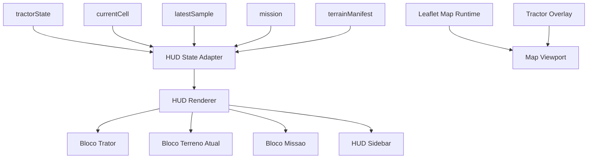

# Sprint 3: HUD de Leitura Operacional Design

**Spec**: [spec.md](/Users/wiser/projects/gabrielgoes/SoloCompactado-IPT/.specs/features/sprint-3-hud/spec.md)  
**Status**: Completed

---

## Architecture Overview

A Sprint 3 sera implementada como evolucao direta de [index.html](/Users/wiser/projects/gabrielgoes/SoloCompactado-IPT/prototipo/index.html), mantendo o mapa `Leaflet`, o loop de navegacao da Sprint 1 e o estado de missao da Sprint 2, mas substituindo o painel operacional minimo atual por um HUD lateral fixo com tres blocos: `Trator`, `Terreno Atual` e `Missao`.

O design evita criar uma segunda fonte de verdade para a interface. O HUD deve ler apenas o estado ja existente no runtime:

- `tractorState` para movimento e configuracao ativa;
- `runtimeState.currentCell` como fonte primaria para a celula sob o trator e para o bloco `Terreno Atual`;
- `runtimeState.latestSample` e `runtimeState.mission` para resumo da coleta e apoio ao HUD quando a amostra refletir a mesma celula atual;
- `runtimeState.terrainManifest` para metadados de dataset e coerencia da sessao restaurada.

O principal ajuste estrutural sera no layout da viewport:

- o mapa deixa de ocupar visualmente 100% da largura util;
- o `#app` passa a ser um container horizontal;
- o HUD ocupa a coluna lateral fixa;
- o mapa ocupa a coluna principal;
- o overlay do trator continua centralizado apenas na area do mapa, e nao no centro da tela inteira.



---

## Code Reuse Analysis

### Existing Components to Leverage

| Component | Location | How to Use |
| --- | --- | --- |
| Navegacao base da Sprint 1 | [index.html](/Users/wiser/projects/gabrielgoes/SoloCompactado-IPT/prototipo/index.html) | Reaproveitar mapa `Leaflet`, camera, overlay do trator e loop por frame |
| Missao e persistencia da Sprint 2 | [index.html](/Users/wiser/projects/gabrielgoes/SoloCompactado-IPT/prototipo/index.html) | Reaproveitar `runtimeState.mission`, `runtimeState.latestSample`, restauracao e exportacao |
| Painel operacional minimo atual | [index.html](/Users/wiser/projects/gabrielgoes/SoloCompactado-IPT/prototipo/index.html) | Refatorar `#mission-panel` para o novo HUD, preservando acoes existentes |
| Dataset local BDC | [terrain-grid.json](/Users/wiser/projects/gabrielgoes/SoloCompactado-IPT/prototipo/data/terrain-grid.json) e [terrain-sources.json](/Users/wiser/projects/gabrielgoes/SoloCompactado-IPT/prototipo/data/terrain-sources.json) | Continuar como fonte do bloco `Terreno Atual` |

### Integration Points

| System | Integration Method |
| --- | --- |
| DOM | Reestruturar a shell HTML para sidebar + mapa |
| `Leaflet` | Continua responsavel apenas pela viewport do mapa |
| `localStorage` | Continua responsavel por restaurar missao e alimentar o HUD apos reload |
| Exportacao JSON | Continua exposta no bloco `Missao` |
| Debug da Sprint 1 | Permanece coexistindo como overlay independente |

### Key Architectural Constraint

O HUD nao deve recalcular nada que ja exista no runtime. Ele deve ser uma camada de leitura. Isso reduz risco de divergencia entre:

- dados mostrados no HUD;
- dados gravados nas amostras;
- dados restaurados do `localStorage`.

Por isso, o design fixa um adaptador unico de estado para a interface:

- o renderer do HUD consome um objeto view-model derivado do estado atual;
- qualquer `null` de terreno vindo do dataset continua `null` no HUD, apenas com formatacao visual apropriada;
- nenhum campo exibido no HUD deve ser inventado ou inferido fora das regras ja aceitas na Sprint 2.

---

## Components

### App Layout Shell

- **Purpose**: Reorganizar a tela em duas colunas fixas, uma para HUD e outra para mapa.
- **Location**: [index.html](/Users/wiser/projects/gabrielgoes/SoloCompactado-IPT/prototipo/index.html)
- **Interfaces**:
  - `#app-shell`
  - `#hud-sidebar`
  - `#map-stage`
- **Dependencies**: CSS base, mapa, HUD, overlays
- **Reuses**: `#map`, `#tractor-overlay`, `#debug-overlay`, `#map-error`

### HUD Sidebar

- **Purpose**: Renderizar a camada visual principal da Sprint 3.
- **Location**: [index.html](/Users/wiser/projects/gabrielgoes/SoloCompactado-IPT/prototipo/index.html)
- **Interfaces**:
  - `#hud-sidebar`
  - `#hud-header`
  - `#hud-tractor`
  - `#hud-terrain`
  - `#hud-mission`
- **Dependencies**: `HUD State Adapter`, DOM
- **Reuses**: estilos de painel existentes (`.floating-panel`) como base visual

### HUD State Adapter

- **Purpose**: Transformar o estado bruto do runtime em um view-model simples para o HUD.
- **Location**: script embutido em [index.html](/Users/wiser/projects/gabrielgoes/SoloCompactado-IPT/prototipo/index.html)
- **Interfaces**:
  - `buildHudViewModel(runtimeState, tractorState): HudViewModel`
  - `formatHudValue(value, options): string`
  - `summarizeMissionId(missionId): string`
- **Dependencies**: `runtimeState`, `tractorState`
- **Reuses**: `runtimeState.latestSample`, `runtimeState.currentCell`, `runtimeState.mission`

### Tractor Block Renderer

- **Purpose**: Renderizar o bloco `Trator` com os campos operacionais da configuracao ativa.
- **Location**: script embutido em [index.html](/Users/wiser/projects/gabrielgoes/SoloCompactado-IPT/prototipo/index.html)
- **Interfaces**:
  - `renderTractorBlock(viewModel.tractor): void`
- **Dependencies**: DOM do HUD, `HudViewModel`
- **Reuses**: `getActiveTractorConfig()`, `tractorState.headingDeg`, `tractorState.speedMps`

### Terrain Block Renderer

- **Purpose**: Renderizar o bloco `Terreno Atual` preservando todos os campos do schema, inclusive os indisponiveis.
- **Location**: script embutido em [index.html](/Users/wiser/projects/gabrielgoes/SoloCompactado-IPT/prototipo/index.html)
- **Interfaces**:
  - `renderTerrainBlock(viewModel.terrain): void`
- **Dependencies**: DOM do HUD, `HudViewModel`
- **Reuses**: `runtimeState.currentCell` como fonte primaria e `runtimeState.latestSample.terrain_snapshot` como apoio quando a `cell_id` coincidir

### Mission Block Renderer

- **Purpose**: Renderizar o bloco `Missao` com resumo da sessao e manter exportacao/limpeza acessiveis.
- **Location**: script embutido em [index.html](/Users/wiser/projects/gabrielgoes/SoloCompactado-IPT/prototipo/index.html)
- **Interfaces**:
  - `renderMissionBlock(viewModel.mission): void`
- **Dependencies**: DOM do HUD, `HudViewModel`
- **Reuses**: `missionExportButton`, `missionClearButton`, status e mensagem da Sprint 2

### HUD Renderer

- **Purpose**: Coordenar atualizacao dos tres blocos e minimizar escrita redundante no DOM.
- **Location**: script embutido em [index.html](/Users/wiser/projects/gabrielgoes/SoloCompactado-IPT/prototipo/index.html)
- **Interfaces**:
  - `renderHud(): void`
  - `cacheHudElements(): HudElements`
- **Dependencies**: `HUD State Adapter`, renderers por bloco
- **Reuses**: estrategia de render do painel atual

### Map Stage Layout Adapter

- **Purpose**: Garantir que overlays, hint, mapa e debug continuem posicionados corretamente depois da divisao lateral.
- **Location**: CSS e shell HTML em [index.html](/Users/wiser/projects/gabrielgoes/SoloCompactado-IPT/prototipo/index.html)
- **Interfaces**:
  - CSS variables de largura
  - media queries desktop
- **Dependencies**: `#map-stage`, `#tractor-overlay`, `#hud-hint`, `#debug-overlay`
- **Reuses**: overlay atual do trator e paines flutuantes

---

## Data Models

### HudViewModel

```javascript
{
  tractor: {
    machine_preset: string,
    route_speed: string,
    heading: string,
    wheel_load: string,
    inflation_pressure: string,
    tyre_width: string,
    track_gauge: string
  },
  terrain: {
    cell_id: string,
    clay_content: string,
    water_content: string,
    matric_suction: string,
    bulk_density: string,
    conc_factor: string,
    sigma_p: string
  },
  mission: {
    mission_id: string,
    sample_count: string,
    last_sampling_reason: string,
    last_sample_timestamp: string,
    lat: string,
    lng: string,
    status_label: string,
    message: string
  }
}
```

**Relationships**: derivado em tempo real de `runtimeState` e `tractorState`; nunca persistido.

### Terrain Display Contract

```javascript
{
  cell_id: string,
  clay_content: number | null,
  water_content: number | null,
  matric_suction: number | null,
  bulk_density: number | null,
  conc_factor: number | null,
  sigma_p: number | null
}
```

**Relationships**: o HUD nao altera esse contrato; apenas formata valores para exibicao.

### Mission Summary Contract

```javascript
{
  mission_id: string,
  sample_count: number,
  last_sampling_reason: string | null,
  last_sample_timestamp: string | null,
  current_position: {
    lat: number,
    lng: number
  }
}
```

**Relationships**: alimentado por `runtimeState.mission`, `runtimeState.latestSample` e `tractorState.position`.

---

## Rendering Strategy

### Layout Strategy

- `body` continua `overflow: hidden`
- `#app` deixa de ser apenas um canvas absoluto e vira layout horizontal
- `#hud-sidebar` recebe largura fixa proporcional:
  - `width: 40vw`
  - `min-width` defensivo para desktop
  - `max-width` para nao esmagar o mapa em telas muito largas
- `#map-stage` ocupa o restante da largura
- `#map` passa a preencher apenas `#map-stage`
- `#tractor-overlay` passa a ser ancorado ao centro de `#map-stage`, preservando o comportamento visual da Sprint 1 dentro da area de mapa

### HUD Update Strategy

O loop principal ja atualiza o runtime continuamente. O HUD deve entrar nesse fluxo sem criar temporizador paralelo.

- `renderHud()` sera chamado no mesmo ciclo em que hoje ja existem:
  - `renderMissionPanel()`
  - `renderDebug()`
  - `renderTractorOverlay()`
- a implementacao pode substituir `renderMissionPanel()` por `renderHud()` ou transformar o metodo atual em subconjunto do novo renderer
- dados que so mudam em eventos discretos, como `mission_id`, nao precisam de logica especial; o renderer pode simplesmente reidratar o view-model e escrever no DOM por frame enquanto o custo permanecer baixo
- o bloco `Terreno Atual` deve ser derivado primeiro de `runtimeState.currentCell`; `latestSample` so pode complementar a exibicao quando refletir a mesma `cell_id`, sem introduzir atraso visual

### Null Display Strategy

Para preservar o contrato da Sprint 2 e a honestidade dos dados:

- `null` de terreno sera mostrado como `Nao disponivel`
- o rotulo do campo sempre aparece
- o bloco `Terreno Atual` nunca colapsa por falta de dado
- nenhum valor placeholder numerico sera usado

### Formatting Strategy

- `heading`: graus com uma casa decimal
- `route_speed`: `m/s` com duas casas decimais
- `wheel_load`: `kg`
- `inflation_pressure`: `kPa`
- `tyre_width` e `track_gauge`: `m`
- `lat` e `lng`: seis casas decimais
- timestamps: manter ISO curta ou formatacao local simples, desde que consistente

---

## Error Handling

### Dataset Unavailable

Se o dataset estiver invalido ou ausente:

- o HUD continua renderizando estrutura basica;
- o bloco `Terreno Atual` mostra campos vazios coerentes;
- o bloco `Missao` mostra status herdado da Sprint 2;
- a navegacao nao deve quebrar por causa do HUD.

### No Sample Yet

Se ainda nao houver amostra:

- `sample_count` continua `0`
- `last_sampling_reason` mostra `-`
- `last_sample_timestamp` mostra `-`
- coordenadas atuais continuam sendo mostradas a partir de `tractorState.position`

### Storage Failure

Se `localStorage` falhar:

- o HUD continua lendo da missao em memoria;
- o status textual continua indicando a condicao de persistencia parcial ou ausente.

---

## CSS and UX Decisions

### Visual Direction

O HUD nao deve parecer nem um modal de debug nem um dashboard corporativo. A direcao visual recomendada e:

- painel lateral escuro translúcido, consistente com o mapa satelital;
- titulos curtos em caixa alta;
- grupos bem separados por espacamento;
- valores principais em fonte maior;
- pouco cromatismo, com destaque apenas para o accent ja usado na Sprint 1.

### Responsive Scope

Esta sprint e desktop-first. O design nao introduz uma experiencia mobile completa, mas deve evitar colapso severo em larguras desktop menores.

Em largura reduzida ainda dentro do alvo desktop:

- o HUD pode diminuir densidade e fontes;
- os blocos continuam empilhados;
- o mapa continua navegavel;
- o debug pode manter seu posicionamento atual dentro de `#map-stage`.

---

## Implementation Plan Inside Runtime

1. Refatorar a shell HTML atual para criar `#hud-sidebar` e `#map-stage`.
2. Mover o painel atual de missao para dentro do novo HUD.
3. Criar markup para os blocos `Trator` e `Terreno Atual`.
4. Preservar os botoes de exportacao e limpeza no bloco `Missao`.
5. Implementar `buildHudViewModel()`.
6. Substituir `renderMissionPanel()` por renderer consolidado do HUD.
7. Ajustar CSS dos overlays para continuar centralizados na area do mapa, nao na tela inteira.
8. Validar coexistencia com debug, hint, map-error e restauracao de sessao.

---

## Requirement Mapping

| Requirement ID | Design Element |
| --- | --- |
| S3HUD-01 | App Layout Shell |
| S3HUD-02 | Layout Strategy |
| S3HUD-03 | HUD Sidebar |
| S3HUD-04 | HUD Sidebar |
| S3HUD-05 | Map Stage Layout Adapter |
| S3HUD-06 | Tractor Block Renderer |
| S3HUD-07 | Mission Block Renderer |
| S3HUD-08 | HUD State Adapter |
| S3HUD-09 | HUD Renderer + Map Stage Layout Adapter |
| S3HUD-10 | Terrain Block Renderer |
| S3HUD-11 | Cell-driven HUD update via HUD Renderer |
| S3HUD-12 | Terrain Block Renderer + latest sample reuse control |
| S3HUD-13 | Null Display Strategy |
| S3HUD-14 | Null Display Strategy |
| S3HUD-15 | Mission restore compatibility via existing runtime state |
| S3HUD-16 | Terrain Display Contract |
| S3HUD-17 | HUD Sidebar vertical composition |
| S3HUD-18 | CSS and UX Decisions |
| S3HUD-19 | CSS and UX Decisions |
| S3HUD-20 | Out-of-scope exclusions enforced in shell/renderer |
| S3HUD-21 | HUD Update Strategy |
| S3HUD-22 | Layout Strategy |
| S3HUD-23 | Independence from compactacao engine |
| S3HUD-24 | Map Stage Layout Adapter + debug coexistence |

---

## Key Decisions

1. O `mission-panel` atual sera refatorado e expandido, preservando os comportamentos existentes de status, exportacao e limpeza.
2. O HUD le o estado existente; nao cria camada analitica nova.
3. Campos de terreno `null` continuam visiveis e explicitamente ausentes.
4. Exportacao e limpeza continuam dentro do bloco `Missao`.
5. O trator permanece centralizado apenas na area do mapa, mesmo com a nova coluna lateral.
6. O HUD preserva mensagens transitorias de exportacao e limpeza sem perde-las no renderer por frame.
7. O banner de erro do mapa deve respeitar a largura util de `#map-stage`.

## Implementation Outcome

- `#app-shell`, `#hud-sidebar` e `#map-stage` foram implementados no runtime.
- O HUD final foi entregue com os blocos `Trator`, `Terreno Atual` e `Missao`.
- `buildHudViewModel()` e `renderHud()` absorveram o renderer fragmentado anterior.
- Exportacao, limpeza, restore e debug continuaram funcionais apos a refatoracao.
- A validacao final foi feita por revisao e testes manuais no navegador.

## Source Context

- Sprint base: [sprint-3-hud.md](/Users/wiser/projects/gabrielgoes/SoloCompactado-IPT/prototipo/sprint-3-hud.md)
- Feature spec: [spec.md](/Users/wiser/projects/gabrielgoes/SoloCompactado-IPT/.specs/features/sprint-3-hud/spec.md)
- Runtime atual: [index.html](/Users/wiser/projects/gabrielgoes/SoloCompactado-IPT/prototipo/index.html)
- Dependencias concluidas:
  - [spec.md](/Users/wiser/projects/gabrielgoes/SoloCompactado-IPT/.specs/features/sprint-1-mapa-trator/spec.md)
  - [spec.md](/Users/wiser/projects/gabrielgoes/SoloCompactado-IPT/.specs/features/sprint-2-coleta-variaveis/spec.md)
