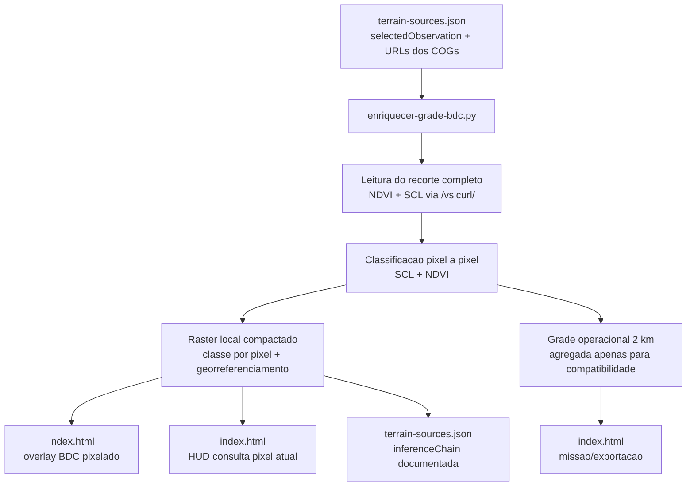

# Sprint 4: Inferencia de Parametros de Solo via BDC — Design

**Spec**: [spec.md](spec.md)
**Status**: Draft

---

## Architecture Overview

A Sprint 4 passa a ter dois produtos complementares:

1. **Raster BDC local pixelado**: fonte primaria para overlay e HUD
2. **Grade operacional de 2 km**: malha de compatibilidade para missao, exportacao e rotulos herdados



---

## Components

### Terrain Enrichment Script

- **Purpose**: Ler o recorte do BDC, classificar cada pixel e gerar os artefatos offline consumidos pelo runtime local.
- **Location**: `prototipo/scripts/enriquecer-grade-bdc.py`
- **Outputs**:
  - `prototipo/data/terrain-bdc-raster.json`
  - `prototipo/data/terrain-grid.json`
  - `prototipo/data/terrain-sources.json`
- **Dependencies**: `rasterio`, `numpy`, `pyproj`, `base64`

### Raster BDC Local

- **Purpose**: Ser a fonte primaria do overlay e do HUD
- **Format**: JSON compactado com:
  - `datasetVersion`
  - `bounds`
  - `width`
  - `height`
  - `classEncoding`
  - `classCodesBase64`
- **Reasoning**: Preserva a granularidade pixelar do BDC sem criar milhoes de objetos JSON individuais

### Grade Operacional

- **Purpose**: Preservar compatibilidade com amostragem da missao e exportacao
- **Constraint**: Nao e a fonte primaria do overlay BDC nem do HUD

---

## Inference Chain

### Passo 1 — Carregar observacao de referencia

Ler `terrain-sources.json` e extrair `sources.bdc.selectedObservation`. O script nao consulta STAC em tempo de execucao.

### Passo 2 — Ler o recorte completo dos COGs

O script abre NDVI e SCL via `/vsicurl/` e le a janela do recorte operacional completo, nao o centro de cada celula operacional.

```python
with rasterio.open(f"/vsicurl/{ndvi_url}") as src_ndvi, \
     rasterio.open(f"/vsicurl/{scl_url}") as src_scl:

    farm_window_ndvi = from_bounds(... recorte total ..., transform=src_ndvi.transform)
    farm_window_scl = from_bounds(... recorte total ..., transform=src_scl.transform)

    ndvi_data = src_ndvi.read(1, window=farm_window_ndvi, masked=True)
    scl_data = src_scl.read(1, window=farm_window_scl, masked=True)
```

### Passo 3 — Classificar pixel a pixel

Regra:

- `SCL=4` e `NDVI>=0.5` -> `vegetation_dense`
- `SCL=4` e `NDVI<0.5` -> `vegetation_sparse`
- `SCL=5` -> `bare_soil`
- `SCL=6` -> `water`
- demais -> `invalid`

Saida compactada como codigo inteiro:

- `0` -> invalid
- `1` -> vegetation_dense
- `2` -> vegetation_sparse
- `3` -> bare_soil
- `4` -> water

### Passo 4 — Gerar `terrain-bdc-raster.json`

Estrutura:

```json
{
  "datasetVersion": "2026-04-05-paladino-bdc-7km-v2",
  "bounds": {
    "north": -13.035192217750629,
    "south": -13.160955782249372,
    "east": -45.781667560590094,
    "west": -45.91079043940991
  },
  "width": 1400,
  "height": 1400,
  "classEncoding": {
    "0": "invalid",
    "1": "vegetation_dense",
    "2": "vegetation_sparse",
    "3": "bare_soil",
    "4": "water"
  },
  "classCodesBase64": "..."
}
```

### Passo 5 — Derivar a grade operacional a partir do raster

Cada celula de 2 km continua existindo, mas agora e derivada do raster pixelado apenas para compatibilidade. O criterio de agregacao e aceito aqui porque nao e mais a fonte primaria do runtime.

### Passo 6 — Runtime usa o raster pixelado

O runtime deve:

- carregar `terrain-bdc-raster-data`
- decodificar `classCodesBase64` para `Uint8Array`
- resolver o pixel corrente a partir de `lat/lng`
- derivar os parametros de solo do pixel corrente
- desenhar o overlay BDC a partir de uma imagem/canvas do raster local

---

## Runtime Decisions

### Overlay

O overlay nao deve usar `L.rectangle` por celula operacional. Em vez disso:

1. decodificar o raster pixelado
2. pintar um `canvas` com a cor de cada pixel
3. converter o `canvas` para `dataURL`
4. exibir com `L.imageOverlay(bounds)`

### HUD

O HUD deve usar o pixel corrente do raster, nao `runtimeState.currentCell`, como fonte primaria das variaveis de solo.

### Mission Sampling

A missao continua usando a grade operacional para `cell_id`, evitando explosao de cardinalidade nos logs. O `terrain_snapshot`, porem, pode refletir o pixel corrente.

---

## Risks

- **Tamanho do HTML**: o raster compactado aumenta o embed, mas ainda e menor do que serializar cada pixel como objeto.
- **Desempenho do overlay**: usar `imageOverlay` evita milhoes de retangulos Leaflet.
- **Precisao geoespacial**: a consulta no runtime usa bounds geograficos do recorte embutido; para a escala da demo, isso e suficiente.
