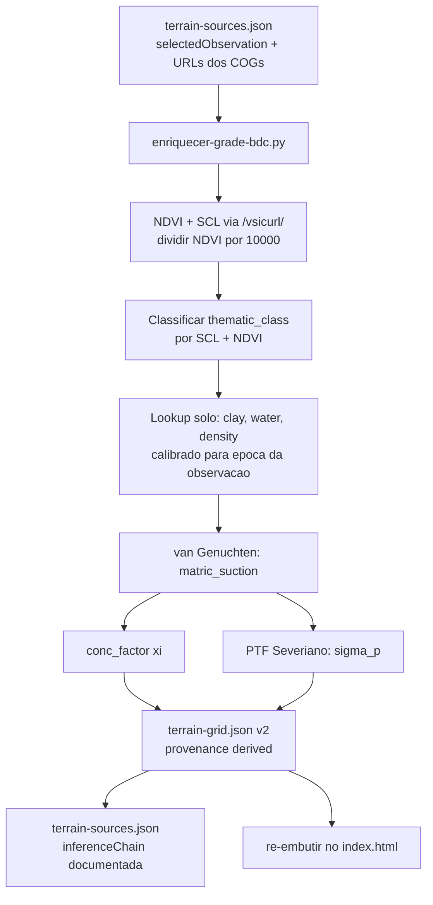

# Sprint 4: Inferencia de Parametros de Solo via BDC — Design

**Spec**: [spec.md](spec.md)
**Status**: Draft

---

## Architecture Overview

A Sprint 4 e composta por uma unica camada de trabalho:

**Preprocessing offline** (Python): script que le a observacao de referencia do manifesto, amostra NDVI e SCL dos COGs do BDC via HTTP, aplica a cadeia de inferencia por celula e produz `terrain-grid.json` enriquecido com variaveis de solo derivadas e documentadas. O resultado e re-embutido no `index.html` para que o HUD da Sprint 3 exiba valores reais.



---

## Components

### Terrain Enrichment Script

- **Purpose**: Enriquecer `terrain-grid.json` com variaveis de solo derivadas de NDVI e SCL do BDC, usando a observacao definida no manifesto como entrada fixa.
- **Location**: `prototipo/scripts/enriquecer-grade-bdc.py`
- **Interfaces**:
  - Entrada: `prototipo/data/terrain-sources.json` (selectedObservation com URLs dos COGs embutidas), `prototipo/data/terrain-grid.json` (grade atual)
  - Saida: `prototipo/data/terrain-grid.json` (atualizado), `prototipo/data/terrain-sources.json` (atualizado com inferenceChain)
- **Dependencies**: `rasterio`, `numpy`, `pyproj` (ambiente `geologia` via pyenv)

---

## Inference Chain (Script Offline)

### Passo 1 — Carregar observacao de referencia

Ler `terrain-sources.json` e extrair `sources.bdc.selectedObservation`. As URLs dos assets NDVI e SCL ja estao dentro deste objeto — o script nao precisa consultar `bdc-paladino-7km-items.json`.

A selecao da observacao nao e responsabilidade deste script. A `selectedObservation` e a entrada fixa do pipeline. Toda etapa subsequente usa os COGs dessa mesma observacao.

```python
with open("prototipo/data/terrain-sources.json") as f:
    sources = json.load(f)
obs = sources["sources"]["bdc"]["selectedObservation"]
# obs.itemId, obs.datetime, obs.cloudCover, obs.assets.NDVI, obs.assets.SCL
ndvi_url = obs["assets"]["NDVI"]
scl_url  = obs["assets"]["SCL"]
```

### Passo 2 — Amostrar NDVI e SCL por celula

COGs acessados via HTTP com prefixo `/vsicurl/` — sem download total do arquivo. Para cada uma das 49 celulas, o pixel do centro e amostrado usando `rasterio.sample()`, que faz leitura por janela e evita carregar a banda inteira na memoria.

**Escala de NDVI no BDC**: valores armazenados como inteiros ×10000. Dividir por 10000 antes de qualquer classificacao.

```python
import rasterio
from pyproj import Transformer

with rasterio.open(f"/vsicurl/{ndvi_url}") as src_ndvi, \
     rasterio.open(f"/vsicurl/{scl_url}")  as src_scl:

    t_ndvi = Transformer.from_crs("EPSG:4326", src_ndvi.crs, always_xy=True)
    t_scl  = Transformer.from_crs("EPSG:4326", src_scl.crs,  always_xy=True)

    # Coordenadas reprojetadas para cada COG
    coords_ndvi = [t_ndvi.transform(c["center"]["lng"], c["center"]["lat"]) for c in cells]
    coords_scl  = [t_scl.transform(c["center"]["lng"],  c["center"]["lat"]) for c in cells]

    # sample() le apenas os pixels necessarios — sem carregar a banda inteira
    ndvi_samples = [v[0] for v in src_ndvi.sample(coords_ndvi)]
    scl_samples  = [v[0] for v in src_scl.sample(coords_scl)]

    for cell, ndvi_raw, scl_raw in zip(cells, ndvi_samples, scl_samples):
        ndvi_val = ndvi_raw / 10000.0   # escala BDC: inteiro x10000
        scl_val  = int(scl_raw)         # sem rescale
```

### Passo 3 — Classificar thematic_class

| SCL | NDVI | thematic_class | Notas |
| --- | --- | --- | --- |
| 4 (vegetacao) | >= 0.5 | `vegetation_dense` | cerrado nativo ou lavoura densa |
| 4 (vegetacao) | < 0.5 | `vegetation_sparse` | pastagem ou lavoura em desenvolvimento |
| 5 (solo exposto) | qualquer | `bare_soil` | campo colhido ou preparado |
| 6 (agua) | qualquer | `water` | corpo d'agua: variaveis de solo inaplicaveis |
| 0,1,2,3,7,8,9,10,11 | qualquer | `null` | nuvem, sombra ou dado invalido |

**Proveniencia**:
- `vegetation_dense`, `vegetation_sparse`, `bare_soil`: campos de solo derivados com provenencia `"derived"`
- `water`: campos de solo `null` com provenencia `"unavailable"` — fisicamente inaplicavel, nao confundir com ausencia por nuvem
- `null` (SCL invalido): todos os campos `null` com provenencia `"unavailable"`

**Gravacao em dois campos**: `thematic_class` derivada deve ser gravada em:
1. `thematicClass.value` — campo de nivel raiz da celula em `terrain-grid.json`
2. `terrainSnapshotBase.thematic_class` — campo dentro do snapshot de solo

### Passo 4 — Lookup de variaveis de solo

Calibrado para Latossolo Vermelho-Amarelo, oeste da Bahia, para a epoca da `selectedObservation` (ref. Imhoff et al. 2004; Severiano et al. 2013).

> **Dependencia de epoca**: os valores de `water_content` abaixo sao validos para o final do periodo chuvoso (marco), que corresponde a `selectedObservation` atual (`S2-16D_V2_030019_20260306`). Se a observacao for trocada para outro periodo (ex: setembro, estacao seca), este lookup deve ser recalibrado antes de re-executar o script.

```python
SOIL_LOOKUP = {
    "vegetation_dense": {   # cerrado nativo ou lavoura densa
        "clay_content":  0.45,   # fracao (45%)
        "water_content": 0.35,   # m3/m3 — final periodo umido (marco)
        "bulk_density":  1.15,   # Mg/m3 — solo nao perturbado
    },
    "vegetation_sparse": {  # pastagem ou lavoura em desenvolvimento
        "clay_content":  0.35,
        "water_content": 0.28,
        "bulk_density":  1.30,
    },
    "bare_soil": {          # campo colhido ou preparado
        "clay_content":  0.30,
        "water_content": 0.18,
        "bulk_density":  1.45,
    },
    "water": {              # corpo d'agua — solo inaplicavel
        "clay_content":  None,
        "water_content": None,
        "bulk_density":  None,
    },
}
```

### Passo 5 — matric_suction via van Genuchten simplificado

Parametros para Latossolo (Tomasella & Hodnett 1996): theta_r=0.10, theta_s=0.50, alpha=0.05 kPa^-1, n=1.8.

Se `water_content` estiver fora dos limites fisicos da curva, fixa nos extremos antes de calcular.

```python
def matric_suction_kpa(theta, theta_r=0.10, theta_s=0.50, alpha=0.05, n=1.8):
    Se = (theta - theta_r) / (theta_s - theta_r)
    Se = max(Se, 1e-6)          # fixar no minimo fisico
    Se = min(Se, 1.0 - 1e-6)   # fixar no maximo fisico
    m = 1 - 1/n
    h = (1/alpha) * (Se**(-1/m) - 1)**(1/n)
    return round(h, 1)
```

Valores de referencia para as tres classes de solo desta sprint (calculados com os parametros acima):
- `vegetation_dense` (theta=0.35): h ≈ 28.4 kPa
- `vegetation_sparse` (theta=0.28): h ≈ 49.1 kPa
- `bare_soil` (theta=0.18): h ≈ 147.3 kPa

### Passo 6 — conc_factor (xi de Froehlich)

```python
def conc_factor(suction_kpa):
    if suction_kpa < 20:   return 3.0   # solo umido
    if suction_kpa < 50:   return 4.0
    if suction_kpa < 150:  return 5.0
    return 6.0                           # solo seco
```

### Passo 7 — sigma_p via PTF Severiano 2013

Equacoes por faixa de argila (Severiano et al. 2013, Latossolos brasileiros):

```python
def sigma_p_severiano(clay_fraction, suction_kpa):
    c = clay_fraction * 100   # converter para %
    if c < 20:    return round(129.0 * suction_kpa ** 0.15, 1)
    elif c < 31:  return round(123.3 * suction_kpa ** 0.13, 1)
    elif c < 41:  return round(119.2 * suction_kpa ** 0.11, 1)
    elif c < 52:  return round(88.3  * suction_kpa ** 0.13, 1)
    else:         return round(62.7  * suction_kpa ** 0.15, 1)
```

---

## Output: terrain-grid.json v2

Estrutura de cada celula apos o enriquecimento (exemplo para `vegetation_dense`):

```json
{
  "cellId": "R3C3",
  "datasetVersion": "2026-04-05-paladino-bdc-7km-v2",
  "thematicClass": {
    "source": "bdc-scl-ndvi",
    "value": "vegetation_dense"
  },
  "terrainSnapshotBase": {
    "cell_id": "R3C3",
    "thematic_class": "vegetation_dense",
    "clay_content": 0.45,
    "water_content": 0.35,
    "matric_suction": 28.4,
    "bulk_density": 1.15,
    "conc_factor": 4.0,
    "sigma_p": 136.4
  },
  "provenance": {
    "thematic_class": "derived",
    "clay_content": "derived",
    "water_content": "derived",
    "matric_suction": "derived",
    "bulk_density": "derived",
    "conc_factor": "derived",
    "sigma_p": "derived"
  }
}
```

Celula com SCL invalido (nuvem) permanece inalterada com todos os campos `null` e provenencia `"unavailable"`.

Celula `water` tem `thematicClass.value = "water"` e `terrainSnapshotBase.thematic_class = "water"`, demais campos `null` com provenencia `"unavailable"`.

---

## Output: terrain-sources.json v2

Secao `inferenceChain` a ser adicionada:

```json
{
  "inferenceChain": {
    "observation_item_id": "S2-16D_V2_030019_20260306",
    "observation_date": "2026-03-06",
    "observation_season": "final do periodo chuvoso (marco)",
    "assets_used": ["NDVI", "SCL"],
    "ndvi_scale_factor": 10000,
    "classification": "SCL + NDVI threshold (SCL=4 NDVI>=0.5 -> vegetation_dense; SCL=4 NDVI<0.5 -> vegetation_sparse; SCL=5 -> bare_soil; SCL=6 -> water; demais -> null)",
    "soil_lookup_reference": "Imhoff et al. 2004; Latossolo Vermelho-Amarelo, oeste Bahia",
    "soil_lookup_epoch_note": "Valores de water_content calibrados para o final do periodo chuvoso. Trocar a observacao por outra epoca exige recalibrar o lookup.",
    "van_genuchten_params": {
      "source": "Tomasella & Hodnett 1996",
      "theta_r": 0.10,
      "theta_s": 0.50,
      "alpha": 0.05,
      "n": 1.8
    },
    "sigma_p_ptf": "Severiano et al. 2013",
    "conc_factor_rule": "3.0 (suction<20kPa) / 4.0 (<50kPa) / 5.0 (<150kPa) / 6.0 (>=150kPa)"
  },
  "fieldProvenance": {
    "_note": "Proveniencia metodologica global do dataset. Proveniencia real de cada campo e registrada por celula em terrain-grid.json.",
    "thematic_class": "derived",
    "clay_content": "derived",
    "water_content": "derived",
    "matric_suction": "derived",
    "bulk_density": "derived",
    "conc_factor": "derived",
    "sigma_p": "derived"
  }
}
```

---

## Error Handling

| Cenario | Tratamento |
| --- | --- |
| COG inacessivel via HTTP | Log de erro por celula, campo permanece `null`, provenencia `unavailable` |
| Celula com SCL de nuvem/sombra | Todos os campos permanecem `null`, provenencia `unavailable` |
| Celula `water` (SCL=6) | `thematic_class = "water"`, variaveis de solo `null`, provenencia `unavailable` |
| `water_content` fora dos limites fisicos | Fixar em `theta_r` ou `theta_s` antes de calcular `matric_suction` |
| Todas as celulas com `sigma_p` null | Script encerra com erro diagnostico claro sem gravar `terrain-grid.json` |
| `assets.NDVI` ou `assets.SCL` ausentes em `terrain-sources.json` | Script encerra com erro claro indicando qual campo esta faltando |

---

## Tech Decisions

| Decisao | Escolha | Justificativa |
| --- | --- | --- |
| Entrada do pipeline | `selectedObservation` de `terrain-sources.json` | Garante consistencia de epoca em todo o pipeline; a selecao da observacao e decisao anterior ao script |
| Acesso ao COG | `/vsicurl/` via rasterio | Evita download total; amostra apenas pixels dos centros das 49 celulas |
| Escala NDVI | Dividir por 10000 | BDC armazena NDVI como inteiro x10000 para compressao |
| Gravacao de thematic_class | Dois campos: `thematicClass.value` e `terrainSnapshotBase.thematic_class` | Preserva contrato do schema da Sprint 2 em ambos os lugares onde o campo existe |
| PTF de sigma_p | Severiano 2013 | Documentada no projeto, calibrada para Latossolos brasileiros |
| Lookup de solo | Calibrado para epoca da observacao | Dependencia explicita: trocar observacao exige recalibrar lookup |
| Re-embed do dataset | Bloco JSON inline no HTML | Mantem compatibilidade com abertura local sem servidor |
| Validacao de escrita | Checar > 80% de celulas com sigma_p > 0 antes de gravar | Previne gravacao de dataset corrompido em caso de falha total de acesso aos COGs |

---

## Requirement Mapping

| Requirement ID | Design Coverage |
| --- | --- |
| S4INF-01 | Passo 1 — Carregar observacao de `selectedObservation` |
| S4INF-02 | Passo 2 — Amostrar NDVI/SCL com escala /10000 |
| S4INF-03 | Passo 3 — SCL=4, NDVI>=0.5 → vegetation_dense |
| S4INF-04 | Passo 3 — SCL=4, NDVI<0.5 → vegetation_sparse |
| S4INF-05 | Passo 3 — SCL=5 → bare_soil |
| S4INF-06 | Passo 3 — SCL=6 → water, provenencia unavailable |
| S4INF-07 | Passo 3 — SCL invalido → null, provenencia unavailable |
| S4INF-08 | Passo 3 + 4 — thematic_class em dois campos; lookup calibrado por epoca |
| S4INF-09 | Passo 5 — van Genuchten para matric_suction |
| S4INF-10 | Passo 6 — conc_factor por faixa de suction |
| S4INF-11 | Passo 7 — sigma_p via PTF Severiano 2013 |
| S4INF-12 | Output terrain-grid.json v2 — provenencia derived |
| S4INF-13 | Output terrain-sources.json — inferenceChain com nota de dependencia de epoca |
| S4INF-14 | Re-embed: datasetVersion v2 no index.html |
| S4INF-15 | HUD exibe valores derivados para celulas classificadas |
| S4INF-16 | Invalidacao de sessao com datasetVersion anterior |
| S4INF-17 | Celulas com SCL invalido: HUD exibe ausencia sem valor fabricado |
| S4INF-18 | index.html funciona localmente sem servidor nem rede |
