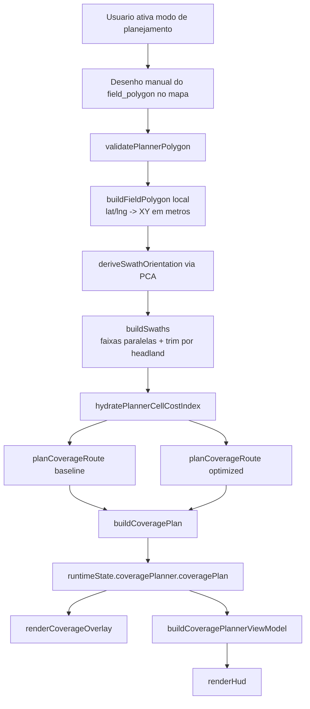

# Sprint 6: Planejamento de Cobertura com Custo de Compactacao - Design

**Spec**: [spec.md](spec.md)
**Status**: Validated

---

## Escopo do design

Todo o codigo novo vive em `prototipo/index.html`, arquivo unico, sem build e sem
dependencias externas novas. O design segue os padroes ja estabelecidos no
runtime: funcoes puras sempre que possivel, estado global em `runtimeState`,
Leaflet nativo para overlays, camelCase e sem classes.

O planner desta sprint e inspirado no Soil2Cover, mas nao replica o pipeline
completo de `dual-graph + optimizer`. O MVP usa:

1. desenho manual de um talhao simples no mapa
2. geracao de `swaths` paralelas dentro desse talhao
3. duas heuristicas deterministicas de cobertura sobre o mesmo conjunto de `swaths`
4. custo agronomico agregado na grade operacional ja existente

---

## Arquitetura: fluxo de dados



---

## Decisoes de design explicitadas

### D1 - Sem `leaflet-draw` e sem bibliotecas geometricas externas
O desenho do talhao sera implementado com Leaflet nativo:

- `map.on("click")` para adicionar vertices
- `L.polyline` para o rascunho aberto
- `L.polygon` para o talhao finalizado
- botoes explicitos no HUD para iniciar, fechar e cancelar o desenho

Isso evita dependencia nova e preserva o carater offline do `index.html`.

### D2 - O planner nao persiste em `localStorage` na Sprint 6
`field_polygon`, `coverage_plan`, `draft_vertices` e overlays do planner ficam
apenas em `runtimeState`. O plano desaparece em reload e nao entra no export da
missao nesta sprint.

Motivo:
- o spec nao exige persistencia do planner
- isso evita churn desnecessario no schema da missao
- reduz o risco de misturar estado de navegacao/coleta com estado de planejamento

### D3 - `working_width_m` entra no contrato do trator
`working_width_m` e um novo campo retornado por `getActiveTractorConfig()`.

Default do MVP:
- `working_width_m: 6.0`

O planner usa esse valor como largura operacional do conjunto trator +
implemento. Como o runtime ja persiste `active_tractor_config` e
`tractor_snapshot`, esse campo passara a circular automaticamente nos snapshots
de missao, mas o planner em si continuara runtime-only.

### D4 - Geometria em sistema local metrico
Toda a geometria do planner sera calculada em um sistema local XY em metros,
ancorado no centro da fazenda ou do manifesto atual:

- `x`: deslocamento leste-oeste
- `y`: deslocamento norte-sul

Conversao:
- mesma aproximacao local ja usada por `moveForward()`
- `METERS_PER_DEGREE_LAT`
- fator de longitude corrigido por `cos(lat0)`

Isso evita usar formulas geodesicas pesadas e e suficiente para o recorte de 7 km
da demo.

### D5 - `headland` simplificado com geometria explicita
Nao havera buffer topologico completo do poligono. Em vez disso, o planner
constroi uma geometria explicita de `headland` em duas camadas:

- `outer_ring`: o proprio contorno do `field_polygon`
- `inner_ring`: um pseudo-offset interno gerado por contracao heuristica dos
  vertices em direcao ao centroide
- `path_ring`: anel usado nas transicoes; usa `inner_ring` quando a contracao
  for valida e faz fallback para `outer_ring` quando nao for

Regras:

- o `headland_width_m` e sempre `working_width_m` como largura nominal do
  `headland`
- os `swaths` sao gerados dentro do poligono e podados nas extremidades por
  `headland_width_m`
- as transicoes usam `headland.path_ring`, nao mais o contorno bruto do talhao
- o overlay do `headland` sera renderizado como banda entre `outer_ring` e
  `inner_ring`; se o `inner_ring` falhar, o fallback visual e um stroke espesso
  sobre o `outer_ring`

Resultado:
- o planner respeita a ideia de manobras no headland
- o `headland` passa a existir como artefato renderizavel e parte explicita do
  plano
- sem precisar implementar offset poligonal robusto para poligonos concavos

### D6 - O custo agronomico usa um proxy por celula, nao simulacao Soil2Cover completa
O custo de compactacao nao vai recalcular um SoilFlex completo para cada candidato
de rota. Em vez disso, cada celula operacional recebe um `penalty_per_m`
precomputado a partir de:

1. terreno base da Sprint 4
2. motor da Sprint 5 na camada de referencia `20-30 cm`
3. `compaction_accumulator` atual da missao

O proxy usa a camada `20-30 cm` por ser a aproximacao mais proxima da referencia
do paper a 20 cm abaixo do centro do pneu.

### D7 - O historico entra no custo via amplificacao de repeticao
Como a Sprint 5 ainda nao fecha feedback completo de `sigma_p` a partir do estado
acumulado, o planner desta sprint usa o historico de forma monotonicamente
penalizante:

- celula ja mais trafegada custa mais
- repetir a mesma celula dentro do plano atual custa progressivamente mais

Isto captura o comportamento desejado para o MVP: evitar retrafego em areas ja
sensiveis, principalmente em transicoes e headlands.

### D8 - Baseline e otimizada compartilham a mesma cobertura
As duas rotas usam o mesmo `field_polygon`, a mesma orientacao e o mesmo conjunto
de `swaths`. O que muda e apenas:

- funcao de custo
- ordem/orientacao escolhida para cobrir as faixas

Isso garante comparacao justa de comprimento e custo.

### D9 - Heuristica deterministica em vez de otimizador global
O planner nao usara OR-Tools, TSP solver ou branch-and-bound. A cobertura sera
resolvida por uma heuristica greedy deterministica:

1. estado atual -> swath nao visitada mais barata
2. escolha entre `A->B` ou `B->A`
3. atualiza custo simulado de repeticao
4. repete ate visitar todas as `swaths`

Nao garante otimo global, mas e simples, offline, implementavel em JS puro e
suficiente para uma demo do conceito.

### D10 - Desenho do talhao pausa a navegacao do trator
Durante `mode === "drawing"`:

- a velocidade do trator e forcada para `0`
- o input por setas e ignorado
- a missao nao gera novas amostras

Sem isso, o mapa continuaria recentralizando enquanto o usuario tenta clicar os
vertices do talhao.

### D11 - Mudanca de entrada invalida o plano calculado
O `coverage_plan` nunca pode sobreviver a mudanca de uma entrada estrutural do
planner.

Regras:

- alterar `working_width_m` limpa imediatamente `coverage_plan`, metricas e
  overlays de rota
- concluir um novo `field_polygon` sempre substitui o poligono anterior e limpa
  qualquer plano existente
- `startFieldDrawing()` nao apaga o plano atual; ele entra em modo de rascunho
  e o plano atual so e descartado quando `finishFieldDrawing()` concluir com
  sucesso
- `cancelFieldDrawing()` descarta apenas `draft_vertices` e restaura o estado
  anterior (`planned`, `polygon-ready` ou `idle`)

Isto fecha o contrato do spec: mudar o talhao ou a largura operacional exige
recalculo obrigatorio.

---

## Estruturas de dados novas

### `runtimeState.coveragePlanner`

```javascript
coveragePlanner: {
  mode: "idle",              // "idle" | "drawing" | "polygon-ready" | "planned"
  overlay_mode: "optimized", // "baseline" | "optimized"
  working_width_m: 6.0,
  draft_vertices: [],        // LatLng[]
  field_polygon: null,       // FieldPolygon | null
  coverage_preview: null,    // CoveragePreview | null
  coverage_plan: null,       // CoveragePlan | null
  status_message: null,
  paused_tractor: false
}
```

### `FieldPolygon`

```javascript
{
  id: "field-...",
  vertices_latlng: [{ lat, lng }, ...],  // sem repetir o primeiro ponto no fim
  vertices_xy: [{ x, y }, ...],          // mesma ordem em metros
  centroid_xy: { x, y },
  centroid_latlng: { lat, lng },
  area_m2: 182345.2,
  perimeter_m: 2411.8,
  bbox_xy: { minX, minY, maxX, maxY },
  winding: "ccw"
}
```

### `HeadlandGeometry`

```javascript
{
  width_m: 6.0,
  outer_ring_xy: [{ x, y }, ...],
  outer_ring_latlng: [{ lat, lng }, ...],
  inner_ring_xy: [{ x, y }, ...] | null,
  inner_ring_latlng: [{ lat, lng }, ...] | null,
  path_ring_xy: [{ x, y }, ...],
  path_ring_latlng: [{ lat, lng }, ...],
  render_mode: "band" | "outer-stroke-fallback"
}
```

### `Swath`

```javascript
{
  id: "swath-12",
  index: 12,
  scan_index: 7,  // ordem da linha de varredura
  start_xy: { x, y },
  end_xy: { x, y },
  start_latlng: { lat, lng },
  end_latlng: { lat, lng },
  start_anchor_xy: { x, y },
  end_anchor_xy: { x, y },
  length_m: 318.4,
  sample_cells: [
    { cell_id: "paladino-r4-c3", length_m: 120.0, availability: "derived" },
    { cell_id: "paladino-r4-c4", length_m: 198.4, availability: "derived" }
  ]
}
```

### `RouteSegment`

```javascript
{
  type: "entry" | "transition" | "swath",
  swath_id: "swath-12" | null,
  polyline_xy: [{ x, y }, ...],
  polyline_latlng: [{ lat, lng }, ...],
  length_m: 152.7,
  compaction_cost: 43.1,
  sample_cells: [
    { cell_id: "paladino-r4-c4", length_m: 80.0 },
    { cell_id: "paladino-r4-c5", length_m: 72.7 }
  ]
}
```

### `RoutePlan`

```javascript
{
  mode: "baseline" | "optimized",
  swath_order: [
    { swath_id: "swath-1", direction: "ab" },
    { swath_id: "swath-2", direction: "ba" }
  ],
  segments: [RouteSegment, ...],
  total_length_m: 4218.2,
  total_compaction_cost: 812.4,
  revisited_cell_hits: 19
}
```

### `CoveragePlan`

```javascript
{
  field_polygon: FieldPolygon,
  headland: HeadlandGeometry,
  origin_latlng: { lat, lng },
  origin_xy: { x, y },
  working_width_m: 6.0,
  headland_width_m: 6.0,
  swath_orientation_deg: 34.2,
  swaths: [Swath, ...],
  baseline_route: RoutePlan,
  optimized_route: RoutePlan,
  metrics: {
    swath_count: 34,
    baseline_length_m: 4218.2,
    optimized_length_m: 4386.0,
    baseline_compaction_cost: 1034.8,
    optimized_compaction_cost: 781.5,
    delta_length_pct: 3.98,
    delta_compaction_pct: -24.48,
    baseline_revisited_cell_hits: 27,
    optimized_revisited_cell_hits: 14,
    unavailable_length_m: 112.0
  }
}
```

### `PlannerCellCost`

```javascript
{
  "paladino-r4-c4": {
    availability: "derived",           // "derived" | "unavailable"
    base_bulk_density: 1.38,
    accumulated_bulk_density: 1.42,
    base_delta_bd_20_30: 0.018,
    historical_pass_count: 3,
    penalty_per_m: 0.144
  }
}
```

---

## Novos componentes e responsabilidades

### Planner HUD Panel

Novo bloco textual no HUD, abaixo do controle de mapa BDC e acima ou junto do
bloco de missao.

Campos e controles:

- `working_width_m` em `input[type=number]`
- botao `Iniciar talhao`
- botao `Fechar talhao`
- botao `Cancelar desenho`
- botao `Gerar plano`
- botao `Limpar plano`
- botao de visualizacao `Ver baseline` / `Ver otimizada`
- status textual do planner
- metricas resumidas do plano ativo

Regras:
- o DOM do painel deve ser preconstruido
- `renderHud()` atualiza apenas valor, estado disabled e classes
- o painel nao substitui o HUD existente; e apenas mais um bloco

### Planner Overlay Layer Group

Usar um `L.layerGroup()` dedicado ao planner, com subcamadas:

- `draftVerticesLayer`
- `fieldPolygonLayer`
- `swathLayer`
- `baselineRouteLayer`
- `optimizedRouteLayer`
- `originMarkerLayer`

Isso permite limpar o planner sem tocar no overlay BDC nem no restante do mapa.

### Geometry Utilities

Conjunto de helpers puros em JS:

- `projectLatLng(latLng, originLat)`
- `unprojectXY(xy, originLat)`
- `rotatePoint(xy, angleRad)`
- `computePolygonArea(verticesXY)`
- `computePolygonCentroid(verticesXY)`
- `detectSelfIntersection(verticesXY)`
- `pointToSegmentDistance(pointXY, segmentStartXY, segmentEndXY)`
- `closestPointOnSegment(pointXY, aXY, bXY)`
- `samplePolyline(polylineXY, stepM)`

### Planner Cost Index

Cache por celula operacional precomputado ao gerar o plano:

- usa `terrainGrid.cells`
- usa `buildCompactionProfile()` + `runCompactionMotor()` sobre o snapshot base da
  celula
- le `runtimeState.mission.compaction_accumulator`
- produz `PlannerCellCost`

---

## Algoritmos e funcoes novas

### `buildFieldPolygon(verticesLatLng, workingWidthM)`

Responsavel por validar e normalizar o poligono desenhado.

**Entrada**:
- `verticesLatLng` sem fechamento duplicado
- `workingWidthM`

**Validacoes**:
- pelo menos 3 vertices distintos
- todos os vertices dentro de `terrainManifest.areaBounds` ou `terrainGrid.bounds`
- sem auto-interseccao
- area suficiente para pelo menos uma faixa util

**Normalizacao**:
- projeta vertices para XY
- garante winding `ccw`
- calcula area, centroide, bbox e perimetro

```javascript
function buildFieldPolygon(verticesLatLng, workingWidthM) {
  const bounds = runtimeState.terrainManifest
    ? runtimeState.terrainManifest.areaBounds
    : runtimeState.terrainGrid.bounds;

  if (!verticesLatLng.every(function(vertex) { return isInsideBounds(vertex, bounds); })) {
    throw new Error("Talhao fora do recorte operacional.");
  }

  const verticesXY = verticesLatLng.map(projectLatLng);
  if (verticesXY.length < 3) throw new Error("Talhao com vertices insuficientes.");
  if (detectSelfIntersection(verticesXY)) throw new Error("Talhao auto-intersectante.");

  const area = Math.abs(computePolygonArea(verticesXY));
  if (area < workingWidthM * workingWidthM) {
    throw new Error("Talhao menor do que a largura operacional minima.");
  }

  const winding = computePolygonArea(verticesXY) >= 0 ? "ccw" : "cw";
  const normalizedXY = winding === "ccw" ? verticesXY : verticesXY.slice().reverse();
  const normalizedLatLng = winding === "ccw" ? verticesLatLng : verticesLatLng.slice().reverse();

  return {
    id: createId("field"),
    vertices_latlng: normalizedLatLng,
    vertices_xy: normalizedXY,
    centroid_xy: computePolygonCentroid(normalizedXY),
    centroid_latlng: unprojectXY(computePolygonCentroid(normalizedXY)),
    area_m2: area,
    perimeter_m: computePerimeter(normalizedXY),
    bbox_xy: computeBoundingBox(normalizedXY),
    winding: "ccw"
  };
}
```

### `buildHeadlandGeometry(fieldPolygon, headlandWidthM)`

Constroi a representacao explicita do `headland`.

**Heuristica do `inner_ring`**:
1. para cada vertice `v`, calcular o vetor `centroid - v`
2. mover `v` em direcao ao centroide por `min(headlandWidthM, dist(v, centroid) * 0.45)`
3. formar um anel interno com os vertices contraidos
4. validar:
   - sem auto-interseccao
   - area positiva
   - area do anel interno menor do que a do poligono externo

**Fallback**:
- se a contracao falhar, `inner_ring = null`
- `path_ring = outer_ring`
- `render_mode = "outer-stroke-fallback"`

```javascript
function buildHeadlandGeometry(fieldPolygon, headlandWidthM) {
  const centroid = fieldPolygon.centroid_xy;
  const innerRingXY = fieldPolygon.vertices_xy.map(function(vertex) {
    const dx = centroid.x - vertex.x;
    const dy = centroid.y - vertex.y;
    const distance = Math.hypot(dx, dy);
    const step = Math.min(headlandWidthM, distance * 0.45);
    if (distance <= 1e-6 || step <= 0) {
      return { x: vertex.x, y: vertex.y };
    }
    return {
      x: vertex.x + (dx / distance) * step,
      y: vertex.y + (dy / distance) * step
    };
  });

  const validInnerRing =
    !detectSelfIntersection(innerRingXY) &&
    Math.abs(computePolygonArea(innerRingXY)) > 1 &&
    Math.abs(computePolygonArea(innerRingXY)) < Math.abs(computePolygonArea(fieldPolygon.vertices_xy));

  return {
    width_m: headlandWidthM,
    outer_ring_xy: fieldPolygon.vertices_xy,
    outer_ring_latlng: fieldPolygon.vertices_latlng,
    inner_ring_xy: validInnerRing ? innerRingXY : null,
    inner_ring_latlng: validInnerRing ? innerRingXY.map(unprojectXY) : null,
    path_ring_xy: validInnerRing ? innerRingXY : fieldPolygon.vertices_xy,
    path_ring_latlng: validInnerRing ? innerRingXY.map(unprojectXY) : fieldPolygon.vertices_latlng,
    render_mode: validInnerRing ? "band" : "outer-stroke-fallback"
  };
}
```

### `deriveSwathOrientation(fieldPolygon)`

Usa PCA simples sobre os vertices do poligono em XY.

Passos:
- centralizar vertices no centroide
- calcular matriz de covariancia `2x2`
- pegar autovetor do maior autovalor
- converter para angulo em graus

Esse angulo vira a direcao longitudinal das faixas.

### `buildSwaths(fieldPolygon, workingWidthM, headlandWidthM, orientationDeg)`

**Decisao**: os `swaths` sao gerados por varredura em coordenadas rotacionadas.

Passos:
1. rotacionar o poligono por `-orientation`
2. calcular `usableYMin = minY + headlandWidthM + workingWidthM / 2`
3. calcular `usableYMax = maxY - headlandWidthM - workingWidthM / 2`
4. iterar `y` com passo `workingWidthM`
5. intersectar a linha horizontal `y = constante` com as arestas do poligono
6. ordenar interseccoes em `x`
7. formar intervalos internos `[x1, x2]`
8. podar cada intervalo em `headlandWidthM` nas duas extremidades
9. se o intervalo podado continuar positivo, vira uma `swath`
10. rotacionar de volta para XY/origem geografica

**Observacao importante**:
- poligonos concavos podem gerar mais de um intervalo no mesmo `scan_index`
- cada intervalo valido vira uma `swath` independente

### `attachSwathAnchors(swaths, headland)`

Para cada endpoint de `swath`:

- achar o ponto mais proximo sobre `headland.path_ring`
- registrar esse ponto como `start_anchor_xy` ou `end_anchor_xy`

O segmento endpoint -> anchor atravessa apenas o `headland` simplificado.

### `hydratePlannerCellCostIndex()`

Precomputa custo agronomico por celula operacional.

**Camada de referencia**:
- indice `2` do perfil: `20-30 cm`

**Procedimento**:
1. iterar `terrainGrid.cells`
2. construir `terrainSnapshotBase` da celula
3. executar `runCompactionMotor(getActiveTractorConfig(), snapshotBase)`
4. extrair camada `20-30 cm`
5. ler acumulado atual da missao na mesma celula
6. calcular `penalty_per_m`

**Formula do proxy**:

```javascript
const baseBulkDensity = layer20.bulk_density || null;
const accumulatedBulkDensity = accLayer ? accLayer.bulk_density_estimated : baseBulkDensity;
const accumulatedDelta = accumulatedBulkDensity && baseBulkDensity
  ? Math.max(0, accumulatedBulkDensity - baseBulkDensity)
  : 0;
const historicalPassCount = accCell ? accCell.pass_count : 0;
const baseDelta = layer20.delta_bulk_density || 0;

penalty_per_m = (baseDelta + accumulatedDelta) * (1 + historicalPassCount);
```

**Celulas `water` ou `unavailable`**:
- nao bloqueiam o planner
- recebem `availability: "unavailable"`
- recebem penalidade alta, mas finita

Regra:

```javascript
unavailablePenalty = maxDerivedPenalty > 0 ? maxDerivedPenalty * 3 : 1;
```

### `sampleSegmentCells(polylineXY, stepM)`

Converte qualquer segmento ou polilinha em contribuicoes por celula da grade.

**Passo fixo do MVP**:
- `stepM = 100`

Racional:
- a grade operacional tem 2 km
- 100 m e suficiente para detectar trocas de celula sem explodir o custo

Saida:
- consolidar por `cell_id`
- somar `length_m` por celula

### `estimatePolylineCompactionCost(sampleCells, costIndex, routePassState, workingWidthM)`

Calcula o custo prospectivo de uma polilinha.

`routePassState`:

```javascript
{
  "paladino-r4-c4": { covered_length_m: 260.0 }
}
```

Formula local por celula:

```javascript
equivalentPasses = Math.floor(covered_length_m / Math.max(workingWidthM, 1));
localCost = traversedLengthM * penalty_per_m * (1 + equivalentPasses);
```

Depois que um segmento entra na rota escolhida:

```javascript
routePassState[cellId].covered_length_m += traversedLengthM;
```

Isso faz o retrafego no mesmo `cell_id` ficar progressivamente mais caro dentro da
mesma rota, mesmo sem feedback completo de `sigma_p`.

### `buildBoundaryArc(headland, anchorA, anchorB, mode, routePassState)`

Como `headland.path_ring` e um anel simples, entre dois anchors existem apenas duas
possibilidades:

- arco horario
- arco anti-horario

Para a baseline:
- escolher o arco de menor comprimento

Para a otimizada:
- escolher o arco de menor `distance + compactionCost`

### `buildTransitionPolyline(currentPoint, currentAnchor, targetSwath, direction, headland, mode, routePassState)`

Monta uma transicao completa:

1. `currentPoint -> currentAnchor`
2. `boundary arc` em `headland.path_ring`
3. `targetAnchor -> targetSwath.start`

No primeiro passo do planner:
- `currentPoint` e a origem projetada do trator
- `currentAnchor` e o anchor mais proximo sobre o contorno do talhao

### `planCoverageRoute(swaths, origin, mode, plannerCellCostIndex)`

Heuristica greedy deterministica.

**Candidato**:
- cada `swath` nao visitada em duas orientacoes: `ab` e `ba`

**Score baseline**:

```javascript
score = transitionLengthM + swathLengthM;
```

**Score optimized**:

```javascript
distanceTerm = (transitionLengthM + swathLengthM) / distanceScale;
compactionTerm = (transitionCompactionCost + swathCompactionCost) / compactionScale;
score = distanceTerm + compactionTerm;
```

`distanceScale`:
- media dos comprimentos das `swaths`
- fallback `1`

`compactionScale`:
- media do custo agronomico bruto das `swaths`
- fallback `1`

**Desempate**:
- menor `swath.index`
- depois orientacao `ab` antes de `ba`

**Saida**:
- `RoutePlan`
- com segmentos completos, ordem das `swaths`, custo total e repeticao simulada

### `buildCoveragePlan(fieldPolygon, workingWidthM)`

Orquestrador principal:

```javascript
function buildCoveragePlan(fieldPolygon, workingWidthM) {
  const headlandWidthM = workingWidthM;
  const headland = buildHeadlandGeometry(fieldPolygon, headlandWidthM);
  const orientationDeg = deriveSwathOrientation(fieldPolygon);
  const swaths = buildSwaths(fieldPolygon, workingWidthM, headlandWidthM, orientationDeg);
  const swathsWithAnchors = attachSwathAnchors(swaths, headland);
  const costIndex = hydratePlannerCellCostIndex();
  const origin = projectLatLng(tractorState.position);

  const baselineRoute = planCoverageRoute(swathsWithAnchors, origin, "baseline", costIndex);
  const optimizedRoute = planCoverageRoute(swathsWithAnchors, origin, "optimized", costIndex);

  return {
    field_polygon: fieldPolygon,
    headland: headland,
    origin_latlng: tractorState.position,
    origin_xy: origin,
    working_width_m: workingWidthM,
    headland_width_m: headlandWidthM,
    swath_orientation_deg: orientationDeg,
    swaths: swathsWithAnchors,
    baseline_route: baselineRoute,
    optimized_route: optimizedRoute,
    metrics: buildCoverageMetrics(swathsWithAnchors, baselineRoute, optimizedRoute)
  };
}
```

---

## Integracao com o runtime atual

### Alteracoes em `runtimeState`

Adicionar:

```javascript
coveragePlanner: {
  mode: "idle",
  overlay_mode: "optimized",
  working_width_m: 6.0,
  draft_vertices: [],
  field_polygon: null,
  coverage_plan: null,
  status_message: null,
  paused_tractor: false
}
```

### Alteracoes em `getActiveTractorConfig()`

Adicionar:

```javascript
working_width_m: Number(runtimeState.coveragePlanner.working_width_m.toFixed(2))
```

### Novos handlers de UI

- `startFieldDrawing()`
- `finishFieldDrawing()`
- `cancelFieldDrawing()`
- `setPlannerWorkingWidth(value)`
- `clearCoveragePlan()`
- `generateCoveragePlan()`
- `setCoverageOverlayMode("baseline" | "optimized")`

Regras complementares:

- `setPlannerWorkingWidth(value)` valida numericamente o input; se o valor mudar,
  limpa `coverage_plan`, overlays e metricas, mas preserva `field_polygon`
- `finishFieldDrawing()` substitui `field_polygon`, limpa o plano anterior e deixa
  o planner em `mode = "polygon-ready"`
- `cancelFieldDrawing()` descarta so o rascunho em andamento
- `clearCoveragePlan()` descarta `coverage_plan` e `coverage_preview`, preservando
  apenas o `field_polygon` como entrada ativa para uma nova geracao

### Integracao com `attachKeyboardControls()`

Quando `runtimeState.coveragePlanner.mode === "drawing"`:

- ignorar `ArrowUp`, `ArrowDown`, `ArrowLeft`, `ArrowRight`
- manter tecla `D` de debug funcionando

### Integracao com o gameloop

No frame loop:

- se `paused_tractor`, forcar `tractorState.speedMps = 0`
- ainda renderizar mapa, HUD e overlays normalmente
- nao recalcular `coverage_plan` automaticamente

O planner recalcula apenas por acao explicita do usuario.

### Persistencia e export

Decisao da sprint:

- `coveragePlanner` nao entra em `createMission()`
- `buildMissionExport()` nao inclui `field_polygon` nem `coverage_plan`
- `resetMission()` nao precisa limpar nada alem de chamar `clearCoveragePlan()`

Excecao:
- `working_width_m` entra no `active_tractor_config` porque e um atributo do
  conjunto mecanico ativo

---

## Overlay e renderizacao

### Draft mode

- vertices: `L.circleMarker`
- rascunho: `L.polyline` tracejada

### Talhao final

- `L.polygon` com stroke forte e fill leve

### Headland

- se `headland.render_mode === "band"`:
  - `L.polygon([outerRing, innerRing])` para representar a banda do `headland`
- se `headland.render_mode === "outer-stroke-fallback"`:
  - `L.polyline(outerRing.concat([outerRing[0]]))` com `weight` alto e `opacity`
    reduzida para marcar o `headland` mesmo sem anel interno valido

### Swaths

- `L.polyline` fina, cor neutra

### Rotas

- baseline: cinza escuro tracejado
- otimizada: laranja solido
- quando `overlay_mode` destacar uma rota, a outra cai para opacidade baixa

### Origem

- `L.circleMarker` na posicao atual do trator usada para o plano

---

## View model do planner no HUD

Novo bloco em `buildHudViewModel()`:

```javascript
planner: {
  mode: "idle" | "drawing" | "polygon-ready" | "planned",
  working_width_m: "6.00 m",
  status: "...",
  swath_count: "34",
  baseline_length: "4218 m",
  optimized_length: "4386 m",
  baseline_compaction: "1034.8",
  optimized_compaction: "781.5",
  delta_length: "+4.0%",
  delta_compaction: "-24.5%",
  overlay_mode: "Rota otimizada"
}
```

O renderer:
- so troca `textContent`, `disabled` e classes
- nao recria botoes nem o bloco de metricas

---

## Riscos e limitacoes assumidas

- Nao ha garantia de otimo global; a heuristica e greedy e deterministica.
- O `headland` e uma aproximacao operacional, nao um buffer poligonal cientifico.
- O custo agronomico e agregado por celula de 2 km, portanto e mais coarse do que
  a geometria dos `swaths`.
- O planner usa uma proxy da camada `20-30 cm`; nao faz simulacao multicamada da
  rota completa.
- Poligonos muito concavos podem gerar varios intervalos por linha de varredura;
  o design suporta isso, mas a qualidade da rota nao sera equivalente a um solver
  global.

---

## Validacao esperada do design

Antes de criar `tasks.md`, a validacao do design deve confirmar:

- o runtime consegue desenhar talhao sem novas dependencias
- o `headland` existe como geometria explicita e renderizavel, nao apenas como
  largura escalar
- `working_width_m` tem dono claro no estado do trator/planner
- o algoritmo de `swaths` e implementavel com geometria local simples
- a baseline e a otimizada usam o mesmo conjunto de `swaths`
- o custo usa `solo base + acumulado atual` sem depender de feedback completo de
  `sigma_p`
- o planner nao interfere na missao nem na persistencia existente alem do campo
  `working_width_m`

---

## Validation Summary

**Date**: 2026-04-06

- O design foi revalidado contra a implementacao final em `prototipo/index.html`.
- O contrato de `runtimeState.coveragePlanner` foi harmonizado para incluir
  `coverage_preview`, refletindo o estado intermediario usado entre preview
  geometrico e plano final.
- A semantica final de `overlay_mode` foi fechada em `baseline | optimized`,
  sem o modo `both`, em linha com a interface entregue.
- O fluxo de descarte do plano foi consolidado como:
  `clearCoveragePlan()` remove preview, rotas e metricas, preservando o
  `field_polygon`.
- O ultimo bug funcional relevante da sprint foi o loop no anel do
  `headland.path_ring`; a correcao em `buildForwardRingArc()` removeu o
  `RangeError: Invalid array length` observado no browser ao gerar o plano.
