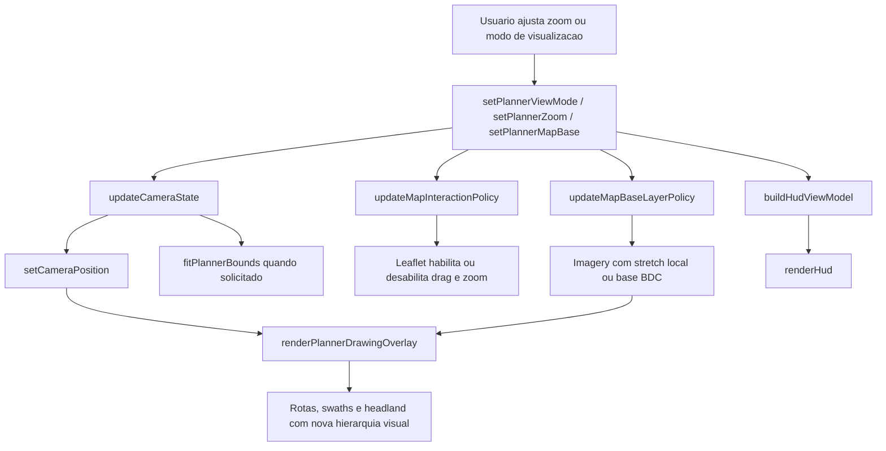

# Sprint 7: Visualizacao do Plano e Navegacao do Planner - Design

**Spec**: [spec.md](spec.md)
**Status**: Validated

---

## Escopo do design

Todo o codigo novo continua em `prototipo/index.html`, sem build e sem
dependencias externas novas. Esta sprint nao recalcula geometria, `swaths` nem
rotas da Sprint 6. O foco e tornar o plano legivel durante dois usos
complementares:

1. inspecao livre do talhao e da rota
2. conducao operacional com o trator em movimento e o plano ainda visivel

O problema principal a ser resolvido e visual:

- as linhas ficam muito proximas no zoom atual
- o mapa hoje segue o trator de forma rigida
- o provider de imagery nao pode receber zoom real acima do detalhe nativo
- mesmo assim o usuario precisa "abrir espaco" visual entre os vetores

Por isso, esta sprint adota como decisao central o **stretch local da imagery**
acima do zoom nativo, preservando o provider atual e deixando que os vetores do
Leaflet se afastem visualmente no canvas do mapa.

---

## Arquitetura: fluxo de dados



---

## Decisoes de design explicitadas

### D1 - Nao trocar o provider de satelite na Sprint 7
O provider atual de imagery permanece o mesmo da Sprint 6.

Motivo:

- o problema principal nao e falta de uma imagem nova, mas sim a ausencia de
  zoom visual util para separar os vetores
- trocar provider agora aumenta variaveis externas sem atacar o ponto central
- o prototipo ja possui `maxNativeZoom` conhecido e isso e suficiente para
  implementar stretch local acima do detalhe nativo

Consequencia:

- a Sprint 7 nao depende de credencial, contrato nem investigacao de novo
  provedor
- toda a solucao fica do lado do cliente Leaflet

### D2 - Zoom visual acima do nativo sera feito por stretch local
O runtime passa a distinguir dois limites:

- `imagery_native_zoom = 16`
- `visual_max_zoom = 18`

O mapa podera chegar a `18`, mas a layer de imagery continua presa ao ultimo
zoom nativo util. Acima de `16`, o que aumenta e apenas a escala visual do tile
no cliente.

Implementacao pretendida:

- `L.tileLayer(..., { maxNativeZoom: 16, maxZoom: 18 })`
- `L.map(..., { zoomSnap: 0.25, zoomDelta: 0.25 })`
- zoom fracionario para abrir espaco entre os vetores sem virar um borrado
  agressivo logo de uma vez

Resultado esperado:

- baseline, otimizada e `swaths` ficam mais afastadas na tela
- o provider nao recebe requisicoes "reais" acima do nativo
- a imagem continua imperfeita, mas suficientemente estavel para leitura do
  overlay

### D3 - O zoom do usuario passa a ser estado explicito
Hoje `setCameraPosition()` usa `map.getZoom()` de forma passiva. Isso mistura:

- o zoom que o usuario escolheu
- o zoom momentaneo da camera
- o follow do trator

Nesta sprint, o zoom deixa de ser lido implicitamente do mapa e passa a ser
guardado em estado.

Campos novos:

- `follow_zoom`
- `planner_zoom`

Regra:

- em `follow mode`, a camera recentraliza o trator usando `follow_zoom`
- em `planner view mode`, a camera usa `planner_zoom` e nao segue o trator

Isso fecha o requisito mais importante do uso operacional: o usuario pode
aproximar o mapa e continuar dirigindo sem que o zoom seja "corrigido" pelo
runtime.

### D4 - Dois modos de camera: `follow` e `planner`
O planner passa a ter dois modos de visualizacao distintos.

`follow`:

- camera continua centrada no trator
- `dragging` continua desabilitado
- zoom passa a ser permitido
- ideal para conduzir olhando a rota

`planner`:

- auto-follow desativado
- `dragging`, `scrollWheelZoom`, `doubleClickZoom` e `touchZoom` habilitados
- `fitBounds` disponivel
- ideal para inspecao do talhao

O modo padrao continua sendo `follow`.

### D5 - O HUD continua sendo a interface primaria de controle
Nao sera usado `L.control.zoom` nativo como controle principal. Os comandos de
camera e visualizacao entram no HUD do planner para manter a mesma linguagem da
interface atual.

Controles novos previstos:

- `Entrar no modo planner` / `Voltar ao follow`
- `Zoom +`
- `Zoom -`
- `Enquadrar plano`
- `Base: Satelite`
- `Base: BDC`
- `Ver baseline`
- `Ver otimizada`

O scroll wheel pode existir como atalho, mas o fluxo demonstravel precisa
funcionar so com os controles visiveis da interface.

Integracao com o runtime atual:

- o controle legado `btn-toggle-map` deixa de ser uma fonte concorrente de
  verdade para a base visual
- a Sprint 7 centraliza a selecao em `coveragePlanner.view.map_base`
- o botao legado passa a ser apenas um espelho da mesma origem de verdade, ou e
  absorvido pelo painel do planner
- nao pode haver dois estados independentes para "satelite vs BDC"

### D6 - A legibilidade sera resolvida por hierarquia visual forte, nao por mostrar tudo com o mesmo peso
O renderer atual usa pesos muito proximos entre `swaths`, baseline e rota
otimizada. Nesta sprint a camada visual passa a ter hierarquia real.

Regras:

- `field_polygon`: contorno fino amarelo, fill discreto
- `headland`: banda ambareada suave, sem competir com a rota
- `swaths`: linhas finas ciano-claro, baixa opacidade
- rota ativa: desenho em duas passadas
  - casing externa clara ou escura para contraste sobre imagery
  - linha interna colorida dominante
- baseline secundaria: stroke fino tracejado e opacidade baixa
- transicoes da rota ativa: mesma cor da rota, mas com `dashArray`
- origem do plano: marcador maior, com halo claro

Objetivo:

- o olho do usuario encontra primeiro a rota ativa
- as `swaths` continuam como malha de referencia
- o resto do plano nao some, mas deixa de competir pelo foco

### D7 - Em `follow mode`, a rota secundaria deixa de disputar atencao
Durante a conducao, a necessidade principal e seguir uma rota, nao comparar duas
ao mesmo tempo. Por isso:

- em `follow mode`, a rota secundaria sera escondida
- em `planner mode`, a rota secundaria permanece visivel em ghosted mode

Isto deixa o contrato explicito:

- comparacao entre baseline e otimizada continua disponivel em `planner mode`
- leitura operacional prioriza apenas a rota ativa em `follow mode`
- alternar a rota destacada continua sendo uma troca puramente visual, sem
  recalculo do plano

Isso reduz o "novelo" de linhas quando o usuario esta dirigindo e olhando o
proximo trecho da rota.

### D8 - A imagery sera suavemente rebaixada quando houver plano ativo
Mesmo com stretch local, imagery muito contrastada disputa leitura com os
vetores. O design introduz uma reducao controlada de contraste visual da base.

Implementacao pretendida:

- em `imagery` com plano ativo, `tileLayer.setOpacity(0.78)`
- em `planner view mode`, pode cair para `0.72`
- em `BDC`, a base continua em opacidade normal do overlay tematico

Isso nao substitui o zoom, mas ajuda bastante na leitura da rota.

Fallback obrigatorio:

- se a imagery emitir `tileerror`, o runtime marca `imagery_failed = true`
- se houver raster BDC disponivel, a base visual muda automaticamente para
  `bdc`
- o overlay do planner permanece intocado
- o HUD mostra estado diagnostico claro de fallback
- o usuario ainda pode tentar voltar para `imagery`, mas o sistema continua
  protegido contra falhas repetidas do provider

### D9 - `fitBounds` usa o envelope logico do plano
O enquadramento do planner nao sera feito no trator. Ele usa:

1. `coverage_plan.field_polygon` quando o plano existe
2. `field_polygon` quando ainda nao ha plano

Padding padrao:

- `32px` em todos os lados no desktop

O zoom calculado por `fitBounds` ainda e clampado por `visual_max_zoom`.

### D10 - Nenhuma alteracao no algoritmo de rotas da Sprint 6
Nenhuma destas funcoes muda de logica:

- `buildCoveragePreview()`
- `buildCoveragePlan()`
- `planCoverageRoute()`

A Sprint 7 e uma sprint de leitura, navegacao e visualizacao. Se a UX melhorar,
o algoritmo continua o mesmo.

---

## Estruturas de dados novas e alteradas

### `runtimeState.coveragePlanner`

O estado atual da Sprint 6 ganha um subestado de visualizacao.

```javascript
coveragePlanner: {
  mode: "idle",
  overlay_mode: "optimized",
  working_width_m: 6.0,
  draft_vertices: [],
  field_polygon: null,
  coverage_preview: null,
  coverage_plan: null,
  status_message: null,
  paused_tractor: false,
  view: {
    mode: "follow",        // "follow" | "planner"
    map_base: "imagery",   // "imagery" | "bdc"
    follow_zoom: 16.0,
    planner_zoom: 16.0,
    imagery_native_zoom: 16,
    visual_max_zoom: 18,
    fit_padding_px: 32,
    imagery_failed: false
  }
}
```

### `PlannerVisualStyle`

Nao sera persistido como objeto de runtime obrigatorio, mas o design explicita o
contrato visual que o renderer deve obedecer.

```javascript
{
  fieldPolygon: { color: "#ffd166", weight: 2, fillOpacity: 0.08 },
  headland: { color: "#ffb347", weight: 1.25, fillOpacity: 0.14 },
  swath: { color: "#8ad2ff", weight: 1.25, opacity: 0.32 },
  activeRouteCasing: { color: "#fff7e6", weight: 6, opacity: 0.95 },
  activeRouteInner: { color: "#ef8c1e", weight: 3, opacity: 0.95 },
  inactiveRoute: { color: "#4f5964", weight: 1.5, opacity: 0.18, dashArray: "8 5" },
  activeTransition: { dashArray: "10 6" },
  originMarker: { radius: 8, color: "#06d6a0", weight: 2, fillOpacity: 0.95 }
}
```

---

## Funcoes novas e alteradas

### `createMap()`

Mudancas:

- habilitar `zoomSnap: 0.25`
- habilitar `zoomDelta: 0.25`
- `maxZoom` do mapa passa a ser `18`
- `dragging` continua desligado por padrao
- `scrollWheelZoom` pode iniciar desligado, mas sera controlado por
  `updateMapInteractionPolicy()`

Objetivo:

- suportar zoom visual gradual sem liberar toda a navegacao do mapa por padrao

### `updateMapInteractionPolicy()`

Nova funcao central para aplicar o modo de camera.

Pseudocodigo:

```javascript
function updateMapInteractionPolicy() {
  const view = runtimeState.coveragePlanner.view;
  const plannerMode = view.mode === "planner";

  if (plannerMode) {
    map.dragging.enable();
    map.scrollWheelZoom.enable();
    map.doubleClickZoom.enable();
    map.touchZoom.enable();
  } else {
    map.dragging.disable();
    map.scrollWheelZoom.disable();
    map.doubleClickZoom.disable();
    map.touchZoom.disable();
  }
}
```

Observacao:

- o zoom por botoes do HUD funciona em qualquer modo
- o scroll wheel fica reservado ao `planner mode` para evitar zoom acidental
  enquanto o usuario dirige

### `setPlannerViewMode(mode)`

Nova funcao de transicao entre `follow` e `planner`.

Regras:

- guarda `planner_zoom` quando entra no modo planner
- guarda `follow_zoom` quando volta ao modo follow
- nunca limpa `coverage_plan`
- atualiza `status_message`
- chama `updateMapInteractionPolicy()`
- chama `renderHud()`

### `setPlannerZoom(directionOrValue)`

Nova funcao de zoom explicito via HUD.

Regras:

- clamp entre `imagery_native_zoom - 1` e `visual_max_zoom`
- usa passo `0.25`
- atualiza `follow_zoom` ou `planner_zoom` conforme o modo
- chama `map.setZoom(nextZoom)`
- em `follow mode`, `setCameraPosition()` continuara recentralizando o trator
  nesse novo zoom

### `syncPlannerZoomFromMap()`

Nova funcao ligada a `map.on("zoomend")`.

Serve para:

- registrar zoom manual quando houver wheel ou double click no modo planner
- manter estado e mapa coerentes

### `setPlannerMapBase(mode)`

Nova funcao para unificar a base visual do planner.

Regras:

- `imagery`: mostra `esriWorldImagery`, remove a base BDC como principal e
  atualiza o botao/legenda legado para estado coerente
- `bdc`: privilegia a leitura do dado tematico, mantem overlays do planner e
  atualiza o botao/legenda legado para estado coerente
- preserva `coverage_plan`, `overlay_mode` e enquadramento atual
- e a unica funcao autorizada a trocar a base visual do mapa

Observacao:

- `toggleBdcOverlay()` da Sprint 6 deixa de governar estado por conta propria
- ele passa a delegar para `setPlannerMapBase("imagery" | "bdc")`
- `bdcOverlayActive` deixa de ser a origem primaria de verdade; pode virar
  apenas cache derivado do estado de view

### `handleImageryTileError()`

Nova funcao dedicada ao caso de falha do provider.

Regras:

- marca `coveragePlanner.view.imagery_failed = true`
- se `map_base === "imagery"` e o raster BDC estiver disponivel, chama
  `setPlannerMapBase("bdc")`
- preserva `coverage_plan`, `field_polygon`, zoom atual e overlays do planner
- publica mensagem diagnostica no HUD e no estado operacional
- evita flood repetido de mensagens se o provider continuar falhando

### `fitPlannerBounds()`

Nova funcao para enquadrar o talhao ou o plano.

Regras:

- usa bounds do `field_polygon` ou `coverage_plan`
- aplica `padding`
- clamp do resultado por `visual_max_zoom`
- nao muda a base do mapa

### `setCameraPosition()`

Alteracao critica.

Hoje:

```javascript
map.setView([tractorState.position.lat, tractorState.position.lng], map.getZoom(), ...)
```

Novo contrato:

```javascript
function setCameraPosition() {
  const plannerView = runtimeState.coveragePlanner.view;
  if (plannerView.mode !== "follow") {
    return;
  }

  map.setView(
    [tractorState.position.lat, tractorState.position.lng],
    plannerView.follow_zoom,
    { animate: false, pan: { animate: false } }
  );
}
```

Esta e a mudanca que permite "seguir o trator sem destruir o zoom escolhido".

### `renderPlannerDrawingOverlay()`

Mantem a estrutura da Sprint 6, mas com nova hierarquia de estilo.

Alteracoes principais:

- `swaths` mais finas e menos opacas
- rota ativa desenhada em duas passadas:
  1. casing
  2. inner stroke
- transicoes da rota ativa com `dashArray`
- rota secundaria:
  - escondida em `follow mode`
  - ghosted em `planner mode`
- origem do plano com marker maior e halo

Pseudocodigo da rota ativa:

```javascript
segments.forEach(function (segment) {
  drawPolyline(segment.polyline_latlng, activeRouteCasingStyle(segment));
  drawPolyline(segment.polyline_latlng, activeRouteInnerStyle(segment));
});
```

### `buildHudViewModel()` e `renderHud()`

Ganham o submodelo visual do planner.

Campos novos esperados:

- `view_mode_label`
- `map_base_label`
- `zoom_label`
- `zoom_in_disabled`
- `zoom_out_disabled`
- `fit_plan_disabled`
- `toggle_view_mode_label`

O painel do planner passa a refletir:

- se a camera esta em `follow` ou `planner`
- qual e a base ativa
- qual e o zoom atual

---

## Politica de legibilidade durante a conducao

Este e o comportamento principal que a sprint quer entregar.

### Em `follow mode`

- o trator continua sendo o centro da camera
- o usuario pode usar `Zoom +` e `Zoom -`
- a rota ativa e dominante
- a rota secundaria nao e desenhada
- `swaths` continuam visiveis, mas discretas
- o objetivo e conduzir com a rota legivel

### Em `planner mode`

- o trator deixa de controlar a camera
- o usuario pode arrastar o mapa
- `fitBounds` fica disponivel
- a rota secundaria pode reaparecer em ghosted mode
- o objetivo e comparar, inspecionar e entender o plano inteiro

---

## Sequencia de implementacao sugerida pelo design

1. introduzir `coveragePlanner.view`
2. refatorar `setCameraPosition()` para usar `follow_zoom`
3. adicionar controles HUD de zoom, base e modo de camera
4. ligar `zoomend` para sincronizar estado
5. reforcar estilos do renderer
6. esconder rota secundaria em `follow mode`
7. adicionar `fitPlannerBounds()`
8. ajustar opacidade da imagery quando houver plano ativo

Isso entrega valor cedo: primeiro o zoom operacional, depois a legibilidade
visual.

---

## Riscos e mitigacoes

### R1 - Stretch demais pode virar borrado
Mitigacao:

- `visual_max_zoom = 18`, nao mais alto
- `zoomSnap = 0.25` para permitir ajuste fino

### R2 - Muitos controles no HUD podem poluir a interface
Mitigacao:

- manter tudo dentro do painel do planner
- priorizar botoes curtos e estados visuais simples

### R3 - Ocultar a rota secundaria pode reduzir comparacao rapida
Mitigacao:

- ocultar apenas em `follow mode`
- manter ghosted em `planner mode`

### R4 - Base BDC e imagery podem divergir em contraste
Mitigacao:

- tratar `BDC` como base alternativa de leitura
- preservar o mesmo overlay vetorial por cima das duas bases

---

## Fora deste design

- refatoracao ampla de `index.html`
- alteracao do algoritmo de custo da Sprint 6
- nova geometria de cobertura
- numeracao de faixas ou marcadores de ordem detalhados
- autoplay da rota planejada

---

## Validation Summary

- O design foi executado integralmente em `prototipo/index.html`.
- `coveragePlanner.view` passou a governar `follow/planner`, `map_base`,
  `follow_zoom`, `planner_zoom`, `imagery_native_zoom`, `visual_max_zoom` e
  `imagery_failed`.
- `setPlannerViewMode()`, `setPlannerZoom()`, `fitPlannerBounds()`,
  `setPlannerMapBase()` e `handleImageryTileError()` estao implementadas.
- O renderer do planner foi reforcado para:
  - rota ativa com `casing + inner stroke`
  - rota secundaria escondida em `follow mode`
  - rota secundaria em ghosted mode no `planner mode`
  - origem com halo claro
- O HUD do planner passou a expor controles explicitos de camera, zoom, base e
  enquadramento, sem recriar o DOM.
