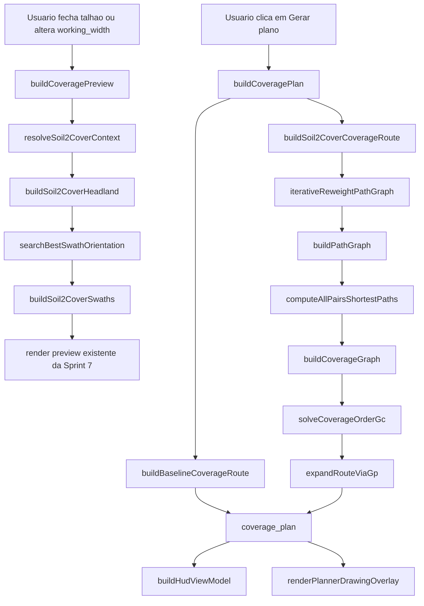

# Sprint 8: Metodo Soil2Cover - Design

**Spec**: [spec.md](spec.md)
**Status**: Validated

---

## Escopo do design

Esta sprint troca o nucleo algoritmico do planner de cobertura da Sprint 6,
preservando a UI, os overlays e os controles da Sprint 7.

O objetivo nao e redesenhar a experiencia do usuario. O objetivo e substituir o
pipeline atual:

- `buildCoveragePreview()`
- `buildCoveragePlan()`
- `planCoverageRoute()`

por um pipeline equivalente ao Soil2Cover para o caso:

- `single crop`
- `single robot`
- sem topografia
- sem nova UI para obstaculos

Isso significa que:

- o mapa, o HUD e os modos de visualizacao continuam os mesmos
- baseline e rota otimizada continuam sendo exibidas no runtime
- o que muda e a geracao de `headland`, `swaths`, grafos e custo iterativo

---

## Arquitetura: fluxo de dados



---

## Estado atual da codebase e impacto

Hoje o planner em `prototipo/index.html` faz:

- `headland = 1 x working_width_m`
- orientacao por PCA
- ordem das `swaths` por heuristica gulosa
- custo agregado por celula e por repeticao local de trechos

Isso aparece principalmente em:

- `buildCoveragePreview()`
- `buildCoveragePlan()`
- `planCoverageRoute()`

O design da Sprint 8 preserva:

- `runtimeState.coveragePlanner`
- controles do HUD da Sprint 7
- `renderPlannerDrawingOverlay()`
- alternancia baseline / otimizada
- metricas comparativas no painel

E substitui:

- geometria do `headland`
- busca da orientacao das `swaths`
- construcao da ordem de cobertura
- custo da rota otimizada

---

## Decisoes de design explicitadas

### D1 - A Sprint 8 reaproveita a casca visual da Sprint 7

Nenhum controle novo de UI sera introduzido nesta sprint.

Continuam valendo:

- `working_width_m`
- desenho manual do talhao
- `Gerar plano`
- `Limpar plano`
- `Ver baseline`
- `Ver otimizada`
- `follow mode` e `planner mode`

Consequencia:

- `coverage_plan` precisa continuar expondo `headland`, `swaths`,
  `baseline_route`, `optimized_route` e `metrics`
- o renderer nao sera reescrito; apenas passara a receber artefatos gerados
  pelo pipeline Soil2Cover

### D2 - `working_width_m` continua sendo largura de cobertura; `robot_width_m` entra como largura fisica do veiculo

O artigo distingue claramente:

- largura de cobertura das faixas
- largura do robo usada para gerar `headland`

No runtime atual so existe `working_width_m` no HUD do planner. Portanto:

- `working_width_m` continua sendo a distancia entre `swaths`
- `robot_width_m` sera derivado da configuracao atual do trator

Regra inicial para o prototipo atual:

- `robot_width_m = track_gauge + tyre_width`

Motivo:

- `getActiveTractorConfig()` ja expoe `track_gauge` e `tyre_width`
- o preset atual e de rodado `wheel`
- essa soma representa a largura externa aproximada do trator

Se esses campos faltarem ou forem invalidos:

- preview, baseline e rota Soil2Cover ficam indisponiveis com diagnostico claro
- isso e aceitavel porque o proprio `headland` do metodo depende de
  `robot_width_m`

### D3 - O planner Soil2Cover usa solo homogeneo representativo do talhao apenas para a rota otimizada

O artigo assume solo homogeneo sobre a area perturbada.

O runtime atual, por outro lado, possui variacao espacial por raster e por
grade operacional. Para compatibilizar ambos:

- a Sprint 8 nao usara `mission.compaction_accumulator` como entrada do
  otimizador
- a Sprint 8 construira um `representative_soil_context` do talhao
- a rota Soil2Cover sera calculada sobre esse contexto homogeneo
- baseline, `headland` e `swaths` nao dependem desse contexto para existir

Metodo escolhido:

1. amostrar as celulas/valores de terreno dentro do `field_polygon`
2. mapear cada area amostrada para um template SoilFlex
3. escolher o template dominante por area amostrada dentro do talhao
4. registrar diagnostico quando houver heterogeneidade relevante

Consequencia:

- a Sprint 8 fica metodologicamente proxima do artigo
- a heterogeneidade do nosso dataset nao some; ela fica diagnosticada
- o acumulador da Sprint 5 continua existindo para HUD e export, mas deixa de
  guiar o route planning da Sprint 8
- quando o contexto SoilFlex nao puder ser resolvido, o preview geometrico e a
  baseline continuam disponiveis

### D4 - Os parametros SoilFlex entram por templates calibrados, nao por digitacao manual

O runtime atual nao possui uma UI de entrada para:

- `lambda_n`
- `kappa`
- `N`
- `yield_line_specific_volume`
- `density_of_solids`
- `xi`

Portanto, a Sprint 8 introduz um catalogo local de parametros, por exemplo:

```javascript
const SOIL2COVER_SOILFLEX_TEMPLATES = {
  argissolo: { ... },
  latossolo: { ... },
  cambissolo: { ... }
};
```

Fonte de selecao:

- `thematic_class`
- atributos do snapshot atual do terreno

Derivacao permitida:

- `specific_volume_initial` pode ser informado diretamente no template
- ou derivado de `bulk_density_initial` e `density_of_solids` quando faltar

Consequencia:

- o design continua offline e sem UI nova
- os insumos do artigo entram de forma controlada e auditavel

### D5 - O `headland` da Sprint 8 deixa de ser uma heuristica de banda e passa a ser um offset geometrico dedicado

O `buildHeadlandGeometry()` atual foi suficiente para a Sprint 6, mas ele nao
representa o buffer interno do artigo.

Nesta sprint entra um gerador dedicado:

- `buildSoil2CoverHeadland(fieldPolygon, robotWidthM, internalObstacles)`

Saidas:

- `render_mode`
- `outer_ring_latlng`
- `inner_ring_latlng`
- `outer_rings_xy`
- `inner_rings_xy`
- `path_rings_xy`
- `outer_rings_latlng`
- `inner_rings_latlng`
- `path_rings_latlng`
- `headland_width_m`

Definicao:

- `headland_width_m = 3 * robot_width_m`
- cada `path_ring` e a polilinha usada para navegacao no `GP`
- para o caso base atual, existe apenas um anel externo e um `path_ring`
- para compatibilidade com o renderer atual, o primeiro anel continua exposto
  tambem como `outer_ring_latlng`, `inner_ring_latlng` e `render_mode = "band"`

Implementacao geometrica:

- converter o poligono para XY local
- garantir orientacao consistente do anel externo
- gerar offset interno por intersecao de retas deslocadas
- se o offset colapsar ou produzir auto-intersecao, abortar com diagnostico

Obstaculos:

- se `internal_obstacles` vierem de uma estrutura geometrica ja existente,
  gerar aneis adicionais
- nao existe autoria manual de obstaculos na Sprint 8

### D6 - A orientacao das `swaths` passa a ser uma busca exaustiva de `0..179`

O PCA da Sprint 6 sai do algoritmo.

Nova funcao:

- `searchBestSwathOrientation(innerFieldGeometry, workingWidthM, stepDeg)`

Fluxo:

1. iterar angulos `0..179` com passo `1`
2. gerar `swaths` retas para cada angulo
3. medir a soma dos comprimentos das `swaths`
4. escolher o angulo com melhor valor da funcao objetivo

Regra de desempate:

- maior soma de comprimentos
- em empate numerico, menor numero de `swaths`
- em novo empate, menor angulo

Consequencia:

- a orientacao do artigo fica refletida diretamente no runtime
- o resultado fica deterministico

### D7 - `buildCoveragePreview()` continua existindo, mas vira preview geometrico Soil2Cover

O preview ainda existe porque o HUD da Sprint 7 e o fluxo de desenho dependem
dele. O que muda e o conteudo.

`buildCoveragePreview(fieldPolygon, workingWidthM)` passa a:

1. resolver `robot_width_m`
2. gerar `headland`
3. gerar a geometria do campo interno
4. buscar o melhor angulo
5. construir `swaths`
6. snapar endpoints ao `path_ring`
7. tentar construir o `representative_soil_context`
8. armazenar diagnosticos do contexto

O preview nao constroi ainda `GP`, `GC` nem iteracoes de rota.

Regra importante:

- falha em `representative_soil_context` SHALL NOT invalidar o preview
- preview so falha quando a geometria base ou `robot_width_m` forem invalidos
- a indisponibilidade SoilFlex fica registrada em `diagnostics` e e tratada
  depois em `buildCoveragePlan()`

Saida prevista:

```javascript
{
  field_polygon,
  working_width_m,
  robot_width_m,
  headland_width_m,
  swath_orientation_deg,
  headland,
  swaths, // cada swath preserva start_xy/end_xy/start_latlng/end_latlng
  representative_soil_context, // pode ser null
  diagnostics
}
```

### D8 - O baseline passa a sair do mesmo `GP/GC`, mas com pesos puramente de distancia

Na Sprint 6, baseline e otimizada vinham de uma heuristica comum com `mode`.

Na Sprint 8, ambas passam pelo mesmo pipeline de grafos:

- baseline:
  - `GP` inicial com pesos de distancia
  - `GC` derivado dos menores caminhos em `GP`
  - ordem de cobertura resolvida sobre `GC`
  - expansao final via `GP`

- Soil2Cover:
  - mesmo `GP` inicial
  - iteracao de reponderacao por `B_rho(n)` e `n_ij`

Consequencia:

- baseline e Soil2Cover ficam comparaveis
- a diferenca entre ambas passa a ser realmente metodologica, nao de pipeline

### D9 - O `Path Graph` sera construido explicitamente e segmentado em arestas atomicas

Nova camada de runtime:

- `buildPathGraph(preview, entryPoint, exitPoint)`

Vertices iniciais:

- pontos discretos dos `path_rings`
- endpoints das `swaths`
- pontos snapped no `path_ring`
- `entry_point`
- `exit_point`, quando existir

Arestas iniciais:

- adjacencias consecutivas em cada `path_ring`
- conexao endpoint -> snap point
- conexao entry/exit -> snap point

Depois disso entra uma normalizacao:

- detectar sobreposicoes colineares e incidencias ponto-segmento
- quebrar segmentos em partes atomicas
- canonizar vertices por tolerancia `graph_split_tolerance_m`

Essa etapa e obrigatoria porque o custo Soil2Cover depende de contar passagens
por aresta sem ambiguidade.

### D10 - `GC` sera derivado dos menores caminhos de `GP`

Nova funcao:

- `buildCoverageGraph(pathGraph, swaths, entryVertexId)`

Regra:

- os vertices de `GC` sao o ponto de entrada e os endpoints das `swaths`
- endpoints da mesma `swath` recebem custo zero
- os demais custos usam o menor caminho em `GP`

Algoritmo:

- Floyd-Warshall sobre a matriz de pesos de `GP`
- armazenamento do predecessor ou `next-hop` para reconstruir caminhos

Se `exit_point` existir:

- ele nao entra na ordem de cobertura em `GC`
- ele so entra na expansao final da rota sobre `GP`

### D11 - O solver de ordem de cobertura sera um modulo dedicado de TSP equivalente

O artigo usa um resolvedor equivalente a TSP/Hamiltonian path. O browser nao
tem OR-Tools, entao o design precisa separar a formulacao do mecanismo de
resolucao.

Nova interface:

```javascript
solveCoverageOrderGc({
  coverageGraph,
  swaths,
  mode
}) => {
  ordered_vertices,
  ordered_swaths,
  total_cost
}
```

Contrato:

- a formulacao continua sendo um problema equivalente a TSP/Hamiltonian path
- a implementacao no prototipo deve ser deterministica
- o solver deve retornar a ordem completa das `swaths` e a orientacao de cada
  uma

Decisao pratica para esta sprint:

- usar um solver dedicado em JavaScript, deterministico
- permitir branch-and-bound com poda para problemas pequenos
- permitir fallback de busca local deterministica para problemas maiores
- registrar no trace qual estrategia foi usada

Isso preserva o contrato do spec sem fingir que teremos OR-Tools no browser.

### D12 - O custo Soil2Cover sera calculado por curva `B_rho(n)` em profundidade fixa

O custo da rota nao sera mais um agregado por celula.

Nova camada de calculo:

- `buildBrhoCurve(soilContext, machineContext, maxPasses)`
- `getPassWeightedCost(edgeLengthM, passCount, brhoCurve)`

Definicoes:

- `B_rho(n)` = aumento acumulado de densidade apos `n` passadas
- peso da aresta `e_ij` na iteracao seguinte:
  - `d_ij * B_rho(n_ij)`

Onde:

- `n_ij` e o numero de passagens acumuladas na rota expandida da iteracao
  anterior
- na primeira iteracao, os pesos de `GP` continuam proporcionais a distancia

Isso alinha o design ao texto do artigo e ao contrato do `spec.md`.

Profundidade:

- sempre `target_depth_m = 0.20` na Sprint 8

### D13 - O loop iterativo da rota otimizada sera explicitamente traqueado

Nova funcao principal:

- `buildSoil2CoverCoverageRoute(preview, entryPoint, exitPoint, options)`

Fluxo:

1. construir `GP` base
2. inicializar pesos por distancia
3. montar `GC`
4. resolver ordem de cobertura
5. expandir a rota em segmentos de mapa
6. contar `n_ij` sobre as arestas atomicas
7. reponderar `GP`
8. repetir ate convergencia ou limite

Trace por iteracao:

```javascript
{
  iteration,
  solver_strategy,
  route_signature,
  total_length_m,
  total_compaction_cost,
  stop_criterion
}
```

Convergencia:

- duas iteracoes consecutivas com a mesma `route_signature`

### D14 - A rota final expandida continua no formato consumido pelo renderer atual

Mesmo com `GP` e `GC`, a saida final precisa continuar compativel com a Sprint 7.

Cada rota expandida vira:

```javascript
{
  mode: "baseline" | "optimized",
  swath_order: [...],
  segments: [
    {
      type: "entry" | "transition" | "swath" | "exit",
      polyline_xy,
      polyline_latlng,
      length_m,
      compaction_cost,
      gp_edge_ids
    }
  ],
  total_length_m,
  total_compaction_cost
}
```

Isso permite:

- reusar `renderPlannerDrawingOverlay()`
- manter o destaque baseline/otimizada
- continuar exibindo origem e `headland`

---

## Estruturas de dados novas e alteradas

### `coverage_preview`

```javascript
coverage_preview: {
  field_polygon,
  working_width_m,
  robot_width_m,
  headland_width_m,
  swath_orientation_deg,
  headland, // inclui campos compativeis com o renderer atual e rings canonicos
  swaths,   // incluem start_xy/end_xy/start_latlng/end_latlng e snap points
  representative_soil_context, // pode ser null
  diagnostics
}
```

### `coverage_plan`

```javascript
coverage_plan: {
  field_polygon,
  working_width_m,
  robot_width_m,
  headland_width_m,
  swath_orientation_deg,
  headland,
  swaths,
  origin_latlng,
  origin_xy,
  baseline_route,
  optimized_route,
  metrics, // inclui chaves ja consumidas pelo HUD atual
  soil2cover_trace,
  diagnostics
}
```

### `metrics`

```javascript
{
  baseline_length_m,
  optimized_length_m,
  baseline_compaction_cost,
  optimized_compaction_cost,
  delta_length_pct,
  delta_compaction_pct,
  soil2cover_iterations,
  soil2cover_stop_reason,
  soil_homogeneity_status,
  solver_strategy
}
```

### `representative_soil_context`

```javascript
{
  template_id,
  thematic_class,
  homogeneity_status: "homogeneous" | "dominant-template" | "mixed-warning",
  bulk_density_initial,
  specific_volume_initial,
  density_of_solids,
  N_specific_volume_at_1kPa,
  compression_index_lambda_n,
  recompression_index_kappa,
  yield_line_specific_volume,
  stress_concentration_factor_xi,
  target_depth_m
}
```

### `path_graph`

```javascript
{
  vertices: [{ id, x, y, kind, source_ref }],
  edges: [{ id, a, b, length_m, pass_count, base_weight, weight }],
  next_hop_matrix,
  distance_matrix
}
```

### `coverage_graph`

```javascript
{
  vertices: [{ id, swath_id, endpoint_kind }],
  edges: [{ a, b, cost }],
  entry_vertex_id
}
```

### `soil2cover_trace`

```javascript
{
  solver_strategy,
  max_iterations,
  converged,
  stop_reason,
  iterations: [
    {
      iteration,
      route_signature,
      total_length_m,
      total_compaction_cost,
      stop_criterion
    }
  ]
}
```

---

## Modulos e funcoes novas

### Contexto de entrada

- `deriveRobotWidthM(activeTractorConfig)`
- `resolveSoil2CoverMachineContext(activeTractorConfig)`
- `resolveRepresentativeSoilContext(fieldPolygon)`

### Geometria

- `buildSoil2CoverHeadland(fieldPolygon, robotWidthM, internalObstacles)`
- `buildInnerFieldGeometry(fieldPolygon, headlandGeometry)`
- `buildSwathsForAngle(innerFieldGeometry, workingWidthM, angleDeg)`
- `searchBestSwathOrientation(innerFieldGeometry, workingWidthM, stepDeg)`
- `attachSwathSnapPoints(swaths, headlandGeometry, snapPolicy)`

### Compactacao

- `solveSoilFlexBulkDensityAfterPass(soilContext, machineContext, currentBulkDensity)`
- `buildBrhoCurve(soilContext, machineContext, maxPasses)`
- `getPassWeightedCost(edgeLengthM, passCount, brhoCurve)`

### Grafos

- `buildPathGraph(preview, entryPointLatLng, exitPointLatLng)`
- `splitPathGraphOverlaps(pathGraph, toleranceM)`
- `computePathGraphShortestPaths(pathGraph)`
- `buildCoverageGraph(pathGraph, swaths, entryPoint)`
- `solveCoverageOrderGc(coverageGraph, swaths, mode, options)`
- `expandCoverageOrderViaGp(pathGraph, coverageOrder, exitPoint)`

### Rotas

- `buildBaselineCoverageRoute(preview, entryPointLatLng, exitPointLatLng)`
- `buildSoil2CoverCoverageRoute(preview, entryPointLatLng, exitPointLatLng, options)`
- `buildSoil2CoverMetrics(baselineRoute, optimizedRoute, trace)`

---

## Integracao com o runtime atual

### `getActiveTractorConfig()`

Sera estendido para fornecer os campos minimos do contexto Soil2Cover:

- `running_gear_type`
- `contact_width_m`
- `contact_length_m`
- `robot_width_m`
- `load_distribution_model`

Para o preset atual:

- `running_gear_type = "wheel"`
- `contact_width_m = tyre_width`
- `contact_length_m` pode vir de um helper dedicado de aproximacao
- `robot_width_m = track_gauge + tyre_width`

### `buildCoveragePreview()`

Passa a chamar o novo pipeline geometrico Soil2Cover, mas continua sendo o
entrypoint do preview no HUD e no desenho do talhao.

### `buildCoveragePlan()`

Passa a:

1. obter `preview`
2. gerar baseline via `GC`
3. tentar gerar rota Soil2Cover iterativa
4. compor `metrics`, `trace` e `diagnostics`
5. preservar `origin_latlng` e `origin_xy` no contrato atual do plano

### `renderPlannerDrawingOverlay()`

Nao muda de contrato. Apenas consome:

- `headland`
- `swaths`
- `baseline_route.segments`
- `optimized_route.segments`

### `buildHudViewModel()`

Ganha metricas novas:

- `soil2cover_iterations`
- `soil2cover_stop_reason`
- `soil_homogeneity_status`
- `solver_strategy`

Sem mudar a estrutura principal do painel do planner nem as chaves de metricas
que ele ja consome hoje.

---

## Politica de falha e degradacao

### Quando a baseline existe, mas a rota Soil2Cover nao

O prototipo continua funcional quando:

- faltarem parametros SoilFlex
- `robot_width_m` nao puder ser derivado
- o `headland` colapsar
- o `GP` ficar desconectado
- o solver otimizado falhar

Nesses casos:

- baseline continua disponivel
- `optimized_route = null`
- `overlay_mode` efetivo deve cair para `baseline` enquanto a rota otimizada
  estiver indisponivel
- HUD mostra diagnostico de indisponibilidade

### Quando o solo e heterogeneo

Nao bloquear por padrao.

Comportamento:

- escolher template dominante
- registrar `mixed-warning`
- expor aviso tecnico no plano e no HUD

### Quando `exit_point` nao existir

Comportamento default:

- a ordem de cobertura e resolvida a partir do `entry_point`
- a rota termina no ultimo endpoint expandido

---

## Pseudocodigo de alto nivel

```javascript
function buildCoveragePlan(fieldPolygon, workingWidthM) {
  const preview = buildCoveragePreview(fieldPolygon, workingWidthM);
  const entryPoint = tractorState.position;
  const originLatLng = {
    lat: Number(entryPoint.lat.toFixed(6)),
    lng: Number(entryPoint.lng.toFixed(6))
  };
  const originXY = projectLatLng(entryPoint);

  const baselineRoute = buildBaselineCoverageRoute(preview, entryPoint, null);

  let optimizedRoute = null;
  let soil2coverTrace = null;
  let diagnostics = preview.diagnostics.slice();

  try {
    const optimizedResult = buildSoil2CoverCoverageRoute(preview, entryPoint, null, {
      maxIterations: runtimeConfig.maxRouteIterations
    });
    optimizedRoute = optimizedResult.route;
    soil2coverTrace = optimizedResult.trace;
    diagnostics = diagnostics.concat(optimizedResult.diagnostics);
  } catch (error) {
    diagnostics.push({
      code: "soil2cover-unavailable",
      message: error.message
    });
  }

  return {
    field_polygon: fieldPolygon,
    working_width_m: preview.working_width_m,
    robot_width_m: preview.robot_width_m,
    headland_width_m: preview.headland_width_m,
    swath_orientation_deg: preview.swath_orientation_deg,
    headland: preview.headland,
    swaths: preview.swaths,
    origin_latlng: originLatLng,
    origin_xy: originXY,
    baseline_route: baselineRoute,
    optimized_route: optimizedRoute,
    metrics: buildSoil2CoverMetrics(baselineRoute, optimizedRoute, soil2coverTrace),
    soil2cover_trace: soil2coverTrace,
    diagnostics: diagnostics
  };
}
```

---

## Compatibilidade com os artigos-base

O design fica alinhado ao Soil2Cover em:

- `headland = 3 x robot_width_m`
- `swath angle search = 1 degree`
- `headland generation -> swath generation -> route planning -> path expansion`
- `Path Graph` e `Coverage Graph`
- `closest-point-on-ring`
- Floyd-Warshall para menores caminhos
- TSP equivalente sobre `GC`
- custo por `B_rho(n)`
- reponderacao iterativa por `n_ij`

O design deliberadamente nao tenta cobrir nesta sprint:

- headland coverage por curvatura continua
- obstaculos com nova UI de autoria
- strip cropping com multiplos `GC_i`
- topografia

---

## Impacto esperado no plano atual

Depois da Sprint 8:

- a baseline continua existindo
- a rota otimizada deixa de ser gulosa
- o `headland` deixa de usar `1 x working_width_m`
- o custo deixa de usar acumulacao por celula do planner da Sprint 6
- o algoritmo do planner passa a ser explicavel por grafos e iteracoes

O prototipo continua com a mesma casca de uso da Sprint 7, mas com um metodo de
escolha de rota significativamente mais proximo do artigo.
