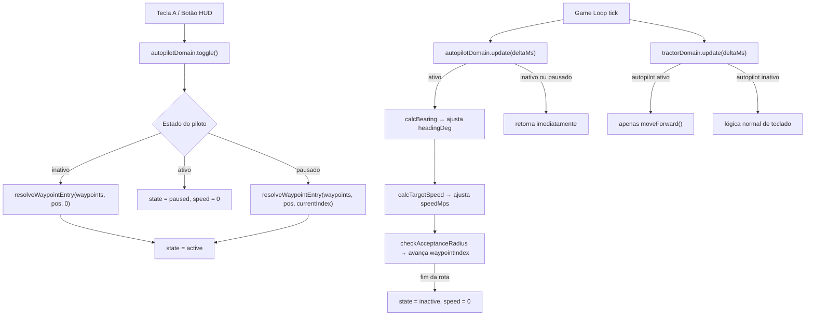

# Sprint 9: Piloto Automático — Design

**Spec:** `.specs/features/sprint-9-piloto-automatico/spec.md`
**Status:** Draft

---

## Architecture Overview

O piloto automático é um novo domain (`autopilot.js`) que roda **antes** do `tractorDomain.update()` no game loop. Quando ativo, ele computa heading e velocidade-alvo e os aplica diretamente ao `tractorState`. O `tractorDomain.update()` recebe um flag e, quando o piloto está ativo, pula o bloco de input de teclado e apenas executa o `moveForward()` com o estado já preparado pelo piloto.



---

## Code Reuse Analysis

### Existing Components to Leverage

| Componente | Localização | Como usar |
|---|---|---|
| Padrão IIFE + `registerModule` | Todos os domains | Mesmo padrão para `autopilot.js` |
| `tractorState` (headingDeg, speedMps, position) | `tractor.js` via config | Autopilot lê e mutua diretamente via referência |
| `turnRateDegPerSec`, `accelerationMps2`, `brakeRateMps2` | `tractorState` | Reutilizados como parâmetros físicos do piloto |
| `config.clamp()` | Passado via config em runtime | Mesmo utilitário para clampar speed e heading delta |
| `config.moveForward()` | Passado via config em runtime | Já calcula deslocamento geodésico; reutilizado em `tractorDomain` |
| `plannerLayers` | `mapDomain.getPlannerLayers()` | Adicionar layer `autopilotWaypoint` para o marcador P3 |
| `pushUiMessage` / `renderHud` | Passados via config | Mensagens de estado e re-render do HUD |
| `paused_tractor` flag | `runtime.coveragePlanner` | Consultado no `autopilot.update()` — piloto respeita pausa externa |

### Integration Points

| Sistema | Como conecta |
|---|---|
| `tractor.js` | Recebe flag `isAutopilotActive` via config; quando true, pula bloco de input e só executa `moveForward()` |
| `keyboard.js` | Passa `blocked = isAutopilotActive()` no `applyDirectionalInput` para setas direcionais |
| `planner.js` — `clearPlan()` | Chama `autopilotDomain.deactivate()` antes de descartar o plano |
| `index.html` — `bootstrapLegacyRuntime` | Inicializa `autopilotDomain`, adiciona tecla `A` no handler de `keydown`, inclui `autopilot.update()` no game loop |

---

## Decisões de Design

### D1 — Sequência flat de waypoints como estrutura interna

Ao ativar o piloto, `segments` é **achatado** em um array flat de waypoints enriquecidos:

```js
// Estrutura interna gerada na ativação
autopilotState.waypoints = [
  { lat, lng, segmentIndex, segmentType, totalSegments },
  ...
];
autopilotState.waypointIndex = N; // índice atual no flat array
```

**Motivo:** simplifica o loop de tick — um único `waypointIndex` controla toda a navegação sem lógica aninhada de segmento + ponto. O `segmentIndex` e `segmentType` embutidos em cada waypoint permitem que o HUD e o controle de velocidade consultem o tipo do segmento atual com `O(1)`.

### D2 — Autopilot modifica `tractorState` diretamente; `tractor.js` só executa `moveForward`

Quando autopilot está ativo, o contrato é:
1. `autopilot.update(deltaMs)` → escreve `tractorState.headingDeg` e `tractorState.speedMps`
2. `tractorDomain.update(deltaMs)` → lê `isAutopilotActive()`, pula o bloco de input, apenas executa `moveForward()`

Isso evita duplicar física e mantém o `moveForward()` como única fonte de deslocamento.

### D3 — `paused_tractor` externo é respeitado sem novo estado

Em `autopilot.update()`: se `runtime.coveragePlanner.paused_tractor === true`, retorna imediatamente (sem mudar `autopilotState.state`). Quando `paused_tractor` volta a `false`, o piloto reaplica `resolveWaypointEntry(waypoints, position, waypointIndex)` antes de continuar.

**Motivo:** isso mantém o contrato do spec para AP-24 e continua seguro mesmo quando o bloqueio externo não desloca o trator. Se nada mudou de fato, o reacoplamento retorna o mesmo waypoint ou um índice equivalente.

### D4 — Bearing geodésico + delta de ângulo mínimo (ES5 puro)

```js
// bearing em graus [0, 360), horário a partir do Norte
function calcBearing(from, to) {
  var lat1 = from.lat * Math.PI / 180;
  var lat2 = to.lat * Math.PI / 180;
  var dLng = (to.lng - from.lng) * Math.PI / 180;
  var x = Math.sin(dLng) * Math.cos(lat2);
  var y = Math.cos(lat1) * Math.sin(lat2) - Math.sin(lat1) * Math.cos(lat2) * Math.cos(dLng);
  return (Math.atan2(x, y) * 180 / Math.PI + 360) % 360;
}

// delta de ângulo mínimo em [-180, 180]
function calcHeadingDelta(current, target) {
  var delta = ((target - current) % 360 + 360) % 360;
  return delta > 180 ? delta - 360 : delta;
}
```

### D5 — Distância euclidiana planar para acceptance radius e reacoplamento

Para distâncias < 100 m (acceptance radius 2 m, threshold 15 m), a aproximação planar é suficiente:

```js
function calcDistanceM(a, b) {
  var dLat = (b.lat - a.lat) * 111320;
  var dLng = (b.lng - a.lng) * 111320 * Math.cos(a.lat * Math.PI / 180);
  return Math.sqrt(dLat * dLat + dLng * dLng);
}
```

Haversine seria mais preciso mas desnecessário nessa escala.

### D6 — Aceleração e frenagem por tick seguem o limite alvo

Quando o piloto está ativo, a velocidade converge para o alvo do segmento sem ultrapassá-lo:

```js
if (tractorState.speedMps > targetSpeed) {
  tractorState.speedMps = config.clamp(
    tractorState.speedMps - tractorState.brakeRateMps2 * deltaSeconds,
    targetSpeed,
    tractorState.maxSpeedMps
  );
} else if (tractorState.speedMps < targetSpeed) {
  tractorState.speedMps = config.clamp(
    tractorState.speedMps + tractorState.accelerationMps2 * deltaSeconds,
    0,
    targetSpeed
  );
}
```

### D7 — Reacoplamento: função única `resolveWaypointEntry`, nunca retrocede

Uma única função cobre ativação inicial e retomada após pausa:

```js
// currentIndex = 0 na ativação; waypointIndex atual na retomada
function resolveWaypointEntry(waypoints, position, currentIndex) { ... }
```

Busca dentre os waypoints com índice `>= currentIndex`. O índice resultante nunca volta atrás. Se o trator estiver a > 15 m de todos os pontos pendentes, retorna `0` (navega até a origem antes de seguir a sequência).

---

## Components

### `autopilot.js` (novo)

- **Propósito:** Domain do piloto automático — gerencia estado, navegação por waypoints, controle de heading/speed e marcador visual
- **Localização:** `prototipo/src/domains/autopilot.js`
- **API pública exposta via `registerModule("domains", "autopilot", {...})`:**
  - `createAutopilotDomain(config)` → retorna o domain ativo
  - `getActiveDomain()` → referência ao domain criado
- **API do domain (`activeDomain`):**
  - `toggle()` — cicla entre inactive → active → paused → active; usa `resolveWaypointEntry` em ambas as transições para `active`
  - `deactivate(message)` — desativa sem ciclar; reseta todos os campos de `config.runtime.autopilot`; limpa marcador; emite `message` via `pushUiMessage` se fornecido (AP-23: "Plano descartado. Piloto desativado."; AP-09: "Rota concluída.")
  - `update(deltaMs)` — tick do piloto; chamado no game loop antes de `tractorDomain.update()`
  - `isActive()` — `true` se `state === "active"`
  - `getSnapshot()` — retorna `{ state, segmentIndex, segmentCount, segmentType }` para HUD
- **Config recebido:**
  - `tractorState` — referência mutável ao estado do trator
  - `runtime` — para ler `coveragePlanner.overlay_mode`, `paused_tractor`, `coverage_plan`
  - `clamp(value, min, max)` — utilitário
  - `pushUiMessage(text, ttl)` — mensagens de feedback
  - `renderHud()` — re-render após mudança de estado
  - `mapLayers` — para o marcador visual (P3)
- **Reusa:** padrão IIFE + `registerModule`; `clamp`; `pushUiMessage`

### Modificação: `runtime.js`

- **O que muda:** `createRuntime()` ganha sub-objeto `autopilot` como espelho mínimo para debug:

```js
autopilot: {
  state: "inactive"   // espelho — atualizado por autopilotDomain via config.runtime.autopilot
}
```

> **Separação de responsabilidades:** a fonte de verdade do estado completo do piloto é a var local `autopilotState` em `autopilot.js` (mesmo padrão de `tractorState` em `tractor.js`). O runtime contém apenas `state` para exposição via `getRuntimeSnapshot()`. Flags internas como `_wasPausedExternal` ficam encapsuladas no domain.

- `autopilot.js` atualiza `config.runtime.autopilot.state` sempre que o estado muda.
- `getRuntimeSnapshot()` ganha `autopilotState: runtimeState.autopilot.state` para debug.

### Modificação: `tractor.js`

- **O que muda:** `createTractorDomain(config)` recebe `config.isAutopilotActive` (função)
- Em `update(deltaMs)`, a ordem das verificações fica:

```js
// 1. gate paused_tractor (já existe — sem mudança)
if (config.runtime.coveragePlanner.paused_tractor) {
  tractorState.speedMps = 0;
  return;
}

// 2. bypass autopilot (NOVO — após paused_tractor)
if (config.isAutopilotActive()) {
  // heading e speed já foram definidos por autopilotDomain.update()
  distanceMeters = tractorState.speedMps * deltaSeconds;
  if (distanceMeters > 0) {
    tractorState.position = config.moveForward(
      tractorState.position, tractorState.headingDeg, distanceMeters
    );
  }
  return;
}

// 3. lógica normal de teclado (já existe — sem mudança)
```

### Modificação: `keyboard.js`

- **O que muda:** `bindKeyboard(config)` recebe `config.isAutopilotActive`
- No handler `keydown`, para setas direcionais:

```js
var blocked = drawingActive || config.isAutopilotActive();
var handledDirectional = config.tractorDomain.applyDirectionalInput("keydown", event.key, blocked);
```

- Adicionar handler para tecla `"a"` / `"A"`:

```js
if (event.key === "a" || event.key === "A") {
  config.autopilotDomain.toggle();
  event.preventDefault();
}
```

### Modificação: `map.js`

- **O que muda:** `createMapDomain(config)` adiciona a layer `autopilotWaypoint` ao objeto `plannerLayers`:

```js
plannerLayers = {
  draftVertices: L.layerGroup(),
  fieldPolygon:  L.layerGroup(),
  headland:      L.layerGroup(),
  swaths:        L.layerGroup(),
  baselineRoute: L.layerGroup(),
  optimizedRoute: L.layerGroup(),
  originMarker:  L.layerGroup(),
  autopilotWaypoint: L.layerGroup()   // ← NOVO (P3)
};
```

- A layer é incluída no `plannerOverlayLayer` pelo mesmo `Object.keys` loop já existente — sem mudança adicional em `map.js`.
- **`clearPlannerLayers()` está em `planner.js:5`**, não em `map.js` — lista cada layer explicitamente. Adicionar linha:
  ```js
  layers.autopilotWaypoint.clearLayers();
  ```
  Isso é uma **segunda mudança em `planner.js`**, além do `clearPlan()` que chama `deactivate()`.

### Modificação: `planner.js` — `clearPlan()`

- Antes de limpar os artefatos, chama `config.autopilotDomain.deactivate("Plano descartado. Piloto desativado.")` se houver domain ativo (AP-23).

### Modificação: `dom.js`

Adicionar ao `buildDomRefs()`:

```js
autopilot: {
  toggleButton: byId("autopilot-toggle"),
  stateLabel:   byId("autopilot-state"),
  segmentLabel: byId("autopilot-segment"),
  typeLabel:    byId("autopilot-type")
}
```

### Modificação: `hud.js`

- `renderHud(viewModel)` ganha bloco autopilot:

```js
setHudMetric(domRefs.autopilot.stateLabel, viewModel.autopilot.state_label, false);
setHudMetric(domRefs.autopilot.segmentLabel, viewModel.autopilot.segment_label,
  viewModel.autopilot.segment_label === "—");
setHudMetric(domRefs.autopilot.typeLabel, viewModel.autopilot.type_label,
  viewModel.autopilot.type_label === "—");
domRefs.autopilot.toggleButton.textContent = viewModel.autopilot.button_label;
domRefs.autopilot.toggleButton.disabled = viewModel.autopilot.button_disabled;
```

### Modificação: `panels.js`

- `bindPlannerPanel(actions)` ganha:

```js
domRefs.autopilot.toggleButton.addEventListener("click", function () {
  actions.onAutopilotToggle();
});
```

### Modificação: `index.html`

1. Adicionar `<script src="src/domains/autopilot.js"></script>` (depois de `planner.js`)
2. Adicionar DOM do piloto no painel do planner (ver seção Data Models)
3. Em `bootstrapLegacyRuntime`:
   - Criar `autopilotDomain` com `createAutopilotDomain(config)`
   - Passar `isAutopilotActive: function() { return autopilotDomain.isActive(); }` para `tractorDomain` e `keyboard`
   - No game loop, antes de `tractorDomain.update(deltaMs)`: `autopilotDomain.update(deltaMs)`
   - Adicionar `onAutopilotToggle` nas actions do painel

---

## Data Models

### `autopilotState` (var local em `autopilot.js` — fonte de verdade)

```js
var autopilotState = {
  state: "inactive",         // "inactive" | "active" | "paused"
  waypoints: [],             // flat array gerado na ativação (ver flattenRoute)
  waypointIndex: 0,          // índice atual no flat array
  routeSnapshot: null,       // ref à rota ativa (optimized ou baseline)
  _wasPausedExternal: false  // flag: detecta liberação de paused_tractor para reacoplamento (AP-24)
  // Resetado por deactivate(): todos os campos voltam ao valor inicial acima
};
```

Cada entrada em `waypoints`:
```js
{ lat: Number, lng: Number, segmentIndex: Number, segmentType: String, totalSegments: Number }
// segmentType: "entry" | "swath" | "transition"
// totalSegments: route.segments.length (constante para toda a rota)
```

### `runtimeState.autopilot` (espelho mínimo em `runtime.js` — apenas debug)

```js
autopilot: {
  state: "inactive"   // sincronizado por autopilot.js via config.runtime.autopilot.state
}
```
```

### ViewModel do HUD — sub-objeto `autopilot`

```js
{
  state_label:     "PILOTO ATIVO" | "PILOTO PAUSADO" | "—",
  segment_label:   "Seg 3 / 12"  | "—",
  type_label:      "Faixa"       | "Cabeceira" | "—",
  // Mapeamento de segmentType → type_label:
  //   "swath"      → "Faixa"
  //   "transition" → "Cabeceira"
  //   "entry"      → "Cabeceira"  (primeiro segmento de aproximação)
  //   qualquer outro → "—"
  button_label:    "Iniciar Piloto" | "Pausar Piloto" | "Retomar Piloto",
  button_disabled: Boolean        // true se não há coverage_plan
}
```

### DOM — elementos novos no painel do planner

```html
<!-- dentro do painel do planner, após os controles de rota -->
<div class="panel-section">
  <span class="panel-title">Piloto Automático</span>
  <div class="panel-grid">
    <span class="panel-label">Estado</span>
    <span id="autopilot-state">—</span>
    <span class="panel-label">Segmento</span>
    <span id="autopilot-segment">—</span>
    <span class="panel-label">Tipo</span>
    <span id="autopilot-type">—</span>
  </div>
  <button id="autopilot-toggle" disabled>Iniciar Piloto</button>
</div>
```

---

## Fluxo do Tick (game loop)

```
tick(timestamp)
  └── tickRuntime(timestamp) → deltaMs
  └── autopilotDomain.update(deltaMs)         ← NOVO, antes do trator
        if paused_tractor → return
        if state !== "active" → return
        bearing = calcBearing(tractorPos, waypoints[waypointIndex])
        delta = calcHeadingDelta(heading, bearing)
        heading += clamp(delta, -maxTurn, +maxTurn)
        targetSpeed = segmentType === "swath" ? CRUISE : HEADLAND
        speed = accel/brake toward targetSpeed
        if distance(tractorPos, waypoint) < RADIUS → waypointIndex++
        if waypointIndex >= waypoints.length → deactivate + "Rota concluída"
  └── tractorDomain.update(deltaMs)
        if isAutopilotActive() → moveForward() only, return
        else → lógica normal de teclado
  └── missionDomain.updateSampling(deltaMs, timestamp)
  └── mapDomain.setCameraPosition(tractorPos)
  └── renderHud(buildHudViewModel())
  └── debugUi.renderDebug()
```

---

## Error Handling

| Cenário | Tratamento | O que o usuário vê |
|---|---|---|
| `toggle()` sem `coverage_plan` | Permanece inativo | HUD: "Gere um plano de cobertura antes de ativar o piloto." |
| `clearPlan()` com piloto ativo | `deactivate()` automático | HUD: "Plano descartado. Piloto desativado." |
| `waypointIndex` excede `waypoints.length` | Desativa; guard defensivo no update | HUD: "Rota concluída." |
| `paused_tractor` externo ativo | `update()` retorna sem mudar estado; ao liberar, reaplica `resolveWaypointEntry` (D3) | HUD permanece no estado anterior; piloto reacoplado antes do próximo movimento |
| `coverage_plan` com rota sem segmentos | `toggle()` exibe mensagem e permanece inativo | HUD: "Rota inválida. Gere um novo plano." |

---

## Sequência de Implementação

1. Criar `autopilot.js` com funções puras (`calcBearing`, `calcHeadingDelta`, `calcDistanceM`, `flattenRoute`, `resolveWaypointEntry`) e `createAutopilotDomain(config)` — sem tocar em nenhum outro arquivo ainda
2. Atualizar `runtime.js` — adicionar `autopilot` ao `createRuntime()`
3. Atualizar `tractor.js` — adicionar o bypass de autopilot em `update()`
4. Atualizar `keyboard.js` — bloquear setas e adicionar tecla `A`
5. Atualizar `dom.js` + `hud.js` + `panels.js` — DOM refs, renderização e binding do botão
6. Atualizar `index.html` — `<script>` tag, DOM do piloto, wiring no `bootstrapLegacyRuntime`
7. Atualizar `planner.js` — `clearPlan()` chama `deactivate()`
8. Validar: rota reta → piloto segue; rota com cabeceiras → velocidade reduz; pausar/retomar; clearPlan desativa

---

## Arquivos Afetados

| Arquivo | Tipo | Escopo da mudança |
|---|---|---|
| `src/domains/autopilot.js` | **NOVO** | Domain completo do piloto |
| `src/core/runtime.js` | modificar | Adicionar `autopilot` ao runtime state |
| `src/domains/tractor.js` | modificar | Bypass de update após `paused_tractor`, antes do teclado |
| `src/domains/map.js` | modificar | Adicionar layer `autopilotWaypoint` a `plannerLayers` e `clearPlannerLayers` |
| `src/core/keyboard.js` | modificar | Bloquear setas + handler tecla A |
| `src/ui/dom.js` | modificar | Refs dos novos elementos DOM |
| `src/ui/hud.js` | modificar | Renderizar estado e progresso do piloto |
| `src/ui/panels.js` | modificar | Bind do botão de toggle |
| `src/domains/planner.js` | modificar | `clearPlan()` desativa piloto |
| `index.html` | modificar | Script tag, DOM, `buildHudViewModel()` + wiring no bootstrap |
