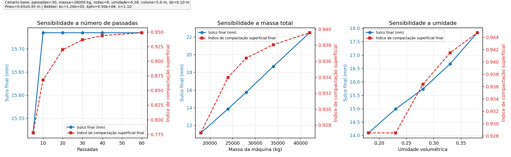

Bloco 1 - Validação por Matriz de Cenários
==========================================

Objetivo
--------

Executar uma validação física interna do protótipo variando uma variável por vez (OVAT), mantendo as demais constantes:

- número de passadas,
- massa total da máquina,
- umidade volumétrica do solo.

Configuração de referência usada
--------------------------------

.. csv-table:: Cenário de referência (Bloco 1)
   :file: data/bloco1_cenario_referencia_pt.csv
   :header-rows: 1

Resultados de sensibilidade
---------------------------

   Sensibilidade do sulco final e do índice de compactação superficial para cada variação OVAT.

.. csv-table:: Variação por passadas
   :file: data/bloco1_sweep_passes_pt.csv
   :header-rows: 1

.. csv-table:: Variação por massa
   :file: data/bloco1_sweep_mass_pt.csv
   :header-rows: 1

.. csv-table:: Variação por umidade
   :file: data/bloco1_sweep_moisture_pt.csv
   :header-rows: 1

Critérios de coerência (gate)
-----------------------------

.. csv-table:: Checks automáticos de coerência física
   :file: data/bloco1_gate_checks_pt.csv
   :header-rows: 1

Leitura crítica do Bloco 1
--------------------------

- O comportamento monotônico esperado foi observado nas três variações testadas.
- O sulco residual satura cedo no cenário de referência (ordem de 10 passadas), o que pode ser interpretado como limiar operacional inicial de intervenção.
- O bloco valida tendência física inicial, mas não substitui calibração geotécnica/agrícola por tipo de solo.

Profundidade de coluna: 5 m (justificativa técnica)
----------------------------------------------------

A coluna foi ajustada para 5 m como domínio computacional prático para as culturas-alvo desta fase. Para interpretação agronômica de compactação e raízes, o foco continua majoritariamente em camadas rasas e intermediárias.

Síntese de evidências (Embrapa + artigos):

.. list-table:: Faixas típicas de interação raiz-solo (resumo)
   :header-rows: 1

   * - Cultura
     - Evidência principal
     - Interpretação prática para o modelo
   * - Milho
     - Embrapa reporta maior concentração de raízes nos primeiros 30 cm; em solos tropicais, raramente ultrapassa 60 cm, e em clima temperado pode passar de 100 cm.
     - Zona crítica de manejo tipicamente superficial a intermediária.
   * - Cana-de-açúcar
     - PAB (2006) observou 31% de raízes metabolicamente ativas em 0,6-0,8 m (vs. 23% em 0,0-0,2 m); PAB (2012) mostra relação entre manejo/tráfego e sistema radicular.
     - Forte interação nas camadas rasas e intermediárias, com exploração relevante em profundidade.
   * - Café
     - Estudos de campo mostram concentração de raízes em 0,20-0,34 m e ocorrência de raízes finas em maior profundidade (0,80-0,94 m) em manejo conservacionista.
     - Predomínio de resposta superficial, com componente profundo dependente de solo e manejo.
   * - Laranja
     - PAB (2007) em citros de tabuleiros costeiros reporta ~60% das raízes em 0-0,20 m e ~90% em 0-0,40 m; Embrapa recomenda solo com profundidade efetiva mínima de 1,0-1,2 m; tese de doutorado da UNESP em laranjeira 'Valência' reporta profundidade máxima de enraizamento de até 6,5 m.
     - Priorização prática em 0-0,40 m, com monitoramento complementar de camadas profundas em cenários de seca/solo favorável.

Conclusão operacional da equipe
-------------------------------

- Manter 5 m como limite de domínio é adequado para a fase atual e para as culturas discutidas.
- Para tomada de decisão no estágio atual, priorizar indicadores por camadas em 0-0,3 m, 0,3-1,0 m e 1,0-2,0 m.
- Profundidades >2 m e até 5 m devem ser tratadas como monitoramento complementar, não como indicador principal nesta fase inicial.

Referências usadas nesta síntese
--------------------------------

- Embrapa (milho): `Relações com o solo (cultivo de milho) <https://www.embrapa.br/agencia-de-informacao-tecnologica/cultivos/milho/pre-producao/caracteristicas-da-especie-e-relacoes-com-o-ambiente/relacoes-com-o-solo>`_
- Pesquisa Agropecuária Brasileira (cana): `Quantificação de raízes metabolicamente ativas de cana-de-açúcar (2006) <https://apct.sede.embrapa.br/index.php/pab/article/view/7239>`_
- Pesquisa Agropecuária Brasileira (cana): `Compressibilidade do solo e sistema radicular da cana-de-açúcar em manejo com e sem controle de tráfego (2012) <https://www.scielo.br/j/pab/a/XyGwtfJrZTRDh5kcpYkpf4z/?format=html&lang=pt>`_
- Revista Brasileira de Engenharia Agrícola e Ambiental (café): `Distribuição espacial das raízes de cafeeiro e dos poros de dois Latossolos (2014) <https://www.scielo.br/j/rbeaa/a/NYGzhX53vXVzktsfFvDCyvy/>`_
- Pesquisa Agropecuária Brasileira (citros/laranja): `Sistema radicular dos citros em Neossolo Quartzarênico dos Tabuleiros Costeiros (2007) <https://ainfo.cnptia.embrapa.br/digital/bitstream/item/180000/1/Sistema-radicular-dos-citros-em-Neossolo-Quartzarenico.pdf>`_
- Embrapa (citros): `Solos - Sistema de Produção de Citros para o Nordeste <https://sistemasdeproducao.cnptia.embrapa.br/FontesHTML/Citros/CitrosNordeste/solos.htm>`_
- UNESP (laranjeira 'Valência', tese): `Distribuição de raízes e a relação com o estado hídrico de laranjeira 'Valência' enxertada sobre limoeiro 'Cravo' (2015, doutorado) <https://acervodigital.unesp.br/handle/11449/126559>`_
