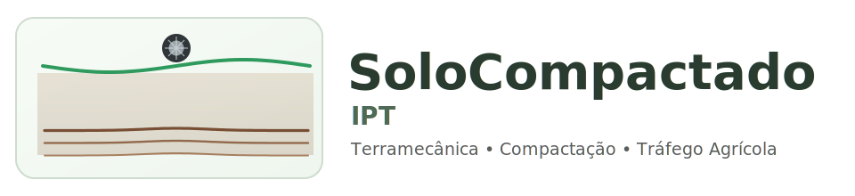

SoloCompactado IPT - Documentação Técnica
=========================================

Esta documentação descreve o protótipo de compactação de solo com foco em:

- hipótese física e geotécnica do modelo,
- equações usadas na simulação,
- interpretação dos resultados para tomada de decisão,
- limites de validade e plano de calibração de campo.

Público-alvo: engenheiros e tecnólogos com experiência em solos e geotecnia, sem necessidade de conhecimento em programação.

.. raw:: html

   

.. toctree::
   :maxdepth: 2
   :caption: Conteúdo

   visao_geral
   fundamentos_terramecanica
   modelo_ponto_unico
   leitura_resultados
   bloco1_validacao
   revisao_referencias
   glossario
   validacao_calibracao
   referencia_codigo
   roteiro_apresentacao
