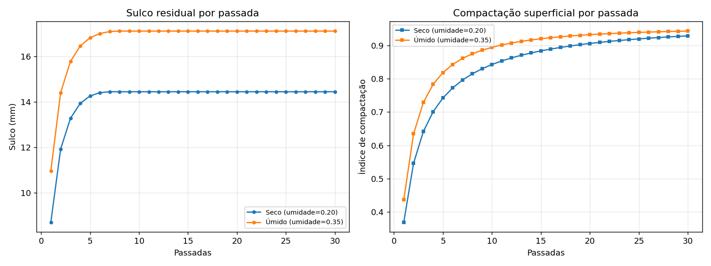
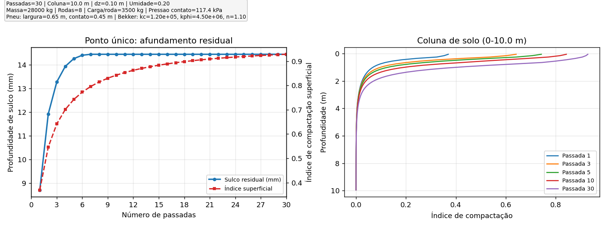
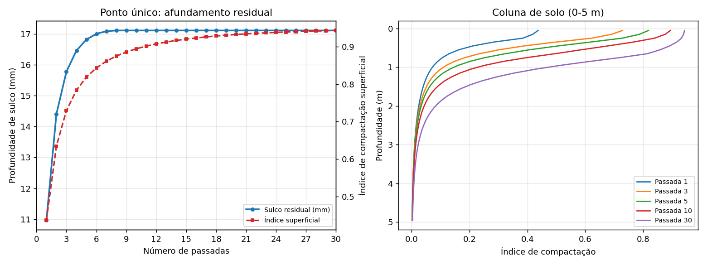

Leitura dos Resultados
======================

Gráfico 1 - Evolução por passadas
---------------------------------

O gráfico principal de evolução mostra duas curvas:

- sulco residual (mm),
- índice de compactação superficial (adimensional).

No gráfico, a linha vermelha tracejada aparece com rótulo curto ``Índice superficial``; esse termo é equivalente a ``índice de compactação superficial``.

Como interpretar:

- crescimento rápido nas primeiras passadas é esperado,
- tendência à saturação indica que incrementos adicionais por passada diminuem,
- para a mesma carga e mesma configuração de roda, cenários mais úmidos tendem a maior deformação.

Transparência de parâmetros:

- os gráficos exibem um quadro com os parâmetros usados na simulação (massa, rodas, geometria do pneu, pressão de contato, umidade, ``kc``, ``kphi``, ``n``);
- cada execução também salva ``parametros_simulacao.csv`` no diretório de saída.

Nota técnica
------------

A frase acima é conceitualmente compatível com terramecânica em solos agrícolas na maioria das condições operacionais, pois o aumento da umidade costuma reduzir a resistência mecânica efetiva e elevar a suscetibilidade ao sulcamento.

No uso prático, essa relação deve sempre ser calibrada por tipo de solo e faixa de umidade local.

Sobre a estabilização por número de passadas
--------------------------------------------

Se o modelo estabiliza próximo da 10ª passada, isso pode ser usado como critério operacional e não é, por si só, um erro.

Interpretação recomendada:

- a estabilização indica que os incrementos marginais por passada ficaram pequenos para aquele cenário paramétrico;
- esse ponto pode ser usado como ``limiar de intervenção`` (ex.: renovar/descompactar após ~10 passadas naquela condição);
- a calibração de campo continua necessária para garantir que esse limiar corresponde a impacto agronômico real no talhão.

Gráfico 2 - Perfil final da coluna (0-5 m)
--------------------------------------------

Mostra a distribuição do índice de compactação com a profundidade para passadas selecionadas.

Como interpretar:

- maior variação nas camadas rasas,
- redução progressiva da influência em profundidade,
- comparação entre passadas indica velocidade de aproximação da saturação.

Gráfico 3 - Sensores virtuais
-----------------------------

No perfil final:

- curva verde: ``cone_index_mpa`` (resistência à penetração virtual),
- curva roxa: ``bulk_density_g_cm3`` (densidade aparente virtual).

Uso recomendado:

- tratar essas curvas como ``proxy`` para planejamento de campanha de campo,
- calibrar com medições reais antes de definir limiares de intervenção.

Estudo comparativo controlado: seco x úmido
-------------------------------------------

Configuração idêntica nos dois cenários, alterando apenas umidade do solo:

- 30 passadas,
- massa total 28 000 kg,
- 8 rodas,
- largura do pneu 0,65 m,
- comprimento de contato 0,45 m,
- cenário seco: umidade 0,20,
- cenário úmido: umidade 0,35.

   Comparação entre cenários seco e úmido: sulco residual e compactação superficial ao longo das passadas.

.. csv-table:: Resumo final da simulação comparativa
   :file: data/resumo_umidade_pt.csv
   :header-rows: 1

.. csv-table:: Primeiras 10 passadas (comparação seca x úmida)
   :file: data/comparacao_umidade_10pass_pt.csv
   :header-rows: 1

Evidência observada no protótipo
--------------------------------

- o sulco residual final foi maior no cenário úmido,
- o índice de compactação superficial final também foi maior no cenário úmido,
- nas 30 passadas simuladas, o sulco do cenário úmido permaneceu acima do cenário seco.

Gráficos individuais por cenário
--------------------------------

   Evolução por passadas no cenário seco.

   Evolução por passadas no cenário úmido.

Indicadores para decisão operacional
------------------------------------

Para gestão de tráfego por faixa, recomenda-se acompanhar:

- taxa de crescimento do sulco por passada,
- compactação média em 0-30 cm e 30-100 cm,
- energia acumulada associada à compactação.

Para definição completa dos termos e unidades, consulte :doc:`glossario`.
