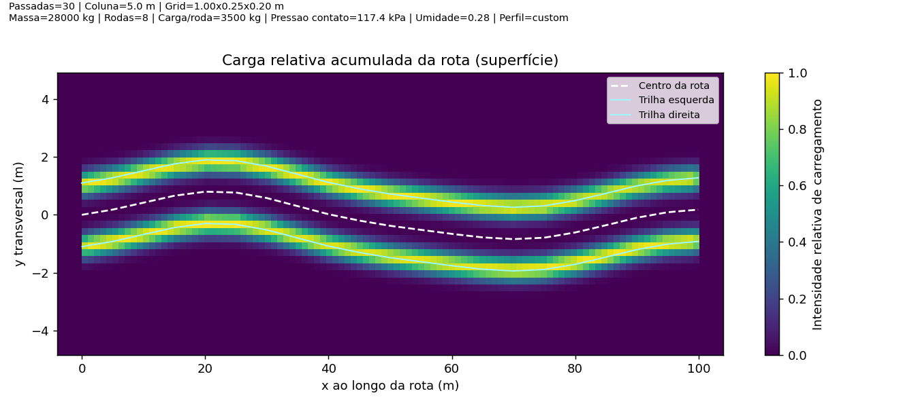
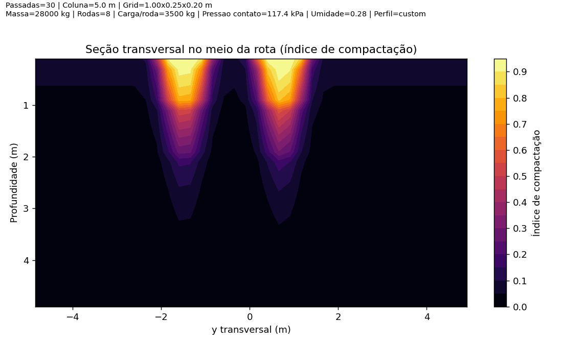
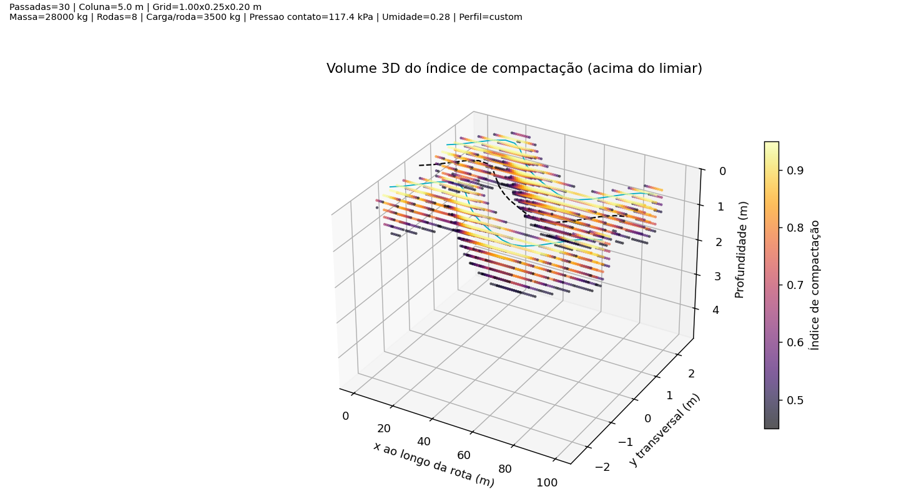

Simulador 3D Interativo
=======================

Objetivo desta página
---------------------

Mostrar, no próprio GitHub Pages, uma demonstração visual 3D do protótipo de compactação
em rota (conceito Terranimo/Softsoil em implementação aberta e simplificada).

Demonstração interativa (HTML)
------------------------------

.. raw:: html

   
<a href="_static/resultados/prototipo_trajeto_3d_demo/volume_compactacao_3d_interativo.html" target="_blank" rel="noopener"><strong>Abrir visualizador 3D em nova aba</strong></a>

   <iframe
     src="_static/resultados/prototipo_trajeto_3d_demo/volume_compactacao_3d_interativo.html"
     style="width: 100%; height: 760px; border: 1px solid #ccc; border-radius: 6px;"
     loading="lazy">
   </iframe>

Caso o bloco interativo não carregue na sua rede/navegador, use o link "Abrir visualizador 3D em nova aba".

Figuras de apoio
----------------

   Mapa de intensidade relativa de carregamento na superfície para a rota amostrada.

   Seção y-z no meio da rota, mostrando a distribuição de compactação com a profundidade.

   Versão estática do volume 3D (pontos acima de limiar de compactação).

Parâmetros do cenário de demonstração
-------------------------------------

.. csv-table::
   :file: _static/resultados/prototipo_trajeto_3d_demo/parametros_simulacao_3d.csv
   :header-rows: 1

Comando usado para gerar este cenário
-------------------------------------

.. code-block:: bash

   python3 src/prototipo_trajeto_3d.py \
     --route-mode csv \
     --route-csv data/exemplo_rota_rtk.csv \
     --soil-profile custom \
     --sigma-crit-layers "0.30:95,1.00:140,2.00:210,5.00:290" \
     --output-dir sphinx/_static/resultados/prototipo_trajeto_3d_demo
